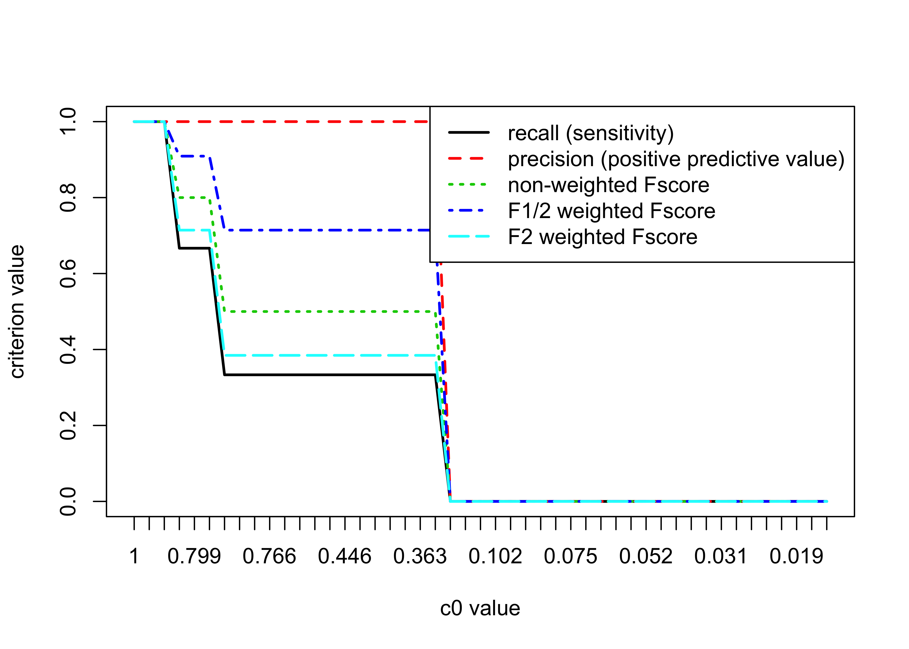
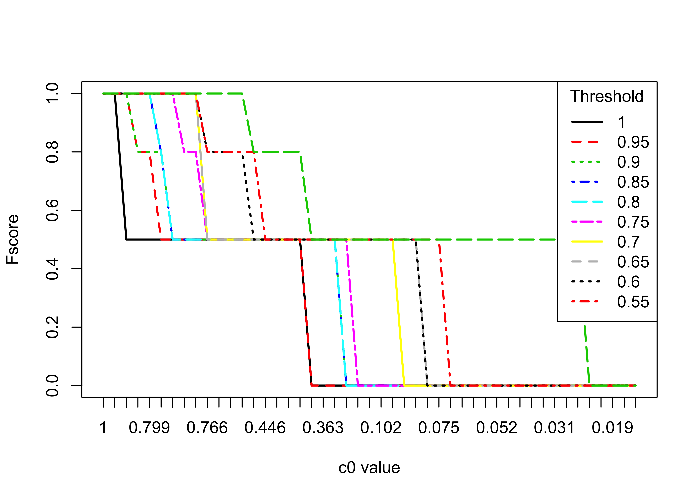
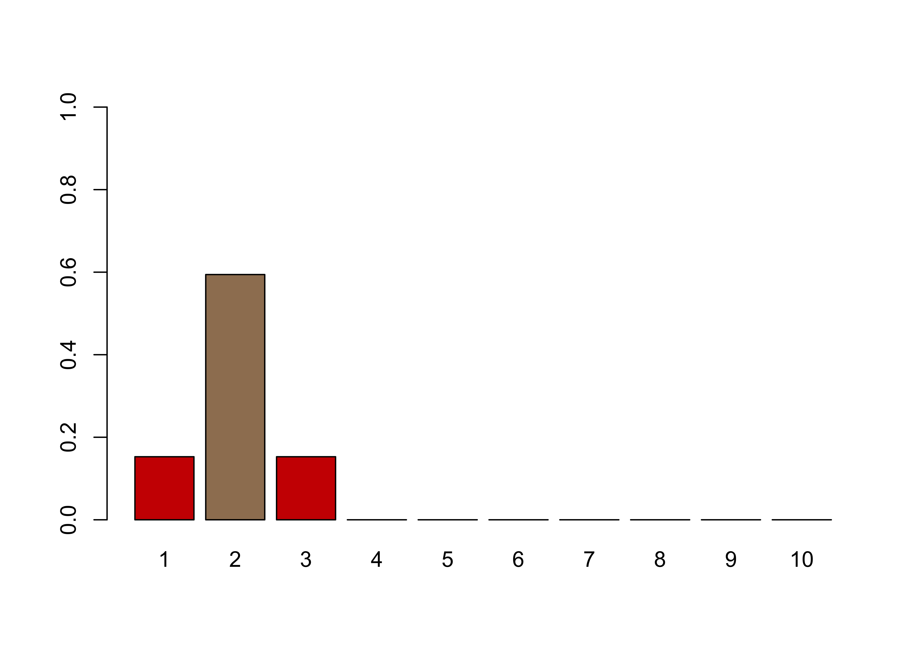
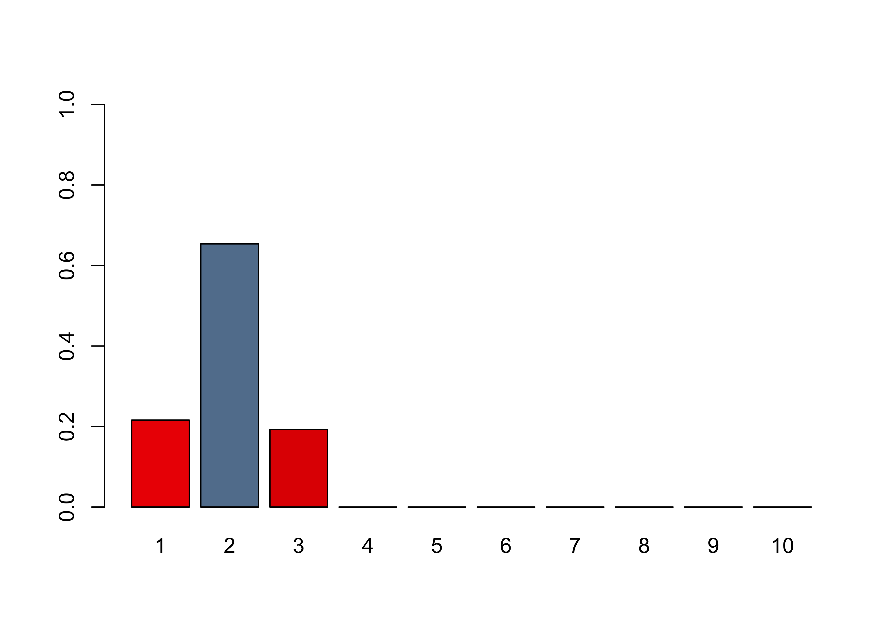

<!-- README.md is generated from README.Rmd. Please edit that file -->


# A General Algorithm to Enhance the Performance of Variable Selection Methods in Correlated Datasets


### *Frédéric Bertrand and Myriam Maumy-Bertrand*


[](https://cran.r-project.org/package=SelectBoost)
[](https://zenodo.org/badge/latestdoi/136206211)


----------------


# SelectBoost


With the growth of big data, variable selection has become one of the major challenges in statistics. Although many methods have been proposed in the literature their performance in terms of recall and precision are limited in a context where the number of variables by far exceeds the number of observations or in a high correlated setting. Results: This package implements a new general algorithm which improves the precision of any existing variable selection method. This algorithm is based on highly intensive simulations and takes into account the correlation structure of the data. Our algorithm can either produce a confidence index for variable selection or it can be used in an experimental design planning perspective.


This website and these examples were created by F. Bertrand and M. Maumy-Bertrand.

## Installation

You can install the released version of SelectBoost from [CRAN](https://CRAN.R-project.org) with:


```r
install.packages("SelectBoost")
```

You can install the development version of SelectBoost from [github](https://github.com) with:


```r
devtools::install_github("fbertran/SelectBoost")
```

If you are a Linux/Unix or a Macos user, you can install a version of SelectBoost with support for `doMC` from [github](https://github.com) with:


```r
devtools::install_github("fbertran/SelectBoost", ref = "doMC")
```


## Examples

### First example: Simulated dataset 

#### Simulating data
Create a correlation matrix for two groups of variable with an intragroup correlation value of $cor\_group$.

```r
library(SelectBoost)
group<-c(rep(1:2,5))
cor_group<-c(.8,.4)
C<-simulation_cor(group,cor_group)
C
#>       [,1] [,2] [,3] [,4] [,5] [,6] [,7] [,8] [,9] [,10]
#>  [1,]  1.0  0.0  0.8  0.0  0.8  0.0  0.8  0.0  0.8   0.0
#>  [2,]  0.0  1.0  0.0  0.4  0.0  0.4  0.0  0.4  0.0   0.4
#>  [3,]  0.8  0.0  1.0  0.0  0.8  0.0  0.8  0.0  0.8   0.0
#>  [4,]  0.0  0.4  0.0  1.0  0.0  0.4  0.0  0.4  0.0   0.4
#>  [5,]  0.8  0.0  0.8  0.0  1.0  0.0  0.8  0.0  0.8   0.0
#>  [6,]  0.0  0.4  0.0  0.4  0.0  1.0  0.0  0.4  0.0   0.4
#>  [7,]  0.8  0.0  0.8  0.0  0.8  0.0  1.0  0.0  0.8   0.0
#>  [8,]  0.0  0.4  0.0  0.4  0.0  0.4  0.0  1.0  0.0   0.4
#>  [9,]  0.8  0.0  0.8  0.0  0.8  0.0  0.8  0.0  1.0   0.0
#> [10,]  0.0  0.4  0.0  0.4  0.0  0.4  0.0  0.4  0.0   1.0
```

Simulate predictor dataset witn $N=100$ observations.

```r
N<-100
X<-simulation_X(N,C)
head(X)
#>             [,1]        [,2]       [,3]       [,4]       [,5]       [,6]
#> [1,]  1.21396145  0.43096472  0.9868039  0.3542829  1.1108204 -0.5146066
#> [2,]  0.78751753 -0.90264514  0.1907726 -0.1752868  0.9928913 -1.5279731
#> [3,] -0.02963105  2.32999509 -0.1129966 -0.3978952  0.5410036  0.1390104
#> [4,] -2.12715577  0.13694175 -2.1056285  0.4528473 -1.9890633  0.5581092
#> [5,]  0.12375381  0.05036364 -0.5439224 -1.2783792 -0.2554037  0.1688758
#> [6,]  1.83146889 -0.23448084  0.5447842 -1.5254886  1.1925717 -0.4548997
#>            [,7]       [,8]        [,9]      [,10]
#> [1,]  1.3266606 -1.1559725  1.07571091 -0.3741334
#> [2,] -1.1169571 -0.3130917  0.35282821 -2.1178733
#> [3,]  0.5529879  1.0605793  0.08464176  2.0897687
#> [4,] -0.8683426  1.4938075 -1.86419187  0.3730376
#> [5,]  0.6895746  0.6776849 -0.10879225 -0.1324266
#> [6,]  1.7168605 -0.8126544  1.75756482 -0.6013311
```

$supp$ set the predictors that will be used to simulate the response (=true predictors). $minB$ and $maxB$ set the minimum and maximum absolute value for a $\beta$ coefficient used in the model for the (true) predictors. $stn$ is a scaling factor for the noise in the response.

```r
supp<-c(1,1,1,0,0,0,0,0,0,0)
minB<-1
maxB<-2
stn<-500
DATA_exemple<-simulation_DATA(X,supp,minB,maxB,stn)
str(DATA_exemple)
#> List of 6
#>  $ X      : num [1:100, 1:10] 1.214 0.7875 -0.0296 -2.1272 0.1238 ...
#>  $ Y      : num [1:100] -0.639 1.983 -3.123 0.486 0.984 ...
#>  $ support: num [1:10] 1 1 1 0 0 0 0 0 0 0
#>  $ beta   : num [1:10] 1.31 -1.4 -1.64 0 0 ...
#>  $ stn    : num 500
#>  $ sigma  : num [1, 1] 0.0813
#>  - attr(*, "class")= chr "simuls"
```

#### Selectboost analysis

By default `fastboost` performs $B=100$ resamplings of the model. As a result, we get a matrix with the proportions of selection of each variable at a given resampling level $c_0$. The resampling are designed to take into account the correlation structure of the predictors. The correlation used by default is the Pearson Correlation but any can be passed through the `corrfunc` argument. The $c_0$ value sets the minimum level for which correlations between two predictors are kept in the resampling process. The correlation structure is used to group the variables. Two groups functions `group_func_1`, grouping by thresholding the correlation matrix, and `group_func_2`, grouping using community selection, are available but any can be provided using the `group` argument of the function. The `func` argument is the variable selection function that should be used to assess variable memberships. It  defaults to `lasso_msgps_AICc` but many others, for instance for lasso, elastinet, logistic glmnet and network inference with the [Cascade package](http://fbertran.github.io/Cascade/), are provided:

* lasso_cv_glmnet_bin_min(X, Y)
* lasso_cv_glmnet_bin_1se(X, Y)
* lasso_glmnet_bin_AICc(X, Y)
* lasso_glmnet_bin_BIC(X, Y)
* lasso_cv_lars_min(X, Y)
* lasso_cv_lars_1se(X, Y)
* lasso_cv_glmnet_min(X, Y)
* lasso_cv_glmnet_min_weighted(X, Y, priors)
* lasso_cv_glmnet_1se(X, Y)
* lasso_cv_glmnet_1se_weighted(X, Y, priors)
* lasso_msgps_Cp(X, Y, penalty = "enet")
* lasso_msgps_AICc(X, Y, penalty = "enet")
* lasso_msgps_GCV(X, Y, penalty = "enet")
* lasso_msgps_BIC(X, Y, penalty = "enet")
* enetf_msgps_Cp(X, Y, penalty = "enet", alpha = 0.5)
* enetf_msgps_AICc(X, Y, penalty = "enet", alpha = 0.5)
* enetf_msgps_GCV(X, Y, penalty = "enet", alpha = 0.5)
* enetf_msgps_BIC(X, Y, penalty = "enet", alpha = 0.5)
* lasso_cascade(M, Y, K, eps = 10^-5, cv.fun)

User defined functions can alse be specified in the `func` argument. See the vignette for an example of use with *adaptative* lasso.

Default steps for $c_0$

```r
quantile(abs(cor(DATA_exemple$X))[abs(cor(DATA_exemple$X))!=1],(0:10)/10)
#>         0%        10%        20%        30%        40%        50% 
#> 0.01007575 0.02310033 0.03081006 0.06227720 0.07647559 0.13206241 
#>        60%        70%        80%        90%       100% 
#> 0.31028993 0.42321397 0.73521805 0.78606674 0.81178121
```


```r
result.boost = fastboost(DATA_exemple$X, DATA_exemple$Y)
result.boost
#>               1    2    3    4    5    6    7    8    9   10
#> c0 = 1     1.00 1.00 1.00 0.00 0.00 0.00 0.00 0.00 0.00 0.00
#> c0 = 0.812 1.00 1.00 1.00 0.43 0.88 0.45 0.71 0.27 1.00 0.92
#> c0 = 0.78  0.38 1.00 0.43 0.08 0.99 0.02 0.04 0.72 0.38 0.15
#> c0 = 0.735 0.62 1.00 0.65 0.08 0.56 0.00 0.53 0.47 0.58 0.02
#> c0 = 0.414 0.59 1.00 0.67 0.31 0.57 0.31 0.63 0.34 0.56 0.40
#> c0 = 0.31  0.57 1.00 0.54 0.84 0.47 0.52 0.55 0.93 0.46 0.43
#> c0 = 0.132 0.51 0.91 0.52 0.89 0.50 0.81 0.47 0.85 0.43 0.84
#> c0 = 0.076 0.52 0.89 0.54 0.89 0.47 0.73 0.40 0.87 0.64 0.80
#> c0 = 0.062 0.39 0.88 0.30 0.93 0.95 0.75 0.43 0.87 0.41 0.75
#> c0 = 0.031 0.37 0.85 0.40 0.96 0.78 0.59 0.48 0.91 0.81 0.66
#> c0 = 0.023 0.40 0.89 0.41 0.99 0.80 0.62 0.55 0.87 0.69 0.69
#> c0 = 0.01  0.48 0.75 0.46 0.99 0.85 0.53 0.71 0.85 0.76 0.73
#> c0 = 0     0.41 0.29 0.41 0.36 0.29 0.33 0.39 0.33 0.34 0.39
#> attr(,"c0.seq")
#>              100%      90%      80%      70%      60%      50%      40% 
#> 1.000000 0.811781 0.779782 0.735218 0.414478 0.310290 0.132062 0.076476 
#>      30%      20%      10%       0%          
#> 0.062397 0.030810 0.023262 0.010076 0.000000 
#> attr(,"steps.seq")
#>  [1] 1.0 0.9 0.8 0.7 0.6 0.5 0.4 0.3 0.2 0.1 0.0
#> attr(,"typeboost")
#> [1] "fastboost"
#> attr(,"limi_alea")
#> [1] NA
#> attr(,"B")
#> [1] 100
#> attr(,"class")
#> [1] "selectboost"
```

#### Comparing true and selected predictors

We can compute, for all the $c_0$ values and for a selection threshold varying from $1$ to $0.5$ by $0.05$ steps, the recall (sensitivity), the precision (positive predictive value), as well as several Fscores ($F_1$ harmonic mean of recall and precision, $F_{1/2}$ and $F_2$ two weighted harmonic means of recall and precision).

```r
All_res=NULL
#Here are the cutoff level tested
for(lev in 20:10/20){
F_score=NULL
for(u in 1:nrow(result.boost)){
	F_score<-rbind(F_score,SelectBoost::compsim(DATA_exemple,result.boost[u,],
	                                            level=lev)[1:5])
}
All_res <- abind::abind(All_res,F_score,along=3)
}
```

For a selection threshold equal to $0.90$, all the $c_0$ values and the 5 criteria.

```r
matplot(1:nrow(result.boost),All_res[,,3],type="l",ylab="criterion value",
        xlab="c0 value",xaxt="n",lwd=2)
axis(1, at=1:length(attr(result.boost,"c0.seq")),  
     labels=round(attr(result.boost,"c0.seq"),3))
legend(x="topright",legend=c("recall (sensitivity)",
      "precision (positive predictive value)","non-weighted Fscore",
      "F1/2 weighted Fscore","F2 weighted Fscore"),lty=1:5,col=1:5,lwd=2)
```


Fscores for all selection thresholds and all the $c_0$ values.

```r
matplot(1:nrow(result.boost),All_res[,3,],type="l",ylab="Fscore",
        xlab="c0 value",xaxt="n",lwd=2,col=1:11,lty=1:11)
axis(1, at=1:length(attr(result.boost,"c0.seq")),
     labels=round(attr(result.boost,"c0.seq"),3))
legend(x="topright",legend=(20:11)/20,lty=1:11,col=1:11,lwd=2,
       title="Threshold")
```


#### Complete Selectboost analysis

What is the maximum number of steps ?

```r
all.cors=unique(abs(cor(DATA_exemple$X))[abs(cor(DATA_exemple$X))!=1])
length(all.cors)
#> [1] 45
```

With such datasets, we can perform all the 45 steps for the Selectboost analysis. We switch to  community analysis from the [igraph package](http://igraph.org) as the grouping variable function.

```r
groups.seq.f2=lapply(sort(unique(c(1,all.cors,0)),decreasing=TRUE), function(c0)
  if(c0!=1){lapply(group_func_2(cor(DATA_exemple$X),c0)$communities,sort)}
  else {lapply(group_func_2(cor(DATA_exemple$X),c0),sort)})
names(groups.seq.f2)<-sort(unique(c(1,all.cors,0)),decreasing=TRUE)
groups.seq.f2[[1]]
#> [[1]]
#> [1] 1
#> 
#> [[2]]
#> [1] 2
#> 
#> [[3]]
#> [1] 3
#> 
#> [[4]]
#> [1] 4
#> 
#> [[5]]
#> [1] 5
#> 
#> [[6]]
#> [1] 6
#> 
#> [[7]]
#> [1] 7
#> 
#> [[8]]
#> [1] 8
#> 
#> [[9]]
#> [1] 9
#> 
#> [[10]]
#> [1] 10
```


```r
result.boost.45 = fastboost(DATA_exemple$X, DATA_exemple$Y, B=100,
                    steps.seq=sort(unique(all.cors),decreasing=TRUE))
result.boost.45
#>               1    2    3    4    5    6    7    8    9   10
#> c0 = 1     1.00 1.00 1.00 0.00 0.00 0.00 0.00 0.00 0.00 0.00
#> c0 = 0.812 1.00 1.00 1.00 0.34 0.90 0.47 0.70 0.24 1.00 0.90
#> c0 = 0.8   1.00 1.00 1.00 0.31 0.86 0.57 0.77 0.23 1.00 0.89
#> c0 = 0.796 1.00 1.00 1.00 0.40 0.55 0.43 0.84 0.31 1.00 0.92
#> c0 = 0.795 0.49 1.00 0.40 0.14 0.30 0.04 0.05 0.70 1.00 0.10
#> c0 = 0.786 0.64 1.00 0.58 0.04 0.56 0.01 0.17 0.67 0.69 0.02
#> c0 = 0.77  0.41 1.00 0.23 0.11 1.00 0.02 0.04 0.76 0.38 0.14
#> c0 = 0.744 0.78 1.00 0.86 0.12 0.73 0.08 0.90 0.86 0.83 0.23
#> c0 = 0.742 0.70 1.00 0.78 0.11 0.76 0.05 0.96 0.91 0.88 0.27
#> c0 = 0.739 0.71 1.00 0.74 0.12 0.74 0.02 0.67 0.75 0.66 0.18
#> c0 = 0.734 0.61 1.00 0.60 0.05 0.57 0.00 0.57 0.50 0.57 0.06
#> c0 = 0.534 0.58 1.00 0.51 0.11 0.58 0.29 0.59 0.32 0.62 0.07
#> c0 = 0.523 0.52 1.00 0.59 0.09 0.60 0.33 0.60 0.25 0.56 0.08
#> c0 = 0.447 0.60 1.00 0.55 0.23 0.57 0.35 0.66 0.35 0.59 0.34
#> c0 = 0.423 0.56 1.00 0.55 0.25 0.63 0.31 0.57 0.37 0.58 0.45
#> c0 = 0.38  0.58 1.00 0.49 0.86 0.54 0.49 0.60 0.45 0.48 0.65
#> c0 = 0.374 0.56 1.00 0.47 0.88 0.55 0.40 0.59 0.55 0.50 0.71
#> c0 = 0.354 0.47 1.00 0.51 0.90 0.54 0.38 0.52 0.85 0.54 0.32
#> c0 = 0.326 0.42 1.00 0.52 0.89 0.58 0.41 0.49 0.90 0.57 0.44
#> c0 = 0.3   0.42 0.92 0.56 0.86 0.55 0.89 0.46 0.85 0.52 0.39
#> c0 = 0.293 0.57 0.94 0.51 0.89 0.55 0.85 0.43 0.85 0.49 0.40
#> c0 = 0.161 0.50 0.88 0.55 0.83 0.59 0.83 0.55 0.88 0.48 0.79
#> c0 = 0.135 0.51 0.80 0.51 0.90 0.62 0.89 0.46 0.79 0.43 0.87
#> c0 = 0.132 0.46 0.86 0.62 0.87 0.52 0.78 0.43 0.86 0.46 0.79
#> c0 = 0.091 0.54 0.82 0.53 0.82 0.55 0.84 0.51 0.77 0.57 0.79
#> c0 = 0.082 0.50 0.83 0.44 0.94 0.61 0.86 0.43 0.86 0.54 0.73
#> c0 = 0.081 0.58 0.86 0.40 0.92 0.56 0.87 0.52 0.90 0.48 0.75
#> c0 = 0.08  0.44 0.92 0.50 0.81 0.59 0.83 0.41 0.88 0.60 0.77
#> c0 = 0.071 0.58 0.96 0.44 0.94 0.59 0.78 0.40 0.75 0.54 0.72
#> c0 = 0.069 0.45 0.77 0.29 0.94 0.93 0.83 0.54 0.80 0.36 0.78
#> c0 = 0.064 0.42 0.90 0.45 0.98 0.95 0.81 0.40 0.76 0.32 0.76
#> c0 = 0.063 0.40 0.86 0.40 0.90 0.92 0.85 0.36 0.77 0.30 0.77
#> c0 = 0.062 0.45 0.86 0.45 0.96 0.91 0.79 0.45 0.83 0.32 0.70
#> c0 = 0.037 0.51 0.88 0.45 0.95 0.81 0.79 0.38 0.85 0.41 0.76
#> c0 = 0.034 0.37 0.86 0.55 0.95 0.85 0.75 0.52 0.85 0.30 0.74
#> c0 = 0.034 0.43 0.88 0.44 0.99 0.79 0.63 0.44 0.80 0.83 0.74
#> c0 = 0.031 0.42 0.81 0.38 0.98 0.83 0.63 0.46 0.82 0.81 0.74
#> c0 = 0.029 0.43 0.87 0.42 0.97 0.81 0.60 0.34 0.85 0.83 0.64
#> c0 = 0.028 0.32 0.76 0.34 0.96 0.80 0.65 0.45 0.86 0.68 0.75
#> c0 = 0.026 0.43 0.82 0.39 0.98 0.85 0.51 0.41 0.86 0.69 0.74
#> c0 = 0.024 0.37 0.89 0.41 0.96 0.81 0.57 0.45 0.86 0.72 0.60
#> c0 = 0.023 0.35 0.76 0.36 0.99 0.80 0.65 0.63 0.88 0.73 0.71
#> c0 = 0.022 0.36 0.72 0.35 0.97 0.78 0.61 0.73 0.83 0.67 0.66
#> c0 = 0.017 0.40 0.82 0.36 0.98 0.82 0.52 0.70 0.87 0.80 0.73
#> c0 = 0.012 0.43 0.75 0.36 1.00 0.78 0.48 0.73 0.79 0.83 0.79
#> c0 = 0.01  0.42 0.84 0.31 0.98 0.80 0.47 0.72 0.87 0.77 0.78
#> c0 = 0     0.29 0.32 0.34 0.35 0.32 0.32 0.28 0.22 0.28 0.28
#> attr(,"c0.seq")
#>  [1] 1.000000 0.811781 0.799602 0.796473 0.795464 0.786067 0.770356
#>  [8] 0.743628 0.742411 0.739273 0.734204 0.534437 0.522540 0.447231
#> [15] 0.423214 0.379532 0.374243 0.353841 0.325777 0.299965 0.292852
#> [22] 0.160630 0.134731 0.132062 0.091023 0.082356 0.081426 0.080401
#> [29] 0.070587 0.068803 0.063677 0.062875 0.062277 0.036649 0.034476
#> [36] 0.033646 0.031345 0.028671 0.027965 0.026083 0.023505 0.023100
#> [43] 0.021707 0.016789 0.012210 0.010076 0.000000
#> attr(,"steps.seq")
#>  [1] 0.00000000 0.81178121 0.79960154 0.79647282 0.79546353 0.78606674
#>  [7] 0.77035584 0.74362845 0.74241055 0.73927268 0.73420439 0.53443703
#> [13] 0.52253951 0.44723126 0.42321397 0.37953222 0.37424256 0.35384132
#> [19] 0.32577725 0.29996505 0.29285152 0.16062974 0.13473130 0.13206241
#> [25] 0.09102289 0.08235619 0.08142616 0.08040110 0.07058731 0.06880324
#> [31] 0.06367734 0.06287471 0.06227720 0.03664934 0.03447620 0.03364627
#> [37] 0.03134490 0.02867071 0.02796466 0.02608315 0.02350503 0.02310033
#> [43] 0.02170656 0.01678861 0.01220971 0.01007575 1.00000000
#> attr(,"typeboost")
#> [1] "fastboost"
#> attr(,"limi_alea")
#> [1] NA
#> attr(,"B")
#> [1] 100
#> attr(,"class")
#> [1] "selectboost"
```

#### Comparing true and selected predictors
Due to the effect of the correlated resampling, the proportion of selection for a variable may increase, especially if it is a variable that is often discarded. Hence, one should force those proportions of selection to be non-increasing. It is one of the results of the $summary$ function for the $selectboost$ class.


```r
dec.result.boost.45 <- summary(result.boost.45)$selectboost_result.dec
dec.result.boost.45
#>               1    2    3 4 5 6 7 8 9 10
#>            1.00 1.00 1.00 0 0 0 0 0 0  0
#> c0 = 0.812 1.00 1.00 1.00 0 0 0 0 0 0  0
#> c0 = 0.8   1.00 1.00 1.00 0 0 0 0 0 0  0
#> c0 = 0.796 1.00 1.00 1.00 0 0 0 0 0 0  0
#> c0 = 0.795 0.49 1.00 0.40 0 0 0 0 0 0  0
#> c0 = 0.786 0.49 1.00 0.40 0 0 0 0 0 0  0
#> c0 = 0.77  0.26 1.00 0.05 0 0 0 0 0 0  0
#> c0 = 0.744 0.26 1.00 0.05 0 0 0 0 0 0  0
#> c0 = 0.742 0.18 1.00 0.00 0 0 0 0 0 0  0
#> c0 = 0.739 0.18 1.00 0.00 0 0 0 0 0 0  0
#> c0 = 0.734 0.08 1.00 0.00 0 0 0 0 0 0  0
#> c0 = 0.534 0.05 1.00 0.00 0 0 0 0 0 0  0
#> c0 = 0.523 0.00 1.00 0.00 0 0 0 0 0 0  0
#> c0 = 0.447 0.00 1.00 0.00 0 0 0 0 0 0  0
#> c0 = 0.423 0.00 1.00 0.00 0 0 0 0 0 0  0
#> c0 = 0.38  0.00 1.00 0.00 0 0 0 0 0 0  0
#> c0 = 0.374 0.00 1.00 0.00 0 0 0 0 0 0  0
#> c0 = 0.354 0.00 1.00 0.00 0 0 0 0 0 0  0
#> c0 = 0.326 0.00 1.00 0.00 0 0 0 0 0 0  0
#> c0 = 0.3   0.00 0.92 0.00 0 0 0 0 0 0  0
#> c0 = 0.293 0.00 0.92 0.00 0 0 0 0 0 0  0
#> c0 = 0.161 0.00 0.86 0.00 0 0 0 0 0 0  0
#> c0 = 0.135 0.00 0.78 0.00 0 0 0 0 0 0  0
#> c0 = 0.132 0.00 0.78 0.00 0 0 0 0 0 0  0
#> c0 = 0.091 0.00 0.74 0.00 0 0 0 0 0 0  0
#> c0 = 0.082 0.00 0.74 0.00 0 0 0 0 0 0  0
#> c0 = 0.081 0.00 0.74 0.00 0 0 0 0 0 0  0
#> c0 = 0.08  0.00 0.74 0.00 0 0 0 0 0 0  0
#> c0 = 0.071 0.00 0.74 0.00 0 0 0 0 0 0  0
#> c0 = 0.069 0.00 0.55 0.00 0 0 0 0 0 0  0
#> c0 = 0.064 0.00 0.55 0.00 0 0 0 0 0 0  0
#> c0 = 0.063 0.00 0.51 0.00 0 0 0 0 0 0  0
#> c0 = 0.062 0.00 0.51 0.00 0 0 0 0 0 0  0
#> c0 = 0.037 0.00 0.51 0.00 0 0 0 0 0 0  0
#> c0 = 0.034 0.00 0.49 0.00 0 0 0 0 0 0  0
#> c0 = 0.034 0.00 0.49 0.00 0 0 0 0 0 0  0
#> c0 = 0.031 0.00 0.42 0.00 0 0 0 0 0 0  0
#> c0 = 0.029 0.00 0.42 0.00 0 0 0 0 0 0  0
#> c0 = 0.028 0.00 0.31 0.00 0 0 0 0 0 0  0
#> c0 = 0.026 0.00 0.31 0.00 0 0 0 0 0 0  0
#> c0 = 0.024 0.00 0.31 0.00 0 0 0 0 0 0  0
#> c0 = 0.023 0.00 0.18 0.00 0 0 0 0 0 0  0
#> c0 = 0.022 0.00 0.14 0.00 0 0 0 0 0 0  0
#> c0 = 0.017 0.00 0.14 0.00 0 0 0 0 0 0  0
#> c0 = 0.012 0.00 0.07 0.00 0 0 0 0 0 0  0
#> c0 = 0.01  0.00 0.07 0.00 0 0 0 0 0 0  0
#> c0 = 0     0.00 0.00 0.00 0 0 0 0 0 0  0
```

Let's compute again, for all the $c_0$ values, the recall (sensitivity), precision (positive predictive value), and several Fscores ($F_1$ harmonic mean of recall and precision, $F_{1/2}$ and $F_2$ two weighted harmonic means of recall and precision).

```r
All_res.45=NULL
#Here are the cutoff level tested
for(lev.45 in 20:10/20){
F_score.45=NULL
for(u.45 in 1:nrow(dec.result.boost.45
)){
	F_score.45<-rbind(F_score.45,SelectBoost::compsim(DATA_exemple,
	           dec.result.boost.45[u.45,],level=lev.45)[1:5])
}
All_res.45 <- abind::abind(All_res.45,F_score.45,along=3)
}
```

For a selection threshold equal to $0.90$, all the $c_0$ values and the 5 criteria.

```r
matplot(1:nrow(dec.result.boost.45),All_res.45[,,3],type="l",
        ylab="criterion value",xlab="c0 value",xaxt="n",lwd=2)
axis(1, at=1:length(attr(result.boost.45,"c0.seq")), 
     labels=round(attr(result.boost.45,"c0.seq"),3))
legend(x="topright",legend=c("recall (sensitivity)",
       "precision (positive predictive value)","non-weighted Fscore",
       "F1/2 weighted Fscore","F2 weighted Fscore"),
       lty=1:5,col=1:5,lwd=2)
```



Fscores for all selection thresholds and all the $c_0$ values.

```r
matplot(1:nrow(dec.result.boost.45),All_res.45[,3,],type="l",
        ylab="Fscore",xlab="c0 value",xaxt="n",lwd=2,col=1:11,lty=1:11)
axis(1, at=1:length(attr(result.boost.45,"c0.seq")), 
     labels=round(attr(result.boost.45,"c0.seq"),3))
legend(x="topright",legend=(20:11)/20,lty=1:11,col=1:11,lwd=2,
       title="Threshold")
```



#### Confidence indices.

First compute the highest $c_0$ value for which the proportion of selection is under the threshold $thr$. In that analysis, we set $thr=1$.

```r
thr=1
index.last.c0=apply(dec.result.boost.45>=thr,2,which.min)-1
index.last.c0
#>  1  2  3  4  5  6  7  8  9 10 
#>  4 19  4  0  0  0  0  0  0  0
```

Define some colorRamp ranging from blue (high confidence) to red (low confidence).

```r
jet.colors <-
  colorRamp(rev(c(
  "blue", "#007FFF", "#FF7F00", "red", "#7F0000")))
```


```r
rownames(dec.result.boost.45)[index.last.c0]
#> [1] "c0 = 0.796" "c0 = 0.326" "c0 = 0.796"
attr(result.boost.45,"c0.seq")[index.last.c0]
#> [1] 0.796473 0.325777 0.796473
confidence.indices = c(0,1-attr(result.boost.45,"c0.seq"))[index.last.c0+1]
confidence.indices
#>  [1] 0.203527 0.674223 0.203527 0.000000 0.000000 0.000000 0.000000
#>  [8] 0.000000 0.000000 0.000000
barplot(confidence.indices,col=rgb(jet.colors(confidence.indices), maxColorValue = 255), 
        names.arg=colnames(result.boost.45), ylim=c(0,1))
```



First compute the highest $c_0$ value for which the proportion of selection is under the threshold $thr$. In that analysis, we set $thr=1$.

```r
thr=.9
index.last.c0=apply(dec.result.boost.45>=thr,2,which.min)-1
index.last.c0
#>  1  2  3  4  5  6  7  8  9 10 
#>  4 21  4  0  0  0  0  0  0  0
```


```r
rownames(dec.result.boost.45)[index.last.c0]
#> [1] "c0 = 0.796" "c0 = 0.293" "c0 = 0.796"
attr(result.boost.45,"c0.seq")[index.last.c0]
#> [1] 0.796473 0.292852 0.796473
confidence.indices = c(0,1-attr(result.boost.45,"c0.seq"))[index.last.c0+1]
confidence.indices
#>  [1] 0.203527 0.707148 0.203527 0.000000 0.000000 0.000000 0.000000
#>  [8] 0.000000 0.000000 0.000000
barplot(confidence.indices,col=rgb(jet.colors(confidence.indices), maxColorValue = 255), 
        names.arg=colnames(result.boost.45), ylim=c(0,1))
```




### Second example: biological network data
#### Simulating data using real data

The loop should be used to generate at least 100 datasets and then average the results.

```r
require(CascadeData)
#> Le chargement a nécessité le package : CascadeData
data(micro_S)
data(micro_US)
micro_US<-Cascade::as.micro_array(micro_US,c(60,90,240,390),6)
micro_S<-Cascade::as.micro_array(micro_S,c(60,90,240,390),6)
S<-Cascade::geneSelection(list(micro_S,micro_US),list("condition",c(1,2),1),-1)
#> Le chargement a nécessité le package : limma
rm(micro_S);data(micro_S)
Sel<-micro_S[S@name,]

supp<-c(1,1,1,1,1,rep(0,95))
minB<-1
maxB<-2
stn<-5

set.seed(3141)
for(i in 1:1){
X<-t(as.matrix(Sel[sample(1:1300 ,100),]))
Xnorm<-t(t(X)/sqrt(diag(t(X)%*%X)))
assign(paste("DATA_exemple3_nb_",i,sep=""),simulation_DATA(Xnorm,supp,minB,maxB,stn))
}
```


```r
all.cors.micro=unique(abs(cor(DATA_exemple3_nb_1$X))[abs(cor(
  DATA_exemple3_nb_1$X))!=1])
length(unique(all.cors.micro))
#> [1] 4950
quantile(all.cors.micro,.90)
#>       90% 
#> 0.5619114
```


```r
top10p.all.cors.micro=all.cors.micro[all.cors.micro>=quantile(all.cors.micro,.90)]
c0seq.top10p.all.cors.micro=quantile(top10p.all.cors.micro,rev(
  seq(0,length(top10p.all.cors.micro),length.out = 50)/495))
c0seq.top10p.all.cors.micro
#>      100% 97.95918% 95.91837% 93.87755% 91.83673% 89.79592%  87.7551% 
#> 0.9485474 0.8399869 0.8107720 0.7938613 0.7856982 0.7667610 0.7574738 
#> 85.71429% 83.67347% 81.63265% 79.59184% 77.55102%  75.5102% 73.46939% 
#> 0.7451456 0.7391484 0.7302308 0.7249281 0.7212886 0.7167389 0.7121513 
#> 71.42857% 69.38776% 67.34694% 65.30612% 63.26531% 61.22449% 59.18367% 
#> 0.7074834 0.7014723 0.6952162 0.6905869 0.6874555 0.6823518 0.6771191 
#> 57.14286% 55.10204% 53.06122% 51.02041% 48.97959% 46.93878% 44.89796% 
#> 0.6743822 0.6679470 0.6633555 0.6596246 0.6548128 0.6494970 0.6396384 
#> 42.85714% 40.81633% 38.77551% 36.73469% 34.69388% 32.65306% 30.61224% 
#> 0.6324979 0.6260551 0.6225704 0.6199723 0.6151346 0.6130546 0.6092452 
#> 28.57143% 26.53061%  24.4898% 22.44898% 20.40816% 18.36735% 16.32653% 
#> 0.6068366 0.6020911 0.5997397 0.5956504 0.5908566 0.5873301 0.5845246 
#> 14.28571%  12.2449% 10.20408% 8.163265% 6.122449% 4.081633% 2.040816% 
#> 0.5807592 0.5776753 0.5756477 0.5728338 0.5705570 0.5682815 0.5655307 
#>        0% 
#> 0.5619894
```


```r
result.boost.micro_nb1 = fastboost(DATA_exemple3_nb_1$X, DATA_exemple3_nb_1$Y, B=100, 
                                   steps.seq=c0seq.top10p.all.cors.micro)
result.boost.micro_nb1
#>               1    2    3    4   5    6    7    8    9   10   11   12   13
#> c0 = 1     1.00 0.00 1.00 1.00 1.0 0.00 1.00 1.00 0.00 0.00 0.00 0.00 1.00
#> c0 = 0.949 1.00 0.00 1.00 1.00 1.0 0.00 1.00 1.00 0.00 0.00 0.00 0.00 1.00
#> c0 = 0.84  1.00 0.56 0.41 1.00 1.0 0.25 0.55 0.98 0.03 0.17 0.00 0.07 1.00
#> c0 = 0.811 1.00 0.73 0.28 0.70 1.0 0.29 0.57 0.88 0.07 0.20 0.00 0.01 1.00
#> c0 = 0.794 1.00 0.60 0.41 0.74 1.0 0.36 0.58 0.83 0.08 0.14 0.00 0.01 1.00
#> c0 = 0.786 1.00 0.66 0.37 0.59 1.0 0.35 0.41 0.77 0.02 0.17 0.04 0.12 0.98
#> c0 = 0.767 0.99 0.61 0.43 0.77 1.0 0.47 0.42 0.71 0.06 0.17 0.00 0.23 1.00
#> c0 = 0.757 1.00 0.58 0.43 0.65 1.0 0.51 0.39 0.62 0.02 0.17 0.02 0.20 0.98
#> c0 = 0.745 0.99 0.59 0.37 0.84 1.0 0.43 0.35 0.72 0.09 0.16 0.02 0.22 0.95
#> c0 = 0.739 0.98 0.58 0.38 0.53 1.0 0.46 0.57 0.77 0.20 0.24 0.13 0.15 0.92
#> c0 = 0.73  1.00 0.63 0.45 0.43 1.0 0.34 0.38 0.75 0.23 0.24 0.16 0.22 0.97
#> c0 = 0.725 0.99 0.47 0.36 0.51 1.0 0.41 0.41 0.76 0.25 0.23 0.18 0.21 0.96
#> c0 = 0.721 0.98 0.37 0.37 0.47 1.0 0.46 0.39 0.82 0.31 0.25 0.15 0.16 0.98
#> c0 = 0.717 0.99 0.48 0.48 0.45 1.0 0.46 0.38 0.62 0.14 0.26 0.16 0.19 0.97
#> c0 = 0.712 0.98 0.49 0.37 0.38 1.0 0.36 0.48 0.57 0.19 0.20 0.25 0.20 0.95
#> c0 = 0.707 0.97 0.52 0.44 0.45 1.0 0.38 0.42 0.71 0.24 0.22 0.12 0.20 0.94
#> c0 = 0.701 0.98 0.52 0.41 0.43 1.0 0.44 0.45 0.61 0.19 0.29 0.26 0.11 0.93
#> c0 = 0.695 0.97 0.44 0.31 0.43 1.0 0.37 0.33 0.66 0.24 0.24 0.21 0.09 0.95
#> c0 = 0.691 1.00 0.61 0.34 0.49 1.0 0.47 0.30 0.50 0.23 0.18 0.17 0.15 0.96
#> c0 = 0.687 0.99 0.57 0.32 0.45 1.0 0.36 0.33 0.42 0.28 0.23 0.26 0.17 0.94
#> c0 = 0.682 0.98 0.52 0.40 0.40 1.0 0.48 0.39 0.41 0.37 0.25 0.19 0.19 0.99
#> c0 = 0.677 0.97 0.46 0.44 0.39 1.0 0.38 0.39 0.42 0.42 0.20 0.25 0.24 0.94
#> c0 = 0.674 0.98 0.60 0.38 0.35 1.0 0.41 0.35 0.34 0.25 0.28 0.35 0.24 0.97
#> c0 = 0.668 0.99 0.52 0.38 0.44 1.0 0.41 0.36 0.37 0.34 0.29 0.39 0.21 0.97
#> c0 = 0.663 0.99 0.48 0.35 0.46 1.0 0.48 0.33 0.32 0.29 0.28 0.34 0.29 0.98
#> c0 = 0.66  1.00 0.48 0.37 0.43 1.0 0.40 0.33 0.45 0.31 0.23 0.35 0.24 0.97
#> c0 = 0.655 1.00 0.39 0.46 0.41 1.0 0.47 0.38 0.43 0.38 0.32 0.33 0.38 0.93
#> c0 = 0.649 0.98 0.44 0.41 0.49 1.0 0.37 0.40 0.43 0.25 0.31 0.43 0.32 0.95
#> c0 = 0.64  0.98 0.46 0.35 0.53 1.0 0.46 0.35 0.42 0.35 0.29 0.32 0.26 0.99
#> c0 = 0.632 0.98 0.47 0.38 0.47 1.0 0.34 0.30 0.48 0.35 0.22 0.36 0.26 0.95
#> c0 = 0.626 0.99 0.48 0.37 0.44 1.0 0.39 0.35 0.45 0.35 0.33 0.38 0.25 0.97
#> c0 = 0.623 0.96 0.49 0.30 0.45 1.0 0.46 0.41 0.42 0.35 0.27 0.29 0.24 0.78
#> c0 = 0.62  0.99 0.57 0.38 0.51 1.0 0.39 0.42 0.41 0.33 0.23 0.31 0.25 0.84
#> c0 = 0.615 0.98 0.54 0.37 0.41 1.0 0.55 0.32 0.38 0.36 0.28 0.26 0.31 0.53
#> c0 = 0.613 1.00 0.52 0.37 0.41 1.0 0.40 0.34 0.44 0.32 0.33 0.31 0.26 0.59
#> c0 = 0.609 0.99 0.46 0.47 0.43 1.0 0.48 0.30 0.49 0.24 0.26 0.36 0.25 0.59
#> c0 = 0.607 0.98 0.50 0.32 0.51 1.0 0.43 0.36 0.35 0.34 0.26 0.36 0.22 0.48
#> c0 = 0.602 0.96 0.64 0.33 0.47 1.0 0.41 0.31 0.43 0.31 0.28 0.38 0.25 0.52
#> c0 = 0.6   0.92 0.47 0.44 0.42 1.0 0.52 0.34 0.40 0.37 0.30 0.31 0.21 0.55
#> c0 = 0.596 0.97 0.55 0.45 0.45 1.0 0.42 0.32 0.38 0.33 0.34 0.29 0.28 0.50
#> c0 = 0.591 0.95 0.50 0.46 0.42 1.0 0.41 0.35 0.42 0.23 0.28 0.29 0.33 0.58
#> c0 = 0.587 0.98 0.60 0.47 0.50 1.0 0.43 0.29 0.55 0.34 0.34 0.26 0.26 0.55
#> c0 = 0.585 0.92 0.57 0.35 0.48 1.0 0.45 0.34 0.53 0.33 0.32 0.39 0.24 0.54
#> c0 = 0.581 0.93 0.60 0.39 0.51 1.0 0.47 0.33 0.46 0.31 0.27 0.39 0.25 0.52
#> c0 = 0.578 0.96 0.53 0.43 0.48 1.0 0.46 0.38 0.46 0.35 0.32 0.32 0.32 0.49
#> c0 = 0.576 0.93 0.60 0.51 0.49 1.0 0.43 0.31 0.38 0.38 0.30 0.40 0.30 0.55
#> c0 = 0.573 0.94 0.57 0.46 0.44 1.0 0.35 0.37 0.41 0.27 0.23 0.33 0.26 0.59
#> c0 = 0.571 0.93 0.54 0.37 0.35 1.0 0.51 0.38 0.43 0.36 0.29 0.35 0.30 0.50
#> c0 = 0.568 0.96 0.53 0.32 0.39 1.0 0.40 0.32 0.52 0.31 0.36 0.41 0.30 0.51
#> c0 = 0.566 0.96 0.57 0.34 0.45 1.0 0.43 0.37 0.42 0.34 0.29 0.34 0.26 0.53
#> c0 = 0.562 0.96 0.59 0.39 0.40 1.0 0.48 0.39 0.42 0.31 0.35 0.32 0.32 0.56
#> c0 = 0     0.38 0.33 0.42 0.36 0.3 0.30 0.40 0.36 0.39 0.42 0.42 0.43 0.36
#>              14   15   16   17   18   19   20   21   22   23   24   25
#> c0 = 1     1.00 0.00 1.00 0.00 0.00 0.00 1.00 0.00 0.00 1.00 0.00 1.00
#> c0 = 0.949 1.00 0.00 1.00 0.00 0.00 0.00 0.04 0.00 0.00 1.00 0.00 1.00
#> c0 = 0.84  0.57 0.12 0.63 0.12 0.32 0.43 0.30 0.02 0.11 0.07 0.28 0.99
#> c0 = 0.811 0.29 0.06 0.51 0.04 0.31 0.35 0.57 0.16 0.22 0.06 0.28 0.99
#> c0 = 0.794 0.31 0.08 0.57 0.10 0.38 0.36 0.52 0.18 0.18 0.05 0.22 0.98
#> c0 = 0.786 0.43 0.07 0.42 0.26 0.50 0.35 0.48 0.12 0.25 0.25 0.25 0.91
#> c0 = 0.767 0.35 0.07 0.49 0.19 0.39 0.48 0.14 0.14 0.32 0.26 0.26 0.85
#> c0 = 0.757 0.30 0.08 0.49 0.30 0.44 0.35 0.12 0.18 0.23 0.24 0.27 0.86
#> c0 = 0.745 0.27 0.08 0.48 0.19 0.38 0.38 0.17 0.18 0.12 0.24 0.26 0.90
#> c0 = 0.739 0.38 0.03 0.50 0.17 0.48 0.30 0.16 0.24 0.18 0.24 0.15 0.84
#> c0 = 0.73  0.28 0.09 0.50 0.21 0.43 0.24 0.24 0.30 0.22 0.19 0.28 0.75
#> c0 = 0.725 0.38 0.09 0.49 0.31 0.51 0.37 0.15 0.26 0.29 0.20 0.29 0.75
#> c0 = 0.721 0.27 0.24 0.41 0.15 0.47 0.40 0.08 0.22 0.13 0.26 0.35 0.65
#> c0 = 0.717 0.24 0.30 0.33 0.22 0.71 0.37 0.08 0.25 0.15 0.21 0.25 0.69
#> c0 = 0.712 0.32 0.22 0.37 0.22 0.63 0.39 0.11 0.24 0.15 0.28 0.35 0.69
#> c0 = 0.707 0.33 0.27 0.40 0.25 0.56 0.37 0.17 0.36 0.21 0.24 0.25 0.79
#> c0 = 0.701 0.34 0.24 0.41 0.24 0.61 0.36 0.18 0.37 0.19 0.36 0.31 0.70
#> c0 = 0.695 0.26 0.27 0.37 0.28 0.58 0.35 0.20 0.27 0.22 0.29 0.51 0.82
#> c0 = 0.691 0.27 0.24 0.30 0.19 0.54 0.36 0.18 0.33 0.23 0.28 0.56 0.73
#> c0 = 0.687 0.28 0.23 0.38 0.24 0.53 0.30 0.22 0.33 0.26 0.26 0.58 0.73
#> c0 = 0.682 0.20 0.24 0.27 0.26 0.47 0.33 0.20 0.38 0.22 0.37 0.59 0.72
#> c0 = 0.677 0.30 0.22 0.40 0.24 0.57 0.29 0.16 0.40 0.26 0.29 0.60 0.62
#> c0 = 0.674 0.27 0.25 0.27 0.29 0.58 0.37 0.21 0.33 0.18 0.32 0.50 0.58
#> c0 = 0.668 0.40 0.27 0.32 0.29 0.57 0.35 0.18 0.36 0.18 0.29 0.48 0.66
#> c0 = 0.663 0.24 0.24 0.32 0.38 0.57 0.43 0.28 0.30 0.23 0.36 0.56 0.64
#> c0 = 0.66  0.36 0.29 0.33 0.31 0.62 0.38 0.18 0.27 0.34 0.35 0.55 0.68
#> c0 = 0.655 0.32 0.23 0.33 0.29 0.54 0.39 0.21 0.43 0.19 0.31 0.56 0.55
#> c0 = 0.649 0.25 0.33 0.29 0.29 0.53 0.32 0.19 0.38 0.14 0.25 0.55 0.66
#> c0 = 0.64  0.21 0.31 0.34 0.30 0.50 0.33 0.19 0.27 0.14 0.26 0.48 0.59
#> c0 = 0.632 0.27 0.25 0.33 0.33 0.54 0.32 0.18 0.27 0.18 0.39 0.49 0.66
#> c0 = 0.626 0.35 0.35 0.33 0.29 0.50 0.46 0.24 0.27 0.22 0.33 0.57 0.60
#> c0 = 0.623 0.27 0.33 0.30 0.30 0.49 0.45 0.13 0.28 0.23 0.33 0.56 0.44
#> c0 = 0.62  0.32 0.30 0.29 0.28 0.54 0.38 0.23 0.28 0.26 0.32 0.48 0.47
#> c0 = 0.615 0.23 0.38 0.39 0.31 0.50 0.39 0.13 0.36 0.37 0.30 0.52 0.38
#> c0 = 0.613 0.30 0.30 0.26 0.32 0.41 0.35 0.21 0.34 0.33 0.28 0.50 0.48
#> c0 = 0.609 0.35 0.34 0.37 0.32 0.39 0.41 0.19 0.37 0.29 0.31 0.45 0.42
#> c0 = 0.607 0.31 0.26 0.30 0.34 0.56 0.37 0.20 0.30 0.36 0.39 0.49 0.36
#> c0 = 0.602 0.35 0.33 0.29 0.33 0.56 0.44 0.20 0.22 0.28 0.34 0.51 0.45
#> c0 = 0.6   0.30 0.31 0.27 0.31 0.56 0.35 0.18 0.30 0.33 0.35 0.44 0.39
#> c0 = 0.596 0.35 0.31 0.38 0.29 0.40 0.31 0.12 0.35 0.34 0.36 0.49 0.44
#> c0 = 0.591 0.36 0.36 0.18 0.26 0.43 0.44 0.22 0.35 0.26 0.41 0.36 0.49
#> c0 = 0.587 0.37 0.39 0.28 0.35 0.44 0.37 0.15 0.40 0.39 0.32 0.41 0.44
#> c0 = 0.585 0.35 0.33 0.28 0.42 0.52 0.38 0.14 0.39 0.26 0.30 0.48 0.42
#> c0 = 0.581 0.29 0.37 0.28 0.30 0.45 0.41 0.20 0.40 0.36 0.33 0.33 0.43
#> c0 = 0.578 0.26 0.28 0.27 0.43 0.55 0.40 0.14 0.30 0.38 0.35 0.39 0.43
#> c0 = 0.576 0.23 0.49 0.27 0.35 0.52 0.40 0.21 0.36 0.35 0.31 0.37 0.35
#> c0 = 0.573 0.26 0.32 0.29 0.34 0.37 0.41 0.23 0.33 0.39 0.28 0.42 0.43
#> c0 = 0.571 0.28 0.39 0.29 0.28 0.56 0.42 0.21 0.44 0.38 0.45 0.38 0.33
#> c0 = 0.568 0.31 0.41 0.23 0.45 0.48 0.41 0.26 0.37 0.32 0.36 0.41 0.34
#> c0 = 0.566 0.25 0.34 0.24 0.39 0.49 0.34 0.29 0.32 0.43 0.36 0.54 0.32
#> c0 = 0.562 0.29 0.36 0.21 0.24 0.47 0.35 0.20 0.28 0.42 0.40 0.42 0.29
#> c0 = 0     0.30 0.34 0.38 0.35 0.34 0.41 0.40 0.45 0.44 0.39 0.41 0.30
#>              26   27   28   29   30   31   32   33   34   35   36   37
#> c0 = 1     0.00 0.00 0.00 1.00 0.00 0.00 0.00 0.00 0.00 1.00 0.00 0.00
#> c0 = 0.949 0.00 0.00 0.00 1.00 0.00 0.00 0.00 0.00 0.00 1.00 0.00 0.00
#> c0 = 0.84  0.07 0.06 0.21 0.90 0.09 0.53 0.05 0.00 0.01 0.20 0.13 0.00
#> c0 = 0.811 0.19 0.22 0.23 0.99 0.24 0.18 0.13 0.08 0.07 0.19 0.11 0.09
#> c0 = 0.794 0.21 0.20 0.28 0.95 0.24 0.32 0.18 0.14 0.06 0.13 0.12 0.10
#> c0 = 0.786 0.20 0.16 0.17 0.93 0.20 0.29 0.11 0.13 0.03 0.21 0.20 0.10
#> c0 = 0.767 0.27 0.28 0.21 0.95 0.31 0.28 0.28 0.17 0.14 0.14 0.14 0.10
#> c0 = 0.757 0.18 0.20 0.24 0.97 0.31 0.28 0.19 0.11 0.18 0.14 0.19 0.20
#> c0 = 0.745 0.19 0.20 0.32 0.93 0.24 0.23 0.29 0.22 0.18 0.05 0.19 0.24
#> c0 = 0.739 0.16 0.15 0.33 0.93 0.37 0.32 0.34 0.26 0.23 0.27 0.20 0.22
#> c0 = 0.73  0.22 0.19 0.24 0.95 0.26 0.28 0.38 0.19 0.25 0.45 0.17 0.24
#> c0 = 0.725 0.23 0.25 0.28 0.97 0.28 0.27 0.33 0.19 0.20 0.36 0.25 0.33
#> c0 = 0.721 0.20 0.19 0.24 0.88 0.32 0.21 0.29 0.31 0.25 0.31 0.17 0.19
#> c0 = 0.717 0.25 0.13 0.29 0.89 0.27 0.33 0.36 0.35 0.35 0.31 0.19 0.25
#> c0 = 0.712 0.23 0.20 0.32 0.87 0.19 0.28 0.29 0.24 0.34 0.37 0.23 0.18
#> c0 = 0.707 0.31 0.18 0.29 0.92 0.26 0.33 0.36 0.28 0.29 0.35 0.20 0.20
#> c0 = 0.701 0.24 0.16 0.32 0.85 0.30 0.27 0.30 0.30 0.30 0.35 0.23 0.22
#> c0 = 0.695 0.24 0.09 0.31 0.84 0.35 0.26 0.51 0.26 0.23 0.33 0.17 0.32
#> c0 = 0.691 0.32 0.12 0.40 0.80 0.30 0.31 0.24 0.31 0.30 0.38 0.23 0.27
#> c0 = 0.687 0.33 0.15 0.42 0.81 0.31 0.29 0.39 0.19 0.29 0.37 0.34 0.19
#> c0 = 0.682 0.23 0.15 0.32 0.84 0.24 0.27 0.25 0.24 0.36 0.41 0.39 0.26
#> c0 = 0.677 0.34 0.17 0.29 0.88 0.22 0.40 0.33 0.27 0.31 0.42 0.24 0.28
#> c0 = 0.674 0.38 0.18 0.31 0.81 0.23 0.26 0.38 0.27 0.26 0.39 0.34 0.33
#> c0 = 0.668 0.34 0.14 0.37 0.88 0.41 0.25 0.29 0.25 0.28 0.35 0.23 0.24
#> c0 = 0.663 0.29 0.17 0.30 0.76 0.35 0.28 0.30 0.21 0.32 0.36 0.26 0.31
#> c0 = 0.66  0.34 0.17 0.42 0.86 0.30 0.28 0.36 0.27 0.38 0.42 0.33 0.37
#> c0 = 0.655 0.26 0.21 0.45 0.78 0.33 0.26 0.41 0.25 0.26 0.38 0.29 0.33
#> c0 = 0.649 0.28 0.19 0.29 0.71 0.30 0.36 0.37 0.18 0.29 0.47 0.26 0.32
#> c0 = 0.64  0.32 0.20 0.35 0.76 0.26 0.36 0.37 0.17 0.32 0.46 0.25 0.26
#> c0 = 0.632 0.21 0.20 0.33 0.81 0.37 0.29 0.41 0.20 0.28 0.36 0.32 0.22
#> c0 = 0.626 0.20 0.17 0.34 0.82 0.30 0.26 0.38 0.24 0.26 0.41 0.30 0.30
#> c0 = 0.623 0.29 0.32 0.24 0.70 0.25 0.27 0.51 0.18 0.33 0.34 0.34 0.26
#> c0 = 0.62  0.30 0.28 0.31 0.84 0.28 0.30 0.40 0.23 0.32 0.41 0.25 0.41
#> c0 = 0.615 0.29 0.21 0.37 0.71 0.24 0.31 0.43 0.24 0.35 0.46 0.42 0.32
#> c0 = 0.613 0.25 0.12 0.26 0.69 0.28 0.24 0.47 0.20 0.38 0.40 0.34 0.34
#> c0 = 0.609 0.29 0.17 0.23 0.71 0.23 0.17 0.41 0.23 0.35 0.39 0.34 0.42
#> c0 = 0.607 0.34 0.15 0.32 0.57 0.31 0.22 0.34 0.23 0.39 0.44 0.27 0.28
#> c0 = 0.602 0.37 0.28 0.35 0.72 0.23 0.24 0.45 0.18 0.28 0.38 0.30 0.27
#> c0 = 0.6   0.49 0.21 0.30 0.68 0.23 0.26 0.46 0.17 0.40 0.39 0.25 0.39
#> c0 = 0.596 0.44 0.19 0.37 0.66 0.32 0.20 0.38 0.23 0.32 0.40 0.19 0.30
#> c0 = 0.591 0.39 0.25 0.30 0.70 0.29 0.21 0.37 0.22 0.33 0.43 0.39 0.27
#> c0 = 0.587 0.37 0.17 0.37 0.67 0.28 0.30 0.36 0.15 0.20 0.36 0.37 0.43
#> c0 = 0.585 0.40 0.30 0.31 0.65 0.31 0.27 0.43 0.24 0.25 0.34 0.36 0.35
#> c0 = 0.581 0.38 0.21 0.27 0.67 0.27 0.24 0.44 0.20 0.33 0.25 0.33 0.40
#> c0 = 0.578 0.37 0.27 0.31 0.68 0.29 0.31 0.45 0.16 0.38 0.38 0.32 0.35
#> c0 = 0.576 0.36 0.19 0.32 0.69 0.31 0.17 0.36 0.31 0.39 0.42 0.33 0.27
#> c0 = 0.573 0.37 0.27 0.32 0.69 0.29 0.30 0.45 0.19 0.26 0.44 0.34 0.33
#> c0 = 0.571 0.45 0.21 0.35 0.79 0.22 0.30 0.37 0.20 0.37 0.38 0.27 0.33
#> c0 = 0.568 0.41 0.33 0.43 0.68 0.29 0.27 0.43 0.24 0.17 0.32 0.28 0.37
#> c0 = 0.566 0.36 0.20 0.37 0.68 0.38 0.37 0.41 0.21 0.36 0.31 0.22 0.31
#> c0 = 0.562 0.42 0.27 0.33 0.66 0.24 0.33 0.40 0.17 0.36 0.44 0.36 0.31
#> c0 = 0     0.39 0.37 0.29 0.37 0.44 0.38 0.41 0.45 0.37 0.36 0.31 0.40
#>              38   39   40   41   42   43   44   45   46   47   48   49
#> c0 = 1     0.00 0.00 0.00 0.00 0.00 1.00 0.00 0.00 0.00 1.00 0.00 0.00
#> c0 = 0.949 0.00 0.00 0.00 0.00 0.00 1.00 0.00 0.00 0.00 1.00 0.00 0.00
#> c0 = 0.84  0.55 0.28 0.01 0.36 0.26 0.62 0.53 0.56 0.00 0.93 0.01 0.37
#> c0 = 0.811 0.59 0.20 0.00 0.55 0.32 0.30 0.45 0.49 0.08 0.55 0.02 0.58
#> c0 = 0.794 0.57 0.27 0.00 0.63 0.29 0.23 0.39 0.36 0.11 0.52 0.04 0.58
#> c0 = 0.786 0.51 0.30 0.00 0.51 0.31 0.36 0.27 0.31 0.09 0.53 0.26 0.62
#> c0 = 0.767 0.58 0.28 0.00 0.66 0.38 0.29 0.26 0.23 0.13 0.51 0.21 0.66
#> c0 = 0.757 0.73 0.21 0.00 0.50 0.37 0.35 0.33 0.23 0.11 0.49 0.19 0.17
#> c0 = 0.745 0.55 0.25 0.01 0.70 0.26 0.26 0.28 0.33 0.20 0.52 0.32 0.17
#> c0 = 0.739 0.61 0.30 0.04 0.76 0.29 0.28 0.28 0.32 0.16 0.53 0.34 0.17
#> c0 = 0.73  0.64 0.20 0.03 0.76 0.28 0.25 0.34 0.30 0.14 0.44 0.33 0.25
#> c0 = 0.725 0.68 0.26 0.18 0.79 0.31 0.35 0.26 0.32 0.19 0.50 0.37 0.17
#> c0 = 0.721 0.60 0.31 0.23 0.64 0.30 0.32 0.32 0.23 0.14 0.62 0.46 0.16
#> c0 = 0.717 0.73 0.23 0.28 0.61 0.33 0.40 0.26 0.28 0.12 0.50 0.44 0.20
#> c0 = 0.712 0.78 0.26 0.18 0.61 0.29 0.28 0.22 0.31 0.20 0.53 0.42 0.17
#> c0 = 0.707 0.67 0.24 0.29 0.68 0.25 0.26 0.21 0.29 0.34 0.51 0.36 0.20
#> c0 = 0.701 0.69 0.27 0.20 0.60 0.33 0.23 0.24 0.29 0.36 0.48 0.34 0.22
#> c0 = 0.695 0.76 0.28 0.29 0.66 0.26 0.30 0.21 0.31 0.39 0.59 0.39 0.20
#> c0 = 0.691 0.67 0.26 0.17 0.53 0.26 0.41 0.28 0.29 0.29 0.55 0.39 0.19
#> c0 = 0.687 0.79 0.34 0.30 0.57 0.27 0.27 0.32 0.28 0.34 0.50 0.44 0.22
#> c0 = 0.682 0.69 0.30 0.26 0.55 0.41 0.32 0.32 0.30 0.32 0.44 0.40 0.24
#> c0 = 0.677 0.51 0.30 0.27 0.59 0.28 0.30 0.24 0.25 0.45 0.44 0.45 0.26
#> c0 = 0.674 0.69 0.42 0.32 0.51 0.30 0.24 0.37 0.36 0.46 0.44 0.44 0.18
#> c0 = 0.668 0.61 0.32 0.31 0.48 0.17 0.26 0.26 0.24 0.48 0.42 0.38 0.18
#> c0 = 0.663 0.72 0.37 0.23 0.53 0.29 0.36 0.28 0.27 0.44 0.48 0.44 0.20
#> c0 = 0.66  0.71 0.27 0.20 0.56 0.25 0.31 0.14 0.27 0.46 0.46 0.42 0.18
#> c0 = 0.655 0.78 0.29 0.29 0.59 0.37 0.30 0.17 0.31 0.50 0.40 0.40 0.19
#> c0 = 0.649 0.66 0.29 0.34 0.61 0.27 0.33 0.25 0.28 0.46 0.51 0.49 0.27
#> c0 = 0.64  0.72 0.30 0.28 0.62 0.31 0.35 0.28 0.25 0.49 0.59 0.43 0.19
#> c0 = 0.632 0.73 0.32 0.29 0.61 0.34 0.34 0.22 0.29 0.42 0.46 0.50 0.22
#> c0 = 0.626 0.73 0.29 0.29 0.59 0.28 0.42 0.20 0.32 0.38 0.43 0.45 0.21
#> c0 = 0.623 0.72 0.39 0.26 0.69 0.33 0.29 0.34 0.28 0.51 0.39 0.59 0.27
#> c0 = 0.62  0.67 0.33 0.41 0.67 0.32 0.36 0.27 0.29 0.50 0.36 0.42 0.21
#> c0 = 0.615 0.66 0.28 0.32 0.68 0.28 0.31 0.32 0.28 0.54 0.39 0.51 0.21
#> c0 = 0.613 0.67 0.35 0.24 0.65 0.33 0.41 0.36 0.31 0.48 0.57 0.56 0.25
#> c0 = 0.609 0.65 0.39 0.41 0.67 0.31 0.31 0.35 0.27 0.49 0.54 0.58 0.26
#> c0 = 0.607 0.72 0.35 0.33 0.65 0.34 0.34 0.32 0.20 0.48 0.47 0.50 0.25
#> c0 = 0.602 0.67 0.36 0.41 0.65 0.32 0.31 0.29 0.28 0.56 0.56 0.38 0.25
#> c0 = 0.6   0.64 0.41 0.29 0.66 0.29 0.44 0.35 0.21 0.51 0.51 0.47 0.29
#> c0 = 0.596 0.71 0.33 0.34 0.64 0.28 0.34 0.34 0.26 0.51 0.47 0.50 0.22
#> c0 = 0.591 0.71 0.42 0.31 0.74 0.35 0.38 0.25 0.28 0.52 0.50 0.44 0.26
#> c0 = 0.587 0.69 0.36 0.24 0.73 0.36 0.30 0.36 0.24 0.48 0.48 0.42 0.30
#> c0 = 0.585 0.61 0.27 0.29 0.67 0.38 0.43 0.37 0.21 0.54 0.60 0.44 0.33
#> c0 = 0.581 0.68 0.31 0.37 0.69 0.35 0.27 0.32 0.25 0.43 0.49 0.41 0.22
#> c0 = 0.578 0.61 0.26 0.33 0.60 0.31 0.25 0.30 0.33 0.48 0.52 0.46 0.21
#> c0 = 0.576 0.68 0.35 0.21 0.61 0.37 0.31 0.35 0.25 0.45 0.51 0.42 0.26
#> c0 = 0.573 0.69 0.37 0.25 0.64 0.33 0.21 0.32 0.27 0.47 0.54 0.48 0.26
#> c0 = 0.571 0.70 0.35 0.39 0.69 0.35 0.29 0.28 0.25 0.53 0.44 0.45 0.25
#> c0 = 0.568 0.75 0.28 0.34 0.64 0.41 0.39 0.27 0.15 0.52 0.43 0.49 0.29
#> c0 = 0.566 0.75 0.30 0.33 0.73 0.34 0.25 0.36 0.26 0.46 0.53 0.39 0.25
#> c0 = 0.562 0.71 0.35 0.38 0.67 0.30 0.34 0.34 0.25 0.45 0.46 0.57 0.24
#> c0 = 0     0.39 0.33 0.37 0.45 0.41 0.32 0.49 0.36 0.45 0.38 0.44 0.37
#>              50   51   52   53   54   55   56   57   58   59   60   61
#> c0 = 1     0.00 0.00 1.00 0.00 0.00 0.00 0.00 0.00 0.00 1.00 0.00 0.00
#> c0 = 0.949 0.00 0.00 1.00 0.00 0.00 0.00 0.00 0.00 0.00 1.00 0.00 0.00
#> c0 = 0.84  0.00 0.90 0.20 0.82 0.40 0.29 0.02 0.07 0.12 0.97 0.02 0.09
#> c0 = 0.811 0.02 0.84 0.11 0.91 0.21 0.20 0.05 0.05 0.74 0.96 0.01 0.10
#> c0 = 0.794 0.04 0.59 0.10 0.96 0.27 0.22 0.12 0.07 0.71 0.87 0.06 0.06
#> c0 = 0.786 0.04 0.77 0.14 0.99 0.31 0.22 0.16 0.28 0.58 0.86 0.39 0.10
#> c0 = 0.767 0.00 0.86 0.16 0.28 0.29 0.23 0.23 0.28 0.61 0.94 0.59 0.17
#> c0 = 0.757 0.18 0.72 0.08 0.27 0.31 0.30 0.25 0.25 0.56 0.84 0.61 0.07
#> c0 = 0.745 0.17 0.76 0.11 0.30 0.32 0.28 0.38 0.26 0.56 0.84 0.69 0.24
#> c0 = 0.739 0.12 0.80 0.13 0.32 0.34 0.29 0.32 0.18 0.57 0.84 0.60 0.23
#> c0 = 0.73  0.12 0.84 0.16 0.27 0.28 0.27 0.25 0.20 0.55 0.80 0.44 0.26
#> c0 = 0.725 0.13 0.78 0.09 0.32 0.34 0.31 0.29 0.28 0.50 0.78 0.43 0.26
#> c0 = 0.721 0.18 0.82 0.10 0.39 0.32 0.25 0.27 0.32 0.56 0.76 0.33 0.23
#> c0 = 0.717 0.14 0.81 0.16 0.21 0.44 0.35 0.35 0.37 0.49 0.78 0.37 0.23
#> c0 = 0.712 0.17 0.69 0.16 0.39 0.49 0.33 0.30 0.24 0.44 0.77 0.31 0.30
#> c0 = 0.707 0.21 0.68 0.19 0.32 0.39 0.40 0.25 0.19 0.45 0.77 0.25 0.22
#> c0 = 0.701 0.33 0.70 0.25 0.40 0.48 0.34 0.28 0.25 0.47 0.77 0.28 0.30
#> c0 = 0.695 0.31 0.72 0.17 0.32 0.37 0.41 0.30 0.33 0.48 0.80 0.42 0.13
#> c0 = 0.691 0.24 0.76 0.15 0.37 0.47 0.37 0.32 0.41 0.56 0.75 0.23 0.23
#> c0 = 0.687 0.27 0.76 0.19 0.41 0.40 0.41 0.26 0.33 0.63 0.64 0.31 0.25
#> c0 = 0.682 0.28 0.79 0.18 0.31 0.42 0.38 0.33 0.26 0.49 0.69 0.30 0.32
#> c0 = 0.677 0.36 0.59 0.32 0.38 0.42 0.46 0.41 0.23 0.45 0.87 0.41 0.22
#> c0 = 0.674 0.41 0.76 0.24 0.35 0.36 0.38 0.36 0.33 0.49 0.80 0.32 0.28
#> c0 = 0.668 0.26 0.72 0.30 0.36 0.44 0.45 0.29 0.35 0.51 0.83 0.27 0.29
#> c0 = 0.663 0.32 0.72 0.23 0.40 0.44 0.42 0.50 0.32 0.45 0.78 0.35 0.31
#> c0 = 0.66  0.32 0.75 0.30 0.47 0.44 0.43 0.41 0.39 0.49 0.55 0.33 0.29
#> c0 = 0.655 0.25 0.70 0.39 0.41 0.43 0.33 0.30 0.31 0.57 0.48 0.33 0.31
#> c0 = 0.649 0.35 0.63 0.28 0.45 0.37 0.31 0.31 0.31 0.51 0.62 0.32 0.30
#> c0 = 0.64  0.32 0.60 0.32 0.49 0.37 0.28 0.36 0.26 0.44 0.48 0.33 0.38
#> c0 = 0.632 0.29 0.68 0.23 0.49 0.47 0.32 0.37 0.26 0.52 0.58 0.33 0.39
#> c0 = 0.626 0.34 0.66 0.40 0.41 0.47 0.23 0.32 0.30 0.53 0.55 0.30 0.34
#> c0 = 0.623 0.33 0.55 0.28 0.40 0.46 0.38 0.43 0.29 0.48 0.62 0.38 0.32
#> c0 = 0.62  0.27 0.56 0.31 0.49 0.42 0.38 0.30 0.26 0.46 0.68 0.31 0.36
#> c0 = 0.615 0.34 0.53 0.37 0.37 0.41 0.40 0.29 0.33 0.43 0.50 0.34 0.28
#> c0 = 0.613 0.27 0.59 0.34 0.41 0.31 0.29 0.35 0.38 0.43 0.45 0.31 0.32
#> c0 = 0.609 0.32 0.70 0.26 0.35 0.37 0.32 0.33 0.32 0.41 0.56 0.36 0.34
#> c0 = 0.607 0.33 0.56 0.32 0.31 0.43 0.27 0.32 0.20 0.46 0.59 0.36 0.40
#> c0 = 0.602 0.30 0.64 0.30 0.36 0.40 0.41 0.38 0.34 0.45 0.55 0.35 0.32
#> c0 = 0.6   0.30 0.63 0.29 0.35 0.41 0.42 0.38 0.36 0.48 0.61 0.36 0.29
#> c0 = 0.596 0.30 0.66 0.38 0.27 0.26 0.37 0.33 0.33 0.46 0.54 0.42 0.34
#> c0 = 0.591 0.31 0.66 0.33 0.42 0.41 0.42 0.43 0.34 0.46 0.58 0.39 0.36
#> c0 = 0.587 0.35 0.55 0.39 0.38 0.37 0.47 0.43 0.23 0.42 0.45 0.36 0.31
#> c0 = 0.585 0.40 0.60 0.35 0.38 0.47 0.52 0.36 0.37 0.49 0.45 0.34 0.42
#> c0 = 0.581 0.34 0.57 0.41 0.38 0.42 0.44 0.36 0.36 0.46 0.60 0.31 0.32
#> c0 = 0.578 0.31 0.48 0.36 0.34 0.45 0.56 0.33 0.45 0.42 0.53 0.31 0.33
#> c0 = 0.576 0.42 0.38 0.30 0.48 0.52 0.57 0.42 0.32 0.47 0.54 0.49 0.38
#> c0 = 0.573 0.42 0.33 0.37 0.37 0.36 0.52 0.29 0.34 0.42 0.59 0.28 0.33
#> c0 = 0.571 0.33 0.42 0.40 0.39 0.48 0.48 0.43 0.39 0.46 0.57 0.44 0.36
#> c0 = 0.568 0.36 0.35 0.41 0.46 0.46 0.38 0.31 0.32 0.48 0.57 0.40 0.32
#> c0 = 0.566 0.32 0.38 0.37 0.33 0.46 0.47 0.40 0.29 0.40 0.57 0.38 0.38
#> c0 = 0.562 0.43 0.40 0.36 0.33 0.44 0.54 0.34 0.30 0.51 0.53 0.47 0.32
#> c0 = 0     0.43 0.34 0.26 0.38 0.43 0.34 0.41 0.36 0.46 0.34 0.42 0.42
#>              62   63   64   65   66   67   68   69   70   71   72   73
#> c0 = 1     0.00 1.00 0.00 0.00 0.00 1.00 0.00 0.00 0.00 1.00 1.00 0.00
#> c0 = 0.949 0.00 1.00 0.00 0.00 0.00 1.00 0.00 0.00 0.00 1.00 1.00 0.00
#> c0 = 0.84  0.19 0.91 0.00 0.43 0.03 0.96 0.09 0.01 0.24 0.42 0.47 0.20
#> c0 = 0.811 0.38 0.95 0.66 0.57 0.00 1.00 0.08 0.00 0.12 0.15 0.31 0.20
#> c0 = 0.794 0.36 0.67 0.69 0.55 0.01 0.98 0.05 0.01 0.17 0.11 0.30 0.22
#> c0 = 0.786 0.21 0.69 0.74 0.55 0.02 1.00 0.17 0.01 0.16 0.21 0.45 0.25
#> c0 = 0.767 0.26 0.63 0.69 0.51 0.03 1.00 0.27 0.23 0.17 0.21 0.45 0.35
#> c0 = 0.757 0.32 0.75 0.66 0.45 0.29 0.99 0.27 0.27 0.20 0.21 0.39 0.18
#> c0 = 0.745 0.28 0.69 0.53 0.50 0.19 0.96 0.19 0.19 0.10 0.16 0.34 0.27
#> c0 = 0.739 0.22 0.74 0.55 0.46 0.21 0.98 0.20 0.25 0.13 0.24 0.39 0.23
#> c0 = 0.73  0.25 0.77 0.52 0.47 0.18 0.98 0.15 0.21 0.15 0.22 0.27 0.25
#> c0 = 0.725 0.31 0.75 0.64 0.38 0.26 0.99 0.28 0.20 0.17 0.20 0.35 0.24
#> c0 = 0.721 0.21 0.69 0.54 0.50 0.16 0.64 0.13 0.21 0.16 0.30 0.28 0.28
#> c0 = 0.717 0.17 0.75 0.60 0.27 0.26 0.60 0.27 0.24 0.17 0.35 0.28 0.33
#> c0 = 0.712 0.26 0.74 0.66 0.32 0.17 0.74 0.19 0.34 0.28 0.22 0.36 0.22
#> c0 = 0.707 0.16 0.73 0.67 0.26 0.24 0.66 0.20 0.43 0.27 0.19 0.20 0.19
#> c0 = 0.701 0.22 0.70 0.57 0.28 0.30 0.71 0.23 0.37 0.30 0.26 0.32 0.32
#> c0 = 0.695 0.17 0.66 0.54 0.30 0.20 0.75 0.22 0.31 0.27 0.33 0.34 0.26
#> c0 = 0.691 0.21 0.66 0.59 0.22 0.24 0.69 0.20 0.41 0.36 0.30 0.20 0.27
#> c0 = 0.687 0.20 0.70 0.61 0.22 0.37 0.66 0.14 0.30 0.26 0.34 0.24 0.23
#> c0 = 0.682 0.25 0.60 0.57 0.61 0.27 0.64 0.15 0.43 0.27 0.31 0.35 0.26
#> c0 = 0.677 0.37 0.59 0.55 0.60 0.35 0.63 0.25 0.46 0.32 0.35 0.28 0.30
#> c0 = 0.674 0.32 0.64 0.52 0.61 0.25 0.67 0.23 0.39 0.29 0.31 0.28 0.29
#> c0 = 0.668 0.31 0.66 0.54 0.57 0.35 0.65 0.24 0.38 0.25 0.30 0.33 0.24
#> c0 = 0.663 0.29 0.53 0.58 0.61 0.38 0.48 0.19 0.36 0.31 0.26 0.28 0.32
#> c0 = 0.66  0.35 0.62 0.56 0.60 0.28 0.63 0.22 0.37 0.27 0.35 0.30 0.32
#> c0 = 0.655 0.42 0.54 0.57 0.61 0.28 0.52 0.21 0.40 0.35 0.44 0.31 0.30
#> c0 = 0.649 0.29 0.52 0.61 0.59 0.37 0.67 0.23 0.34 0.23 0.30 0.29 0.30
#> c0 = 0.64  0.30 0.61 0.50 0.64 0.26 0.62 0.18 0.37 0.36 0.43 0.33 0.30
#> c0 = 0.632 0.44 0.59 0.48 0.64 0.29 0.53 0.24 0.34 0.29 0.37 0.18 0.21
#> c0 = 0.626 0.39 0.53 0.55 0.54 0.34 0.51 0.18 0.35 0.27 0.37 0.30 0.22
#> c0 = 0.623 0.25 0.52 0.53 0.52 0.33 0.70 0.14 0.29 0.19 0.31 0.42 0.34
#> c0 = 0.62  0.37 0.61 0.49 0.63 0.34 0.70 0.16 0.28 0.26 0.32 0.37 0.32
#> c0 = 0.615 0.28 0.62 0.50 0.59 0.35 0.62 0.26 0.31 0.34 0.32 0.40 0.28
#> c0 = 0.613 0.35 0.56 0.52 0.50 0.35 0.61 0.20 0.32 0.26 0.36 0.37 0.30
#> c0 = 0.609 0.38 0.44 0.54 0.55 0.38 0.66 0.22 0.41 0.28 0.35 0.36 0.19
#> c0 = 0.607 0.41 0.63 0.53 0.64 0.34 0.63 0.22 0.34 0.24 0.30 0.46 0.31
#> c0 = 0.602 0.36 0.59 0.53 0.53 0.26 0.66 0.19 0.30 0.25 0.35 0.28 0.27
#> c0 = 0.6   0.35 0.56 0.45 0.68 0.36 0.62 0.15 0.34 0.31 0.35 0.40 0.24
#> c0 = 0.596 0.37 0.61 0.46 0.65 0.34 0.63 0.24 0.30 0.28 0.30 0.40 0.28
#> c0 = 0.591 0.37 0.58 0.46 0.61 0.27 0.63 0.15 0.33 0.27 0.31 0.41 0.26
#> c0 = 0.587 0.35 0.62 0.54 0.64 0.37 0.67 0.16 0.36 0.33 0.38 0.36 0.30
#> c0 = 0.585 0.43 0.46 0.47 0.53 0.38 0.62 0.18 0.37 0.33 0.33 0.44 0.33
#> c0 = 0.581 0.32 0.49 0.50 0.56 0.36 0.60 0.13 0.35 0.32 0.37 0.35 0.26
#> c0 = 0.578 0.48 0.55 0.39 0.53 0.34 0.64 0.16 0.36 0.33 0.37 0.35 0.31
#> c0 = 0.576 0.39 0.55 0.49 0.67 0.27 0.53 0.24 0.34 0.30 0.32 0.32 0.32
#> c0 = 0.573 0.43 0.61 0.54 0.53 0.30 0.50 0.19 0.24 0.36 0.32 0.34 0.27
#> c0 = 0.571 0.46 0.51 0.46 0.51 0.32 0.60 0.18 0.40 0.28 0.34 0.39 0.28
#> c0 = 0.568 0.31 0.53 0.46 0.63 0.35 0.63 0.16 0.35 0.31 0.37 0.39 0.32
#> c0 = 0.566 0.49 0.47 0.44 0.57 0.33 0.43 0.23 0.37 0.30 0.26 0.41 0.22
#> c0 = 0.562 0.43 0.51 0.46 0.60 0.24 0.51 0.13 0.32 0.25 0.33 0.46 0.21
#> c0 = 0     0.44 0.42 0.30 0.40 0.36 0.46 0.33 0.38 0.45 0.43 0.41 0.45
#>              74   75   76   77   78   79   80   81   82   83   84   85
#> c0 = 1     1.00 1.00 0.00 1.00 0.00 1.00 0.00 0.00 1.00 0.00 0.00 1.00
#> c0 = 0.949 1.00 1.00 0.00 1.00 0.00 1.00 0.00 0.00 1.00 0.00 0.00 1.00
#> c0 = 0.84  0.55 0.97 0.01 0.24 0.45 0.47 0.56 0.11 0.68 0.21 0.16 1.00
#> c0 = 0.811 0.66 0.98 0.03 0.38 0.33 0.40 0.62 0.33 0.80 0.26 0.41 1.00
#> c0 = 0.794 0.55 0.98 0.09 0.46 0.38 0.28 0.64 0.25 0.79 0.32 0.45 1.00
#> c0 = 0.786 0.59 0.99 0.10 0.52 0.35 0.29 0.54 0.20 0.66 0.28 0.33 0.45
#> c0 = 0.767 0.48 0.94 0.18 0.25 0.27 0.25 0.63 0.30 0.56 0.29 0.30 0.51
#> c0 = 0.757 0.42 0.99 0.24 0.20 0.36 0.21 0.63 0.28 0.58 0.25 0.42 0.48
#> c0 = 0.745 0.32 0.93 0.19 0.29 0.35 0.19 0.67 0.32 0.55 0.28 0.35 0.58
#> c0 = 0.739 0.37 0.97 0.21 0.43 0.32 0.29 0.60 0.31 0.72 0.40 0.34 0.42
#> c0 = 0.73  0.32 0.96 0.25 0.37 0.33 0.20 0.61 0.27 0.72 0.31 0.38 0.53
#> c0 = 0.725 0.36 0.94 0.19 0.39 0.29 0.23 0.62 0.34 0.55 0.32 0.41 0.40
#> c0 = 0.721 0.49 0.92 0.22 0.52 0.29 0.17 0.63 0.22 0.63 0.44 0.31 0.43
#> c0 = 0.717 0.38 0.87 0.15 0.48 0.35 0.17 0.39 0.17 0.74 0.35 0.26 0.57
#> c0 = 0.712 0.48 0.80 0.31 0.44 0.27 0.25 0.47 0.22 0.66 0.44 0.20 0.53
#> c0 = 0.707 0.50 0.84 0.27 0.55 0.37 0.23 0.52 0.23 0.76 0.37 0.18 0.61
#> c0 = 0.701 0.44 0.80 0.26 0.54 0.31 0.18 0.43 0.28 0.68 0.30 0.35 0.58
#> c0 = 0.695 0.37 0.81 0.26 0.50 0.40 0.15 0.42 0.16 0.73 0.43 0.29 0.56
#> c0 = 0.691 0.34 0.89 0.26 0.41 0.33 0.35 0.33 0.17 0.63 0.24 0.24 0.55
#> c0 = 0.687 0.37 0.84 0.25 0.51 0.43 0.27 0.27 0.23 0.61 0.45 0.22 0.52
#> c0 = 0.682 0.41 0.88 0.33 0.39 0.34 0.29 0.33 0.25 0.68 0.27 0.18 0.46
#> c0 = 0.677 0.49 0.49 0.41 0.52 0.34 0.33 0.44 0.30 0.73 0.44 0.19 0.55
#> c0 = 0.674 0.41 0.57 0.38 0.56 0.40 0.33 0.33 0.33 0.63 0.28 0.20 0.49
#> c0 = 0.668 0.33 0.59 0.37 0.61 0.34 0.31 0.36 0.27 0.68 0.41 0.30 0.58
#> c0 = 0.663 0.47 0.44 0.35 0.69 0.26 0.27 0.38 0.34 0.63 0.31 0.31 0.54
#> c0 = 0.66  0.45 0.57 0.32 0.48 0.33 0.40 0.50 0.35 0.63 0.27 0.21 0.56
#> c0 = 0.655 0.36 0.59 0.48 0.49 0.37 0.21 0.47 0.32 0.62 0.35 0.19 0.48
#> c0 = 0.649 0.35 0.51 0.29 0.54 0.28 0.30 0.57 0.36 0.59 0.28 0.22 0.51
#> c0 = 0.64  0.37 0.55 0.34 0.56 0.31 0.26 0.46 0.36 0.54 0.30 0.24 0.45
#> c0 = 0.632 0.47 0.62 0.41 0.58 0.25 0.28 0.37 0.27 0.63 0.30 0.19 0.54
#> c0 = 0.626 0.30 0.47 0.44 0.53 0.26 0.29 0.43 0.22 0.47 0.30 0.21 0.59
#> c0 = 0.623 0.41 0.58 0.37 0.39 0.33 0.17 0.46 0.31 0.71 0.32 0.23 0.52
#> c0 = 0.62  0.39 0.60 0.47 0.34 0.32 0.22 0.39 0.32 0.67 0.29 0.23 0.53
#> c0 = 0.615 0.49 0.71 0.49 0.39 0.40 0.25 0.35 0.34 0.60 0.28 0.28 0.57
#> c0 = 0.613 0.33 0.69 0.39 0.30 0.34 0.26 0.44 0.26 0.61 0.32 0.27 0.38
#> c0 = 0.609 0.47 0.67 0.47 0.35 0.30 0.23 0.45 0.34 0.60 0.32 0.25 0.43
#> c0 = 0.607 0.37 0.66 0.35 0.27 0.31 0.25 0.43 0.33 0.63 0.39 0.20 0.43
#> c0 = 0.602 0.31 0.65 0.41 0.30 0.41 0.30 0.31 0.25 0.67 0.30 0.23 0.50
#> c0 = 0.6   0.37 0.58 0.35 0.21 0.34 0.18 0.29 0.24 0.65 0.41 0.30 0.55
#> c0 = 0.596 0.41 0.68 0.41 0.29 0.38 0.24 0.32 0.29 0.63 0.37 0.32 0.43
#> c0 = 0.591 0.45 0.62 0.40 0.34 0.33 0.29 0.43 0.28 0.50 0.37 0.36 0.46
#> c0 = 0.587 0.43 0.58 0.32 0.19 0.25 0.23 0.43 0.32 0.58 0.45 0.29 0.45
#> c0 = 0.585 0.42 0.57 0.39 0.40 0.22 0.28 0.38 0.23 0.59 0.34 0.33 0.38
#> c0 = 0.581 0.54 0.65 0.30 0.32 0.39 0.40 0.36 0.22 0.55 0.36 0.24 0.46
#> c0 = 0.578 0.42 0.63 0.36 0.40 0.34 0.45 0.43 0.29 0.65 0.38 0.35 0.41
#> c0 = 0.576 0.52 0.56 0.39 0.31 0.32 0.35 0.37 0.25 0.58 0.37 0.21 0.41
#> c0 = 0.573 0.33 0.56 0.31 0.30 0.44 0.34 0.35 0.31 0.51 0.36 0.29 0.50
#> c0 = 0.571 0.39 0.59 0.44 0.22 0.29 0.37 0.49 0.27 0.62 0.37 0.31 0.48
#> c0 = 0.568 0.33 0.63 0.33 0.36 0.45 0.34 0.47 0.30 0.54 0.39 0.20 0.50
#> c0 = 0.566 0.44 0.54 0.44 0.37 0.36 0.39 0.38 0.25 0.55 0.42 0.20 0.50
#> c0 = 0.562 0.38 0.62 0.47 0.30 0.38 0.33 0.38 0.33 0.53 0.39 0.32 0.49
#> c0 = 0     0.38 0.37 0.38 0.35 0.44 0.37 0.38 0.33 0.41 0.47 0.40 0.41
#>              86   87   88   89   90   91   92   93   94   95   96   97
#> c0 = 1     1.00 0.00 0.00 1.00 0.00 1.00 1.00 1.00 0.00 0.00 1.00 1.00
#> c0 = 0.949 1.00 0.00 0.00 1.00 0.00 1.00 1.00 1.00 0.00 0.00 1.00 1.00
#> c0 = 0.84  0.93 0.04 0.27 0.27 0.02 0.45 0.20 1.00 0.13 0.18 0.93 0.73
#> c0 = 0.811 0.79 0.01 0.51 0.01 0.00 0.68 0.29 0.99 0.07 0.35 0.96 0.79
#> c0 = 0.794 0.24 0.26 0.67 0.01 0.01 0.56 0.21 0.99 0.18 0.28 0.97 0.73
#> c0 = 0.786 0.22 0.41 0.43 0.01 0.02 0.53 0.16 1.00 0.29 0.19 0.92 0.40
#> c0 = 0.767 0.35 0.30 0.49 0.02 0.01 0.44 0.19 1.00 0.19 0.21 0.83 0.35
#> c0 = 0.757 0.34 0.25 0.50 0.01 0.04 0.42 0.27 1.00 0.37 0.21 0.83 0.51
#> c0 = 0.745 0.24 0.26 0.57 0.00 0.07 0.41 0.19 0.99 0.20 0.22 0.90 0.34
#> c0 = 0.739 0.30 0.26 0.61 0.48 0.05 0.35 0.20 1.00 0.16 0.23 0.92 0.47
#> c0 = 0.73  0.34 0.25 0.71 0.61 0.02 0.31 0.31 1.00 0.23 0.31 0.90 0.43
#> c0 = 0.725 0.31 0.34 0.67 0.49 0.02 0.33 0.22 0.99 0.34 0.29 0.82 0.47
#> c0 = 0.721 0.56 0.27 0.78 0.48 0.04 0.34 0.21 0.99 0.31 0.21 0.86 0.34
#> c0 = 0.717 0.37 0.21 0.68 0.61 0.05 0.30 0.20 0.92 0.26 0.22 0.69 0.38
#> c0 = 0.712 0.44 0.24 0.63 0.53 0.07 0.33 0.27 0.98 0.32 0.19 0.81 0.47
#> c0 = 0.707 0.40 0.27 0.64 0.50 0.06 0.34 0.25 0.94 0.23 0.27 0.81 0.48
#> c0 = 0.701 0.51 0.26 0.73 0.46 0.07 0.35 0.27 0.95 0.30 0.38 0.72 0.53
#> c0 = 0.695 0.47 0.34 0.79 0.50 0.03 0.37 0.21 0.94 0.22 0.33 0.79 0.38
#> c0 = 0.691 0.32 0.34 0.69 0.53 0.07 0.40 0.26 0.85 0.23 0.31 0.54 0.42
#> c0 = 0.687 0.34 0.30 0.69 0.50 0.03 0.38 0.23 0.75 0.16 0.23 0.51 0.48
#> c0 = 0.682 0.41 0.25 0.69 0.33 0.04 0.42 0.35 0.68 0.33 0.30 0.64 0.45
#> c0 = 0.677 0.42 0.25 0.68 0.31 0.05 0.41 0.31 0.67 0.20 0.30 0.60 0.48
#> c0 = 0.674 0.30 0.29 0.68 0.45 0.07 0.30 0.31 0.72 0.26 0.33 0.62 0.39
#> c0 = 0.668 0.40 0.30 0.76 0.43 0.06 0.42 0.23 0.60 0.36 0.31 0.63 0.41
#> c0 = 0.663 0.35 0.29 0.62 0.46 0.07 0.41 0.25 0.54 0.31 0.33 0.62 0.40
#> c0 = 0.66  0.44 0.38 0.64 0.25 0.06 0.41 0.32 0.64 0.26 0.38 0.65 0.41
#> c0 = 0.655 0.31 0.29 0.65 0.38 0.05 0.42 0.28 0.56 0.29 0.33 0.67 0.38
#> c0 = 0.649 0.46 0.27 0.69 0.24 0.05 0.41 0.37 0.52 0.29 0.41 0.60 0.37
#> c0 = 0.64  0.47 0.34 0.50 0.42 0.07 0.34 0.29 0.60 0.32 0.35 0.64 0.32
#> c0 = 0.632 0.32 0.29 0.56 0.39 0.06 0.36 0.31 0.54 0.28 0.37 0.66 0.35
#> c0 = 0.626 0.31 0.33 0.60 0.37 0.09 0.48 0.17 0.52 0.34 0.32 0.63 0.36
#> c0 = 0.623 0.40 0.36 0.56 0.33 0.06 0.40 0.27 0.56 0.32 0.29 0.69 0.40
#> c0 = 0.62  0.39 0.46 0.53 0.39 0.05 0.31 0.32 0.51 0.31 0.32 0.62 0.39
#> c0 = 0.615 0.37 0.44 0.53 0.30 0.12 0.45 0.34 0.46 0.35 0.37 0.61 0.39
#> c0 = 0.613 0.43 0.29 0.51 0.38 0.09 0.33 0.28 0.47 0.27 0.39 0.55 0.41
#> c0 = 0.609 0.30 0.44 0.69 0.27 0.11 0.39 0.31 0.54 0.27 0.38 0.63 0.44
#> c0 = 0.607 0.49 0.40 0.65 0.30 0.08 0.38 0.29 0.50 0.19 0.26 0.63 0.36
#> c0 = 0.602 0.40 0.37 0.56 0.35 0.07 0.31 0.27 0.41 0.36 0.28 0.65 0.44
#> c0 = 0.6   0.35 0.30 0.60 0.22 0.07 0.35 0.30 0.40 0.25 0.31 0.57 0.40
#> c0 = 0.596 0.35 0.29 0.61 0.30 0.04 0.37 0.31 0.41 0.28 0.34 0.51 0.40
#> c0 = 0.591 0.44 0.32 0.70 0.25 0.06 0.35 0.28 0.47 0.40 0.35 0.56 0.40
#> c0 = 0.587 0.40 0.42 0.69 0.35 0.08 0.31 0.29 0.40 0.29 0.28 0.55 0.41
#> c0 = 0.585 0.42 0.39 0.70 0.28 0.07 0.36 0.24 0.42 0.38 0.40 0.55 0.41
#> c0 = 0.581 0.49 0.29 0.70 0.26 0.18 0.42 0.27 0.42 0.33 0.35 0.51 0.33
#> c0 = 0.578 0.39 0.41 0.75 0.32 0.27 0.35 0.31 0.43 0.40 0.25 0.57 0.37
#> c0 = 0.576 0.43 0.34 0.68 0.21 0.26 0.33 0.31 0.47 0.27 0.31 0.62 0.25
#> c0 = 0.573 0.44 0.40 0.76 0.21 0.21 0.36 0.26 0.34 0.31 0.36 0.64 0.32
#> c0 = 0.571 0.41 0.29 0.70 0.32 0.26 0.38 0.31 0.37 0.28 0.30 0.48 0.35
#> c0 = 0.568 0.37 0.33 0.61 0.20 0.26 0.29 0.22 0.41 0.23 0.37 0.58 0.34
#> c0 = 0.566 0.29 0.44 0.62 0.36 0.22 0.31 0.32 0.30 0.28 0.31 0.52 0.30
#> c0 = 0.562 0.40 0.38 0.68 0.28 0.29 0.28 0.29 0.45 0.34 0.30 0.61 0.37
#> c0 = 0     0.46 0.41 0.36 0.40 0.37 0.42 0.36 0.30 0.41 0.39 0.31 0.40
#>              98   99  100
#> c0 = 1     0.00 0.00 0.00
#> c0 = 0.949 0.00 0.02 0.00
#> c0 = 0.84  0.13 0.12 0.03
#> c0 = 0.811 0.12 0.08 0.04
#> c0 = 0.794 0.20 0.15 0.20
#> c0 = 0.786 0.21 0.12 0.23
#> c0 = 0.767 0.30 0.18 0.25
#> c0 = 0.757 0.31 0.24 0.28
#> c0 = 0.745 0.18 0.20 0.26
#> c0 = 0.739 0.29 0.24 0.24
#> c0 = 0.73  0.23 0.27 0.29
#> c0 = 0.725 0.23 0.22 0.21
#> c0 = 0.721 0.33 0.21 0.21
#> c0 = 0.717 0.21 0.23 0.13
#> c0 = 0.712 0.25 0.23 0.21
#> c0 = 0.707 0.35 0.18 0.26
#> c0 = 0.701 0.28 0.19 0.21
#> c0 = 0.695 0.29 0.12 0.23
#> c0 = 0.691 0.37 0.25 0.24
#> c0 = 0.687 0.28 0.20 0.31
#> c0 = 0.682 0.28 0.19 0.36
#> c0 = 0.677 0.29 0.17 0.36
#> c0 = 0.674 0.28 0.13 0.36
#> c0 = 0.668 0.33 0.20 0.32
#> c0 = 0.663 0.31 0.18 0.37
#> c0 = 0.66  0.24 0.14 0.37
#> c0 = 0.655 0.25 0.31 0.35
#> c0 = 0.649 0.31 0.15 0.40
#> c0 = 0.64  0.26 0.19 0.35
#> c0 = 0.632 0.29 0.20 0.23
#> c0 = 0.626 0.34 0.21 0.31
#> c0 = 0.623 0.32 0.25 0.31
#> c0 = 0.62  0.39 0.31 0.35
#> c0 = 0.615 0.36 0.24 0.36
#> c0 = 0.613 0.38 0.21 0.33
#> c0 = 0.609 0.27 0.25 0.39
#> c0 = 0.607 0.28 0.20 0.25
#> c0 = 0.602 0.23 0.31 0.27
#> c0 = 0.6   0.20 0.20 0.35
#> c0 = 0.596 0.33 0.24 0.36
#> c0 = 0.591 0.29 0.21 0.22
#> c0 = 0.587 0.21 0.27 0.37
#> c0 = 0.585 0.32 0.26 0.30
#> c0 = 0.581 0.30 0.19 0.27
#> c0 = 0.578 0.27 0.24 0.31
#> c0 = 0.576 0.34 0.24 0.31
#> c0 = 0.573 0.29 0.26 0.30
#> c0 = 0.571 0.31 0.17 0.38
#> c0 = 0.568 0.25 0.26 0.25
#> c0 = 0.566 0.31 0.21 0.32
#> c0 = 0.562 0.30 0.22 0.36
#> c0 = 0     0.36 0.41 0.30
#> attr(,"c0.seq")
#>  [1] 1.000000 0.948547 0.839987 0.810772 0.793861 0.785698 0.766761
#>  [8] 0.757474 0.745146 0.739148 0.730231 0.724928 0.721289 0.716739
#> [15] 0.712151 0.707483 0.701472 0.695216 0.690587 0.687455 0.682352
#> [22] 0.677119 0.674382 0.667947 0.663356 0.659625 0.654813 0.649497
#> [29] 0.639638 0.632498 0.626055 0.622570 0.619972 0.615135 0.613055
#> [36] 0.609245 0.606837 0.602091 0.599740 0.595650 0.590857 0.587330
#> [43] 0.584525 0.580759 0.577675 0.575648 0.572834 0.570557 0.568282
#> [50] 0.565531 0.561989 0.000000
#> attr(,"steps.seq")
#>  [1] 0.0000000 0.9485474 0.8399869 0.8107720 0.7938613 0.7856982 0.7667610
#>  [8] 0.7574738 0.7451456 0.7391484 0.7302308 0.7249281 0.7212886 0.7167389
#> [15] 0.7121513 0.7074834 0.7014723 0.6952162 0.6905869 0.6874555 0.6823518
#> [22] 0.6771191 0.6743822 0.6679470 0.6633555 0.6596246 0.6548128 0.6494970
#> [29] 0.6396384 0.6324979 0.6260551 0.6225704 0.6199723 0.6151346 0.6130546
#> [36] 0.6092452 0.6068366 0.6020911 0.5997397 0.5956504 0.5908566 0.5873301
#> [43] 0.5845246 0.5807592 0.5776753 0.5756477 0.5728338 0.5705570 0.5682815
#> [50] 0.5655307 0.5619894 1.0000000
#> attr(,"typeboost")
#> [1] "fastboost"
#> attr(,"limi_alea")
#> [1] NA
#> attr(,"B")
#> [1] 100
#> attr(,"class")
#> [1] "selectboost"
```


```r
dec.result.boost.micro_nb1 <- summary(result.boost.micro_nb1)$selectboost_result.dec
dec.result.boost.micro_nb1
#>               1 2    3    4   5 6    7    8 9 10 11 12   13   14 15   16
#>            1.00 0 1.00 1.00 1.0 0 1.00 1.00 0  0  0  0 1.00 1.00  0 1.00
#> c0 = 0.949 1.00 0 1.00 1.00 1.0 0 1.00 1.00 0  0  0  0 1.00 1.00  0 1.00
#> c0 = 0.84  1.00 0 0.41 1.00 1.0 0 0.55 0.98 0  0  0  0 1.00 0.57  0 0.63
#> c0 = 0.811 1.00 0 0.28 0.70 1.0 0 0.55 0.88 0  0  0  0 1.00 0.29  0 0.51
#> c0 = 0.794 1.00 0 0.28 0.70 1.0 0 0.55 0.83 0  0  0  0 1.00 0.29  0 0.51
#> c0 = 0.786 1.00 0 0.24 0.55 1.0 0 0.38 0.77 0  0  0  0 0.98 0.29  0 0.36
#> c0 = 0.767 0.99 0 0.24 0.55 1.0 0 0.38 0.71 0  0  0  0 0.98 0.21  0 0.36
#> c0 = 0.757 0.99 0 0.24 0.43 1.0 0 0.35 0.62 0  0  0  0 0.96 0.16  0 0.36
#> c0 = 0.745 0.98 0 0.18 0.43 1.0 0 0.31 0.62 0  0  0  0 0.93 0.13  0 0.35
#> c0 = 0.739 0.97 0 0.18 0.12 1.0 0 0.31 0.62 0  0  0  0 0.90 0.13  0 0.35
#> c0 = 0.73  0.97 0 0.18 0.02 1.0 0 0.12 0.60 0  0  0  0 0.90 0.03  0 0.35
#> c0 = 0.725 0.96 0 0.09 0.02 1.0 0 0.12 0.60 0  0  0  0 0.89 0.03  0 0.34
#> c0 = 0.721 0.95 0 0.09 0.00 1.0 0 0.10 0.60 0  0  0  0 0.89 0.00  0 0.26
#> c0 = 0.717 0.95 0 0.09 0.00 1.0 0 0.09 0.40 0  0  0  0 0.88 0.00  0 0.18
#> c0 = 0.712 0.94 0 0.00 0.00 1.0 0 0.09 0.35 0  0  0  0 0.86 0.00  0 0.18
#> c0 = 0.707 0.93 0 0.00 0.00 1.0 0 0.03 0.35 0  0  0  0 0.85 0.00  0 0.18
#> c0 = 0.701 0.93 0 0.00 0.00 1.0 0 0.03 0.25 0  0  0  0 0.84 0.00  0 0.18
#> c0 = 0.695 0.92 0 0.00 0.00 1.0 0 0.00 0.25 0  0  0  0 0.84 0.00  0 0.14
#> c0 = 0.691 0.92 0 0.00 0.00 1.0 0 0.00 0.09 0  0  0  0 0.84 0.00  0 0.07
#> c0 = 0.687 0.91 0 0.00 0.00 1.0 0 0.00 0.01 0  0  0  0 0.82 0.00  0 0.07
#> c0 = 0.682 0.90 0 0.00 0.00 1.0 0 0.00 0.00 0  0  0  0 0.82 0.00  0 0.00
#> c0 = 0.677 0.89 0 0.00 0.00 1.0 0 0.00 0.00 0  0  0  0 0.77 0.00  0 0.00
#> c0 = 0.674 0.89 0 0.00 0.00 1.0 0 0.00 0.00 0  0  0  0 0.77 0.00  0 0.00
#> c0 = 0.668 0.89 0 0.00 0.00 1.0 0 0.00 0.00 0  0  0  0 0.77 0.00  0 0.00
#> c0 = 0.663 0.89 0 0.00 0.00 1.0 0 0.00 0.00 0  0  0  0 0.77 0.00  0 0.00
#> c0 = 0.66  0.89 0 0.00 0.00 1.0 0 0.00 0.00 0  0  0  0 0.76 0.00  0 0.00
#> c0 = 0.655 0.89 0 0.00 0.00 1.0 0 0.00 0.00 0  0  0  0 0.72 0.00  0 0.00
#> c0 = 0.649 0.87 0 0.00 0.00 1.0 0 0.00 0.00 0  0  0  0 0.72 0.00  0 0.00
#> c0 = 0.64  0.87 0 0.00 0.00 1.0 0 0.00 0.00 0  0  0  0 0.72 0.00  0 0.00
#> c0 = 0.632 0.87 0 0.00 0.00 1.0 0 0.00 0.00 0  0  0  0 0.68 0.00  0 0.00
#> c0 = 0.626 0.87 0 0.00 0.00 1.0 0 0.00 0.00 0  0  0  0 0.68 0.00  0 0.00
#> c0 = 0.623 0.84 0 0.00 0.00 1.0 0 0.00 0.00 0  0  0  0 0.49 0.00  0 0.00
#> c0 = 0.62  0.84 0 0.00 0.00 1.0 0 0.00 0.00 0  0  0  0 0.49 0.00  0 0.00
#> c0 = 0.615 0.83 0 0.00 0.00 1.0 0 0.00 0.00 0  0  0  0 0.18 0.00  0 0.00
#> c0 = 0.613 0.83 0 0.00 0.00 1.0 0 0.00 0.00 0  0  0  0 0.18 0.00  0 0.00
#> c0 = 0.609 0.82 0 0.00 0.00 1.0 0 0.00 0.00 0  0  0  0 0.18 0.00  0 0.00
#> c0 = 0.607 0.81 0 0.00 0.00 1.0 0 0.00 0.00 0  0  0  0 0.07 0.00  0 0.00
#> c0 = 0.602 0.79 0 0.00 0.00 1.0 0 0.00 0.00 0  0  0  0 0.07 0.00  0 0.00
#> c0 = 0.6   0.75 0 0.00 0.00 1.0 0 0.00 0.00 0  0  0  0 0.07 0.00  0 0.00
#> c0 = 0.596 0.75 0 0.00 0.00 1.0 0 0.00 0.00 0  0  0  0 0.02 0.00  0 0.00
#> c0 = 0.591 0.73 0 0.00 0.00 1.0 0 0.00 0.00 0  0  0  0 0.02 0.00  0 0.00
#> c0 = 0.587 0.73 0 0.00 0.00 1.0 0 0.00 0.00 0  0  0  0 0.00 0.00  0 0.00
#> c0 = 0.585 0.67 0 0.00 0.00 1.0 0 0.00 0.00 0  0  0  0 0.00 0.00  0 0.00
#> c0 = 0.581 0.67 0 0.00 0.00 1.0 0 0.00 0.00 0  0  0  0 0.00 0.00  0 0.00
#> c0 = 0.578 0.67 0 0.00 0.00 1.0 0 0.00 0.00 0  0  0  0 0.00 0.00  0 0.00
#> c0 = 0.576 0.64 0 0.00 0.00 1.0 0 0.00 0.00 0  0  0  0 0.00 0.00  0 0.00
#> c0 = 0.573 0.64 0 0.00 0.00 1.0 0 0.00 0.00 0  0  0  0 0.00 0.00  0 0.00
#> c0 = 0.571 0.63 0 0.00 0.00 1.0 0 0.00 0.00 0  0  0  0 0.00 0.00  0 0.00
#> c0 = 0.568 0.63 0 0.00 0.00 1.0 0 0.00 0.00 0  0  0  0 0.00 0.00  0 0.00
#> c0 = 0.566 0.63 0 0.00 0.00 1.0 0 0.00 0.00 0  0  0  0 0.00 0.00  0 0.00
#> c0 = 0.562 0.63 0 0.00 0.00 1.0 0 0.00 0.00 0  0  0  0 0.00 0.00  0 0.00
#> c0 = 0     0.05 0 0.00 0.00 0.3 0 0.00 0.00 0  0  0  0 0.00 0.00  0 0.00
#>            17 18 19   20 21 22   23 24   25 26 27 28   29 30 31 32 33 34
#>             0  0  0 1.00  0  0 1.00  0 1.00  0  0  0 1.00  0  0  0  0  0
#> c0 = 0.949  0  0  0 0.04  0  0 1.00  0 1.00  0  0  0 1.00  0  0  0  0  0
#> c0 = 0.84   0  0  0 0.04  0  0 0.07  0 0.99  0  0  0 0.90  0  0  0  0  0
#> c0 = 0.811  0  0  0 0.04  0  0 0.06  0 0.99  0  0  0 0.90  0  0  0  0  0
#> c0 = 0.794  0  0  0 0.00  0  0 0.05  0 0.98  0  0  0 0.86  0  0  0  0  0
#> c0 = 0.786  0  0  0 0.00  0  0 0.05  0 0.91  0  0  0 0.84  0  0  0  0  0
#> c0 = 0.767  0  0  0 0.00  0  0 0.05  0 0.85  0  0  0 0.84  0  0  0  0  0
#> c0 = 0.757  0  0  0 0.00  0  0 0.03  0 0.85  0  0  0 0.84  0  0  0  0  0
#> c0 = 0.745  0  0  0 0.00  0  0 0.03  0 0.85  0  0  0 0.80  0  0  0  0  0
#> c0 = 0.739  0  0  0 0.00  0  0 0.03  0 0.79  0  0  0 0.80  0  0  0  0  0
#> c0 = 0.73   0  0  0 0.00  0  0 0.00  0 0.70  0  0  0 0.80  0  0  0  0  0
#> c0 = 0.725  0  0  0 0.00  0  0 0.00  0 0.70  0  0  0 0.80  0  0  0  0  0
#> c0 = 0.721  0  0  0 0.00  0  0 0.00  0 0.60  0  0  0 0.71  0  0  0  0  0
#> c0 = 0.717  0  0  0 0.00  0  0 0.00  0 0.60  0  0  0 0.71  0  0  0  0  0
#> c0 = 0.712  0  0  0 0.00  0  0 0.00  0 0.60  0  0  0 0.69  0  0  0  0  0
#> c0 = 0.707  0  0  0 0.00  0  0 0.00  0 0.60  0  0  0 0.69  0  0  0  0  0
#> c0 = 0.701  0  0  0 0.00  0  0 0.00  0 0.51  0  0  0 0.62  0  0  0  0  0
#> c0 = 0.695  0  0  0 0.00  0  0 0.00  0 0.51  0  0  0 0.61  0  0  0  0  0
#> c0 = 0.691  0  0  0 0.00  0  0 0.00  0 0.42  0  0  0 0.57  0  0  0  0  0
#> c0 = 0.687  0  0  0 0.00  0  0 0.00  0 0.42  0  0  0 0.57  0  0  0  0  0
#> c0 = 0.682  0  0  0 0.00  0  0 0.00  0 0.41  0  0  0 0.57  0  0  0  0  0
#> c0 = 0.677  0  0  0 0.00  0  0 0.00  0 0.31  0  0  0 0.57  0  0  0  0  0
#> c0 = 0.674  0  0  0 0.00  0  0 0.00  0 0.27  0  0  0 0.50  0  0  0  0  0
#> c0 = 0.668  0  0  0 0.00  0  0 0.00  0 0.27  0  0  0 0.50  0  0  0  0  0
#> c0 = 0.663  0  0  0 0.00  0  0 0.00  0 0.25  0  0  0 0.38  0  0  0  0  0
#> c0 = 0.66   0  0  0 0.00  0  0 0.00  0 0.25  0  0  0 0.38  0  0  0  0  0
#> c0 = 0.655  0  0  0 0.00  0  0 0.00  0 0.12  0  0  0 0.30  0  0  0  0  0
#> c0 = 0.649  0  0  0 0.00  0  0 0.00  0 0.12  0  0  0 0.23  0  0  0  0  0
#> c0 = 0.64   0  0  0 0.00  0  0 0.00  0 0.05  0  0  0 0.23  0  0  0  0  0
#> c0 = 0.632  0  0  0 0.00  0  0 0.00  0 0.05  0  0  0 0.23  0  0  0  0  0
#> c0 = 0.626  0  0  0 0.00  0  0 0.00  0 0.00  0  0  0 0.23  0  0  0  0  0
#> c0 = 0.623  0  0  0 0.00  0  0 0.00  0 0.00  0  0  0 0.11  0  0  0  0  0
#> c0 = 0.62   0  0  0 0.00  0  0 0.00  0 0.00  0  0  0 0.11  0  0  0  0  0
#> c0 = 0.615  0  0  0 0.00  0  0 0.00  0 0.00  0  0  0 0.00  0  0  0  0  0
#> c0 = 0.613  0  0  0 0.00  0  0 0.00  0 0.00  0  0  0 0.00  0  0  0  0  0
#> c0 = 0.609  0  0  0 0.00  0  0 0.00  0 0.00  0  0  0 0.00  0  0  0  0  0
#> c0 = 0.607  0  0  0 0.00  0  0 0.00  0 0.00  0  0  0 0.00  0  0  0  0  0
#> c0 = 0.602  0  0  0 0.00  0  0 0.00  0 0.00  0  0  0 0.00  0  0  0  0  0
#> c0 = 0.6    0  0  0 0.00  0  0 0.00  0 0.00  0  0  0 0.00  0  0  0  0  0
#> c0 = 0.596  0  0  0 0.00  0  0 0.00  0 0.00  0  0  0 0.00  0  0  0  0  0
#> c0 = 0.591  0  0  0 0.00  0  0 0.00  0 0.00  0  0  0 0.00  0  0  0  0  0
#> c0 = 0.587  0  0  0 0.00  0  0 0.00  0 0.00  0  0  0 0.00  0  0  0  0  0
#> c0 = 0.585  0  0  0 0.00  0  0 0.00  0 0.00  0  0  0 0.00  0  0  0  0  0
#> c0 = 0.581  0  0  0 0.00  0  0 0.00  0 0.00  0  0  0 0.00  0  0  0  0  0
#> c0 = 0.578  0  0  0 0.00  0  0 0.00  0 0.00  0  0  0 0.00  0  0  0  0  0
#> c0 = 0.576  0  0  0 0.00  0  0 0.00  0 0.00  0  0  0 0.00  0  0  0  0  0
#> c0 = 0.573  0  0  0 0.00  0  0 0.00  0 0.00  0  0  0 0.00  0  0  0  0  0
#> c0 = 0.571  0  0  0 0.00  0  0 0.00  0 0.00  0  0  0 0.00  0  0  0  0  0
#> c0 = 0.568  0  0  0 0.00  0  0 0.00  0 0.00  0  0  0 0.00  0  0  0  0  0
#> c0 = 0.566  0  0  0 0.00  0  0 0.00  0 0.00  0  0  0 0.00  0  0  0  0  0
#> c0 = 0.562  0  0  0 0.00  0  0 0.00  0 0.00  0  0  0 0.00  0  0  0  0  0
#> c0 = 0      0  0  0 0.00  0  0 0.00  0 0.00  0  0  0 0.00  0  0  0  0  0
#>              35 36 37 38 39 40 41 42   43 44 45 46   47 48 49 50 51   52
#>            1.00  0  0  0  0  0  0  0 1.00  0  0  0 1.00  0  0  0  0 1.00
#> c0 = 0.949 1.00  0  0  0  0  0  0  0 1.00  0  0  0 1.00  0  0  0  0 1.00
#> c0 = 0.84  0.20  0  0  0  0  0  0  0 0.62  0  0  0 0.93  0  0  0  0 0.20
#> c0 = 0.811 0.19  0  0  0  0  0  0  0 0.30  0  0  0 0.55  0  0  0  0 0.11
#> c0 = 0.794 0.13  0  0  0  0  0  0  0 0.23  0  0  0 0.52  0  0  0  0 0.10
#> c0 = 0.786 0.13  0  0  0  0  0  0  0 0.23  0  0  0 0.52  0  0  0  0 0.10
#> c0 = 0.767 0.06  0  0  0  0  0  0  0 0.16  0  0  0 0.50  0  0  0  0 0.10
#> c0 = 0.757 0.06  0  0  0  0  0  0  0 0.16  0  0  0 0.48  0  0  0  0 0.02
#> c0 = 0.745 0.00  0  0  0  0  0  0  0 0.07  0  0  0 0.48  0  0  0  0 0.02
#> c0 = 0.739 0.00  0  0  0  0  0  0  0 0.07  0  0  0 0.48  0  0  0  0 0.02
#> c0 = 0.73  0.00  0  0  0  0  0  0  0 0.04  0  0  0 0.39  0  0  0  0 0.02
#> c0 = 0.725 0.00  0  0  0  0  0  0  0 0.04  0  0  0 0.39  0  0  0  0 0.00
#> c0 = 0.721 0.00  0  0  0  0  0  0  0 0.01  0  0  0 0.39  0  0  0  0 0.00
#> c0 = 0.717 0.00  0  0  0  0  0  0  0 0.01  0  0  0 0.27  0  0  0  0 0.00
#> c0 = 0.712 0.00  0  0  0  0  0  0  0 0.00  0  0  0 0.27  0  0  0  0 0.00
#> c0 = 0.707 0.00  0  0  0  0  0  0  0 0.00  0  0  0 0.25  0  0  0  0 0.00
#> c0 = 0.701 0.00  0  0  0  0  0  0  0 0.00  0  0  0 0.22  0  0  0  0 0.00
#> c0 = 0.695 0.00  0  0  0  0  0  0  0 0.00  0  0  0 0.22  0  0  0  0 0.00
#> c0 = 0.691 0.00  0  0  0  0  0  0  0 0.00  0  0  0 0.18  0  0  0  0 0.00
#> c0 = 0.687 0.00  0  0  0  0  0  0  0 0.00  0  0  0 0.13  0  0  0  0 0.00
#> c0 = 0.682 0.00  0  0  0  0  0  0  0 0.00  0  0  0 0.07  0  0  0  0 0.00
#> c0 = 0.677 0.00  0  0  0  0  0  0  0 0.00  0  0  0 0.07  0  0  0  0 0.00
#> c0 = 0.674 0.00  0  0  0  0  0  0  0 0.00  0  0  0 0.07  0  0  0  0 0.00
#> c0 = 0.668 0.00  0  0  0  0  0  0  0 0.00  0  0  0 0.05  0  0  0  0 0.00
#> c0 = 0.663 0.00  0  0  0  0  0  0  0 0.00  0  0  0 0.05  0  0  0  0 0.00
#> c0 = 0.66  0.00  0  0  0  0  0  0  0 0.00  0  0  0 0.03  0  0  0  0 0.00
#> c0 = 0.655 0.00  0  0  0  0  0  0  0 0.00  0  0  0 0.00  0  0  0  0 0.00
#> c0 = 0.649 0.00  0  0  0  0  0  0  0 0.00  0  0  0 0.00  0  0  0  0 0.00
#> c0 = 0.64  0.00  0  0  0  0  0  0  0 0.00  0  0  0 0.00  0  0  0  0 0.00
#> c0 = 0.632 0.00  0  0  0  0  0  0  0 0.00  0  0  0 0.00  0  0  0  0 0.00
#> c0 = 0.626 0.00  0  0  0  0  0  0  0 0.00  0  0  0 0.00  0  0  0  0 0.00
#> c0 = 0.623 0.00  0  0  0  0  0  0  0 0.00  0  0  0 0.00  0  0  0  0 0.00
#> c0 = 0.62  0.00  0  0  0  0  0  0  0 0.00  0  0  0 0.00  0  0  0  0 0.00
#> c0 = 0.615 0.00  0  0  0  0  0  0  0 0.00  0  0  0 0.00  0  0  0  0 0.00
#> c0 = 0.613 0.00  0  0  0  0  0  0  0 0.00  0  0  0 0.00  0  0  0  0 0.00
#> c0 = 0.609 0.00  0  0  0  0  0  0  0 0.00  0  0  0 0.00  0  0  0  0 0.00
#> c0 = 0.607 0.00  0  0  0  0  0  0  0 0.00  0  0  0 0.00  0  0  0  0 0.00
#> c0 = 0.602 0.00  0  0  0  0  0  0  0 0.00  0  0  0 0.00  0  0  0  0 0.00
#> c0 = 0.6   0.00  0  0  0  0  0  0  0 0.00  0  0  0 0.00  0  0  0  0 0.00
#> c0 = 0.596 0.00  0  0  0  0  0  0  0 0.00  0  0  0 0.00  0  0  0  0 0.00
#> c0 = 0.591 0.00  0  0  0  0  0  0  0 0.00  0  0  0 0.00  0  0  0  0 0.00
#> c0 = 0.587 0.00  0  0  0  0  0  0  0 0.00  0  0  0 0.00  0  0  0  0 0.00
#> c0 = 0.585 0.00  0  0  0  0  0  0  0 0.00  0  0  0 0.00  0  0  0  0 0.00
#> c0 = 0.581 0.00  0  0  0  0  0  0  0 0.00  0  0  0 0.00  0  0  0  0 0.00
#> c0 = 0.578 0.00  0  0  0  0  0  0  0 0.00  0  0  0 0.00  0  0  0  0 0.00
#> c0 = 0.576 0.00  0  0  0  0  0  0  0 0.00  0  0  0 0.00  0  0  0  0 0.00
#> c0 = 0.573 0.00  0  0  0  0  0  0  0 0.00  0  0  0 0.00  0  0  0  0 0.00
#> c0 = 0.571 0.00  0  0  0  0  0  0  0 0.00  0  0  0 0.00  0  0  0  0 0.00
#> c0 = 0.568 0.00  0  0  0  0  0  0  0 0.00  0  0  0 0.00  0  0  0  0 0.00
#> c0 = 0.566 0.00  0  0  0  0  0  0  0 0.00  0  0  0 0.00  0  0  0  0 0.00
#> c0 = 0.562 0.00  0  0  0  0  0  0  0 0.00  0  0  0 0.00  0  0  0  0 0.00
#> c0 = 0     0.00  0  0  0  0  0  0  0 0.00  0  0  0 0.00  0  0  0  0 0.00
#>            53 54 55 56 57 58   59 60 61 62           63 64 65 66   67 68
#>             0  0  0  0  0  0 1.00  0  0  0 1.000000e+00  0  0  0 1.00  0
#> c0 = 0.949  0  0  0  0  0  0 1.00  0  0  0 1.000000e+00  0  0  0 1.00  0
#> c0 = 0.84   0  0  0  0  0  0 0.97  0  0  0 9.100000e-01  0  0  0 0.96  0
#> c0 = 0.811  0  0  0  0  0  0 0.96  0  0  0 9.100000e-01  0  0  0 0.96  0
#> c0 = 0.794  0  0  0  0  0  0 0.87  0  0  0 6.300000e-01  0  0  0 0.94  0
#> c0 = 0.786  0  0  0  0  0  0 0.86  0  0  0 6.300000e-01  0  0  0 0.94  0
#> c0 = 0.767  0  0  0  0  0  0 0.86  0  0  0 5.700000e-01  0  0  0 0.94  0
#> c0 = 0.757  0  0  0  0  0  0 0.76  0  0  0 5.700000e-01  0  0  0 0.93  0
#> c0 = 0.745  0  0  0  0  0  0 0.76  0  0  0 5.100000e-01  0  0  0 0.90  0
#> c0 = 0.739  0  0  0  0  0  0 0.76  0  0  0 5.100000e-01  0  0  0 0.90  0
#> c0 = 0.73   0  0  0  0  0  0 0.72  0  0  0 5.100000e-01  0  0  0 0.90  0
#> c0 = 0.725  0  0  0  0  0  0 0.70  0  0  0 4.900000e-01  0  0  0 0.90  0
#> c0 = 0.721  0  0  0  0  0  0 0.68  0  0  0 4.300000e-01  0  0  0 0.55  0
#> c0 = 0.717  0  0  0  0  0  0 0.68  0  0  0 4.300000e-01  0  0  0 0.51  0
#> c0 = 0.712  0  0  0  0  0  0 0.67  0  0  0 4.200000e-01  0  0  0 0.51  0
#> c0 = 0.707  0  0  0  0  0  0 0.67  0  0  0 4.100000e-01  0  0  0 0.43  0
#> c0 = 0.701  0  0  0  0  0  0 0.67  0  0  0 3.800000e-01  0  0  0 0.43  0
#> c0 = 0.695  0  0  0  0  0  0 0.67  0  0  0 3.400000e-01  0  0  0 0.43  0
#> c0 = 0.691  0  0  0  0  0  0 0.62  0  0  0 3.400000e-01  0  0  0 0.37  0
#> c0 = 0.687  0  0  0  0  0  0 0.51  0  0  0 3.400000e-01  0  0  0 0.34  0
#> c0 = 0.682  0  0  0  0  0  0 0.51  0  0  0 2.400000e-01  0  0  0 0.32  0
#> c0 = 0.677  0  0  0  0  0  0 0.51  0  0  0 2.300000e-01  0  0  0 0.31  0
#> c0 = 0.674  0  0  0  0  0  0 0.44  0  0  0 2.300000e-01  0  0  0 0.31  0
#> c0 = 0.668  0  0  0  0  0  0 0.44  0  0  0 2.300000e-01  0  0  0 0.29  0
#> c0 = 0.663  0  0  0  0  0  0 0.39  0  0  0 1.000000e-01  0  0  0 0.12  0
#> c0 = 0.66   0  0  0  0  0  0 0.16  0  0  0 1.000000e-01  0  0  0 0.12  0
#> c0 = 0.655  0  0  0  0  0  0 0.09  0  0  0 2.000000e-02  0  0  0 0.01  0
#> c0 = 0.649  0  0  0  0  0  0 0.09  0  0  0 1.110223e-16  0  0  0 0.01  0
#> c0 = 0.64   0  0  0  0  0  0 0.00  0  0  0 1.110223e-16  0  0  0 0.00  0
#> c0 = 0.632  0  0  0  0  0  0 0.00  0  0  0 0.000000e+00  0  0  0 0.00  0
#> c0 = 0.626  0  0  0  0  0  0 0.00  0  0  0 0.000000e+00  0  0  0 0.00  0
#> c0 = 0.623  0  0  0  0  0  0 0.00  0  0  0 0.000000e+00  0  0  0 0.00  0
#> c0 = 0.62   0  0  0  0  0  0 0.00  0  0  0 0.000000e+00  0  0  0 0.00  0
#> c0 = 0.615  0  0  0  0  0  0 0.00  0  0  0 0.000000e+00  0  0  0 0.00  0
#> c0 = 0.613  0  0  0  0  0  0 0.00  0  0  0 0.000000e+00  0  0  0 0.00  0
#> c0 = 0.609  0  0  0  0  0  0 0.00  0  0  0 0.000000e+00  0  0  0 0.00  0
#> c0 = 0.607  0  0  0  0  0  0 0.00  0  0  0 0.000000e+00  0  0  0 0.00  0
#> c0 = 0.602  0  0  0  0  0  0 0.00  0  0  0 0.000000e+00  0  0  0 0.00  0
#> c0 = 0.6    0  0  0  0  0  0 0.00  0  0  0 0.000000e+00  0  0  0 0.00  0
#> c0 = 0.596  0  0  0  0  0  0 0.00  0  0  0 0.000000e+00  0  0  0 0.00  0
#> c0 = 0.591  0  0  0  0  0  0 0.00  0  0  0 0.000000e+00  0  0  0 0.00  0
#> c0 = 0.587  0  0  0  0  0  0 0.00  0  0  0 0.000000e+00  0  0  0 0.00  0
#> c0 = 0.585  0  0  0  0  0  0 0.00  0  0  0 0.000000e+00  0  0  0 0.00  0
#> c0 = 0.581  0  0  0  0  0  0 0.00  0  0  0 0.000000e+00  0  0  0 0.00  0
#> c0 = 0.578  0  0  0  0  0  0 0.00  0  0  0 0.000000e+00  0  0  0 0.00  0
#> c0 = 0.576  0  0  0  0  0  0 0.00  0  0  0 0.000000e+00  0  0  0 0.00  0
#> c0 = 0.573  0  0  0  0  0  0 0.00  0  0  0 0.000000e+00  0  0  0 0.00  0
#> c0 = 0.571  0  0  0  0  0  0 0.00  0  0  0 0.000000e+00  0  0  0 0.00  0
#> c0 = 0.568  0  0  0  0  0  0 0.00  0  0  0 0.000000e+00  0  0  0 0.00  0
#> c0 = 0.566  0  0  0  0  0  0 0.00  0  0  0 0.000000e+00  0  0  0 0.00  0
#> c0 = 0.562  0  0  0  0  0  0 0.00  0  0  0 0.000000e+00  0  0  0 0.00  0
#> c0 = 0      0  0  0  0  0  0 0.00  0  0  0 0.000000e+00  0  0  0 0.00  0
#>            69 70   71   72 73   74   75 76   77 78   79 80 81   82 83 84
#>             0  0 1.00 1.00  0 1.00 1.00  0 1.00  0 1.00  0  0 1.00  0  0
#> c0 = 0.949  0  0 1.00 1.00  0 1.00 1.00  0 1.00  0 1.00  0  0 1.00  0  0
#> c0 = 0.84   0  0 0.42 0.47  0 0.55 0.97  0 0.24  0 0.47  0  0 0.68  0  0
#> c0 = 0.811  0  0 0.15 0.31  0 0.55 0.97  0 0.24  0 0.40  0  0 0.68  0  0
#> c0 = 0.794  0  0 0.11 0.30  0 0.44 0.97  0 0.24  0 0.28  0  0 0.67  0  0
#> c0 = 0.786  0  0 0.11 0.30  0 0.44 0.97  0 0.24  0 0.28  0  0 0.54  0  0
#> c0 = 0.767  0  0 0.11 0.30  0 0.33 0.92  0 0.00  0 0.24  0  0 0.44  0  0
#> c0 = 0.757  0  0 0.11 0.24  0 0.27 0.92  0 0.00  0 0.20  0  0 0.44  0  0
#> c0 = 0.745  0  0 0.06 0.19  0 0.17 0.86  0 0.00  0 0.18  0  0 0.41  0  0
#> c0 = 0.739  0  0 0.06 0.19  0 0.17 0.86  0 0.00  0 0.18  0  0 0.41  0  0
#> c0 = 0.73   0  0 0.04 0.07  0 0.12 0.85  0 0.00  0 0.09  0  0 0.41  0  0
#> c0 = 0.725  0  0 0.02 0.07  0 0.12 0.83  0 0.00  0 0.09  0  0 0.24  0  0
#> c0 = 0.721  0  0 0.02 0.00  0 0.12 0.81  0 0.00  0 0.03  0  0 0.24  0  0
#> c0 = 0.717  0  0 0.02 0.00  0 0.01 0.76  0 0.00  0 0.03  0  0 0.24  0  0
#> c0 = 0.712  0  0 0.00 0.00  0 0.01 0.69  0 0.00  0 0.03  0  0 0.16  0  0
#> c0 = 0.707  0  0 0.00 0.00  0 0.01 0.69  0 0.00  0 0.01  0  0 0.16  0  0
#> c0 = 0.701  0  0 0.00 0.00  0 0.00 0.65  0 0.00  0 0.00  0  0 0.08  0  0
#> c0 = 0.695  0  0 0.00 0.00  0 0.00 0.65  0 0.00  0 0.00  0  0 0.08  0  0
#> c0 = 0.691  0  0 0.00 0.00  0 0.00 0.65  0 0.00  0 0.00  0  0 0.00  0  0
#> c0 = 0.687  0  0 0.00 0.00  0 0.00 0.60  0 0.00  0 0.00  0  0 0.00  0  0
#> c0 = 0.682  0  0 0.00 0.00  0 0.00 0.60  0 0.00  0 0.00  0  0 0.00  0  0
#> c0 = 0.677  0  0 0.00 0.00  0 0.00 0.21  0 0.00  0 0.00  0  0 0.00  0  0
#> c0 = 0.674  0  0 0.00 0.00  0 0.00 0.21  0 0.00  0 0.00  0  0 0.00  0  0
#> c0 = 0.668  0  0 0.00 0.00  0 0.00 0.21  0 0.00  0 0.00  0  0 0.00  0  0
#> c0 = 0.663  0  0 0.00 0.00  0 0.00 0.06  0 0.00  0 0.00  0  0 0.00  0  0
#> c0 = 0.66   0  0 0.00 0.00  0 0.00 0.06  0 0.00  0 0.00  0  0 0.00  0  0
#> c0 = 0.655  0  0 0.00 0.00  0 0.00 0.06  0 0.00  0 0.00  0  0 0.00  0  0
#> c0 = 0.649  0  0 0.00 0.00  0 0.00 0.00  0 0.00  0 0.00  0  0 0.00  0  0
#> c0 = 0.64   0  0 0.00 0.00  0 0.00 0.00  0 0.00  0 0.00  0  0 0.00  0  0
#> c0 = 0.632  0  0 0.00 0.00  0 0.00 0.00  0 0.00  0 0.00  0  0 0.00  0  0
#> c0 = 0.626  0  0 0.00 0.00  0 0.00 0.00  0 0.00  0 0.00  0  0 0.00  0  0
#> c0 = 0.623  0  0 0.00 0.00  0 0.00 0.00  0 0.00  0 0.00  0  0 0.00  0  0
#> c0 = 0.62   0  0 0.00 0.00  0 0.00 0.00  0 0.00  0 0.00  0  0 0.00  0  0
#> c0 = 0.615  0  0 0.00 0.00  0 0.00 0.00  0 0.00  0 0.00  0  0 0.00  0  0
#> c0 = 0.613  0  0 0.00 0.00  0 0.00 0.00  0 0.00  0 0.00  0  0 0.00  0  0
#> c0 = 0.609  0  0 0.00 0.00  0 0.00 0.00  0 0.00  0 0.00  0  0 0.00  0  0
#> c0 = 0.607  0  0 0.00 0.00  0 0.00 0.00  0 0.00  0 0.00  0  0 0.00  0  0
#> c0 = 0.602  0  0 0.00 0.00  0 0.00 0.00  0 0.00  0 0.00  0  0 0.00  0  0
#> c0 = 0.6    0  0 0.00 0.00  0 0.00 0.00  0 0.00  0 0.00  0  0 0.00  0  0
#> c0 = 0.596  0  0 0.00 0.00  0 0.00 0.00  0 0.00  0 0.00  0  0 0.00  0  0
#> c0 = 0.591  0  0 0.00 0.00  0 0.00 0.00  0 0.00  0 0.00  0  0 0.00  0  0
#> c0 = 0.587  0  0 0.00 0.00  0 0.00 0.00  0 0.00  0 0.00  0  0 0.00  0  0
#> c0 = 0.585  0  0 0.00 0.00  0 0.00 0.00  0 0.00  0 0.00  0  0 0.00  0  0
#> c0 = 0.581  0  0 0.00 0.00  0 0.00 0.00  0 0.00  0 0.00  0  0 0.00  0  0
#> c0 = 0.578  0  0 0.00 0.00  0 0.00 0.00  0 0.00  0 0.00  0  0 0.00  0  0
#> c0 = 0.576  0  0 0.00 0.00  0 0.00 0.00  0 0.00  0 0.00  0  0 0.00  0  0
#> c0 = 0.573  0  0 0.00 0.00  0 0.00 0.00  0 0.00  0 0.00  0  0 0.00  0  0
#> c0 = 0.571  0  0 0.00 0.00  0 0.00 0.00  0 0.00  0 0.00  0  0 0.00  0  0
#> c0 = 0.568  0  0 0.00 0.00  0 0.00 0.00  0 0.00  0 0.00  0  0 0.00  0  0
#> c0 = 0.566  0  0 0.00 0.00  0 0.00 0.00  0 0.00  0 0.00  0  0 0.00  0  0
#> c0 = 0.562  0  0 0.00 0.00  0 0.00 0.00  0 0.00  0 0.00  0  0 0.00  0  0
#> c0 = 0      0  0 0.00 0.00  0 0.00 0.00  0 0.00  0 0.00  0  0 0.00  0  0
#>              85   86 87 88   89 90   91   92   93 94 95   96   97 98 99
#>            1.00 1.00  0  0 1.00  0 1.00 1.00 1.00  0  0 1.00 1.00  0  0
#> c0 = 0.949 1.00 1.00  0  0 1.00  0 1.00 1.00 1.00  0  0 1.00 1.00  0  0
#> c0 = 0.84  1.00 0.93  0  0 0.27  0 0.45 0.20 1.00  0  0 0.93 0.73  0  0
#> c0 = 0.811 1.00 0.79  0  0 0.01  0 0.45 0.20 0.99  0  0 0.93 0.73  0  0
#> c0 = 0.794 1.00 0.24  0  0 0.01  0 0.33 0.12 0.99  0  0 0.93 0.67  0  0
#> c0 = 0.786 0.45 0.22  0  0 0.01  0 0.30 0.07 0.99  0  0 0.88 0.34  0  0
#> c0 = 0.767 0.45 0.22  0  0 0.01  0 0.21 0.07 0.99  0  0 0.79 0.29  0  0
#> c0 = 0.757 0.42 0.21  0  0 0.00  0 0.19 0.07 0.99  0  0 0.79 0.29  0  0
#> c0 = 0.745 0.42 0.11  0  0 0.00  0 0.18 0.00 0.98  0  0 0.79 0.12  0  0
#> c0 = 0.739 0.26 0.11  0  0 0.00  0 0.12 0.00 0.98  0  0 0.79 0.12  0  0
#> c0 = 0.73  0.26 0.11  0  0 0.00  0 0.08 0.00 0.98  0  0 0.77 0.08  0  0
#> c0 = 0.725 0.13 0.08  0  0 0.00  0 0.08 0.00 0.97  0  0 0.69 0.08  0  0
#> c0 = 0.721 0.13 0.08  0  0 0.00  0 0.08 0.00 0.97  0  0 0.69 0.00  0  0
#> c0 = 0.717 0.13 0.00  0  0 0.00  0 0.04 0.00 0.90  0  0 0.52 0.00  0  0
#> c0 = 0.712 0.09 0.00  0  0 0.00  0 0.04 0.00 0.90  0  0 0.52 0.00  0  0
#> c0 = 0.707 0.09 0.00  0  0 0.00  0 0.04 0.00 0.86  0  0 0.52 0.00  0  0
#> c0 = 0.701 0.06 0.00  0  0 0.00  0 0.04 0.00 0.86  0  0 0.43 0.00  0  0
#> c0 = 0.695 0.04 0.00  0  0 0.00  0 0.04 0.00 0.85  0  0 0.43 0.00  0  0
#> c0 = 0.691 0.03 0.00  0  0 0.00  0 0.04 0.00 0.76  0  0 0.18 0.00  0  0
#> c0 = 0.687 0.00 0.00  0  0 0.00  0 0.02 0.00 0.66  0  0 0.15 0.00  0  0
#> c0 = 0.682 0.00 0.00  0  0 0.00  0 0.02 0.00 0.59  0  0 0.15 0.00  0  0
#> c0 = 0.677 0.00 0.00  0  0 0.00  0 0.01 0.00 0.58  0  0 0.11 0.00  0  0
#> c0 = 0.674 0.00 0.00  0  0 0.00  0 0.00 0.00 0.58  0  0 0.11 0.00  0  0
#> c0 = 0.668 0.00 0.00  0  0 0.00  0 0.00 0.00 0.46  0  0 0.11 0.00  0  0
#> c0 = 0.663 0.00 0.00  0  0 0.00  0 0.00 0.00 0.40  0  0 0.10 0.00  0  0
#> c0 = 0.66  0.00 0.00  0  0 0.00  0 0.00 0.00 0.40  0  0 0.10 0.00  0  0
#> c0 = 0.655 0.00 0.00  0  0 0.00  0 0.00 0.00 0.32  0  0 0.10 0.00  0  0
#> c0 = 0.649 0.00 0.00  0  0 0.00  0 0.00 0.00 0.28  0  0 0.03 0.00  0  0
#> c0 = 0.64  0.00 0.00  0  0 0.00  0 0.00 0.00 0.28  0  0 0.03 0.00  0  0
#> c0 = 0.632 0.00 0.00  0  0 0.00  0 0.00 0.00 0.22  0  0 0.03 0.00  0  0
#> c0 = 0.626 0.00 0.00  0  0 0.00  0 0.00 0.00 0.20  0  0 0.00 0.00  0  0
#> c0 = 0.623 0.00 0.00  0  0 0.00  0 0.00 0.00 0.20  0  0 0.00 0.00  0  0
#> c0 = 0.62  0.00 0.00  0  0 0.00  0 0.00 0.00 0.15  0  0 0.00 0.00  0  0
#> c0 = 0.615 0.00 0.00  0  0 0.00  0 0.00 0.00 0.10  0  0 0.00 0.00  0  0
#> c0 = 0.613 0.00 0.00  0  0 0.00  0 0.00 0.00 0.10  0  0 0.00 0.00  0  0
#> c0 = 0.609 0.00 0.00  0  0 0.00  0 0.00 0.00 0.10  0  0 0.00 0.00  0  0
#> c0 = 0.607 0.00 0.00  0  0 0.00  0 0.00 0.00 0.06  0  0 0.00 0.00  0  0
#> c0 = 0.602 0.00 0.00  0  0 0.00  0 0.00 0.00 0.00  0  0 0.00 0.00  0  0
#> c0 = 0.6   0.00 0.00  0  0 0.00  0 0.00 0.00 0.00  0  0 0.00 0.00  0  0
#> c0 = 0.596 0.00 0.00  0  0 0.00  0 0.00 0.00 0.00  0  0 0.00 0.00  0  0
#> c0 = 0.591 0.00 0.00  0  0 0.00  0 0.00 0.00 0.00  0  0 0.00 0.00  0  0
#> c0 = 0.587 0.00 0.00  0  0 0.00  0 0.00 0.00 0.00  0  0 0.00 0.00  0  0
#> c0 = 0.585 0.00 0.00  0  0 0.00  0 0.00 0.00 0.00  0  0 0.00 0.00  0  0
#> c0 = 0.581 0.00 0.00  0  0 0.00  0 0.00 0.00 0.00  0  0 0.00 0.00  0  0
#> c0 = 0.578 0.00 0.00  0  0 0.00  0 0.00 0.00 0.00  0  0 0.00 0.00  0  0
#> c0 = 0.576 0.00 0.00  0  0 0.00  0 0.00 0.00 0.00  0  0 0.00 0.00  0  0
#> c0 = 0.573 0.00 0.00  0  0 0.00  0 0.00 0.00 0.00  0  0 0.00 0.00  0  0
#> c0 = 0.571 0.00 0.00  0  0 0.00  0 0.00 0.00 0.00  0  0 0.00 0.00  0  0
#> c0 = 0.568 0.00 0.00  0  0 0.00  0 0.00 0.00 0.00  0  0 0.00 0.00  0  0
#> c0 = 0.566 0.00 0.00  0  0 0.00  0 0.00 0.00 0.00  0  0 0.00 0.00  0  0
#> c0 = 0.562 0.00 0.00  0  0 0.00  0 0.00 0.00 0.00  0  0 0.00 0.00  0  0
#> c0 = 0     0.00 0.00  0  0 0.00  0 0.00 0.00 0.00  0  0 0.00 0.00  0  0
#>            100
#>              0
#> c0 = 0.949   0
#> c0 = 0.84    0
#> c0 = 0.811   0
#> c0 = 0.794   0
#> c0 = 0.786   0
#> c0 = 0.767   0
#> c0 = 0.757   0
#> c0 = 0.745   0
#> c0 = 0.739   0
#> c0 = 0.73    0
#> c0 = 0.725   0
#> c0 = 0.721   0
#> c0 = 0.717   0
#> c0 = 0.712   0
#> c0 = 0.707   0
#> c0 = 0.701   0
#> c0 = 0.695   0
#> c0 = 0.691   0
#> c0 = 0.687   0
#> c0 = 0.682   0
#> c0 = 0.677   0
#> c0 = 0.674   0
#> c0 = 0.668   0
#> c0 = 0.663   0
#> c0 = 0.66    0
#> c0 = 0.655   0
#> c0 = 0.649   0
#> c0 = 0.64    0
#> c0 = 0.632   0
#> c0 = 0.626   0
#> c0 = 0.623   0
#> c0 = 0.62    0
#> c0 = 0.615   0
#> c0 = 0.613   0
#> c0 = 0.609   0
#> c0 = 0.607   0
#> c0 = 0.602   0
#> c0 = 0.6     0
#> c0 = 0.596   0
#> c0 = 0.591   0
#> c0 = 0.587   0
#> c0 = 0.585   0
#> c0 = 0.581   0
#> c0 = 0.578   0
#> c0 = 0.576   0
#> c0 = 0.573   0
#> c0 = 0.571   0
#> c0 = 0.568   0
#> c0 = 0.566   0
#> c0 = 0.562   0
#> c0 = 0       0
```

#### Confidence indices.

First compute the highest $c_0$ value for which the proportion of selection is under the threshold $thr$. In that analysis, we set $thr=1$.

```r
thr=1
index.last.c0.micro_nb1=apply(dec.result.boost.micro_nb1>=thr,2,which.min)-1
index.last.c0.micro_nb1
#>   1   2   3   4   5   6   7   8   9  10  11  12  13  14  15  16  17  18 
#>   6   0   2   3  51   0   2   2   0   0   0   0   5   2   0   2   0   0 
#>  19  20  21  22  23  24  25  26  27  28  29  30  31  32  33  34  35  36 
#>   0   1   0   0   2   0   2   0   0   0   2   0   0   0   0   0   2   0 
#>  37  38  39  40  41  42  43  44  45  46  47  48  49  50  51  52  53  54 
#>   0   0   0   0   0   0   2   0   0   0   2   0   0   0   0   2   0   0 
#>  55  56  57  58  59  60  61  62  63  64  65  66  67  68  69  70  71  72 
#>   0   0   0   0   2   0   0   0   2   0   0   0   2   0   0   0   2   2 
#>  73  74  75  76  77  78  79  80  81  82  83  84  85  86  87  88  89  90 
#>   0   2   2   0   2   0   2   0   0   2   0   0   5   2   0   0   2   0 
#>  91  92  93  94  95  96  97  98  99 100 
#>   2   2   3   0   0   2   2   0   0   0
```

We have to cap the confidence index value to the $1-\{\textrm{smallest } c_0\}$ that we specified in the $c_0$ sequence and that was actually used for resampling. As a consequence, we have to exclude the $c_0=0$ case since we do not know what happen between $c0=\verb+quantile+(cors,.9)$ and $c_0=0$.


```r
index.last.c0.micro_nb1 <- pmin(index.last.c0.micro_nb1,
                                nrow(dec.result.boost.micro_nb1)-1)
```

Define some colorRamp ranging from blue (high confidence) to red (low confidence).

```r
jet.colors <-colorRamp(rev(c("blue", "#007FFF", "#FF7F00", "red", "#7F0000")))
```


```r
rownames(dec.result.boost.micro_nb1)[index.last.c0.micro_nb1]
#>  [1] "c0 = 0.786" "c0 = 0.949" "c0 = 0.84"  "c0 = 0.562" "c0 = 0.949"
#>  [6] "c0 = 0.949" "c0 = 0.794" "c0 = 0.949" "c0 = 0.949" ""          
#> [11] "c0 = 0.949" "c0 = 0.949" "c0 = 0.949" "c0 = 0.949" "c0 = 0.949"
#> [16] "c0 = 0.949" "c0 = 0.949" "c0 = 0.949" "c0 = 0.949" "c0 = 0.949"
#> [21] "c0 = 0.949" "c0 = 0.949" "c0 = 0.949" "c0 = 0.949" "c0 = 0.949"
#> [26] "c0 = 0.949" "c0 = 0.949" "c0 = 0.794" "c0 = 0.949" "c0 = 0.949"
#> [31] "c0 = 0.949" "c0 = 0.949" "c0 = 0.84"  "c0 = 0.949" "c0 = 0.949"
attr(result.boost.micro_nb1,"c0.seq")[index.last.c0.micro_nb1]
#>  [1] 0.785698 0.948547 0.839987 0.561989 0.948547 0.948547 0.793861
#>  [8] 0.948547 0.948547 1.000000 0.948547 0.948547 0.948547 0.948547
#> [15] 0.948547 0.948547 0.948547 0.948547 0.948547 0.948547 0.948547
#> [22] 0.948547 0.948547 0.948547 0.948547 0.948547 0.948547 0.793861
#> [29] 0.948547 0.948547 0.948547 0.948547 0.839987 0.948547 0.948547
confidence.indices.micro_nb1 = c(0,1-attr(result.boost.micro_nb1,"c0.seq"))[
  index.last.c0.micro_nb1+1]
confidence.indices.micro_nb1
#>   [1] 0.214302 0.000000 0.051453 0.160013 0.438011 0.000000 0.051453
#>   [8] 0.051453 0.000000 0.000000 0.000000 0.000000 0.206139 0.051453
#>  [15] 0.000000 0.051453 0.000000 0.000000 0.000000 0.000000 0.000000
#>  [22] 0.000000 0.051453 0.000000 0.051453 0.000000 0.000000 0.000000
#>  [29] 0.051453 0.000000 0.000000 0.000000 0.000000 0.000000 0.051453
#>  [36] 0.000000 0.000000 0.000000 0.000000 0.000000 0.000000 0.000000
#>  [43] 0.051453 0.000000 0.000000 0.000000 0.051453 0.000000 0.000000
#>  [50] 0.000000 0.000000 0.051453 0.000000 0.000000 0.000000 0.000000
#>  [57] 0.000000 0.000000 0.051453 0.000000 0.000000 0.000000 0.051453
#>  [64] 0.000000 0.000000 0.000000 0.051453 0.000000 0.000000 0.000000
#>  [71] 0.051453 0.051453 0.000000 0.051453 0.051453 0.000000 0.051453
#>  [78] 0.000000 0.051453 0.000000 0.000000 0.051453 0.000000 0.000000
#>  [85] 0.206139 0.051453 0.000000 0.000000 0.051453 0.000000 0.051453
#>  [92] 0.051453 0.160013 0.000000 0.000000 0.051453 0.051453 0.000000
#>  [99] 0.000000 0.000000
barplot(confidence.indices.micro_nb1,col=rgb(jet.colors(confidence.indices.micro_nb1),
maxColorValue = 255), names.arg=colnames(result.boost.micro_nb1), ylim=c(0,1))
abline(h=)
```


Let's compute again, for all the $c_0$ values, the recall (sensitivity), precision (positive predictive value), and several Fscores ($F_1$ harmonic mean of recall and precision, $F_{1/2}$ and $F_2$ two weighted harmonic means of recall and precision).

```r
All_micro_nb1=NULL
#Here are the cutoff level tested
for(lev.micro_nb1 in 20:10/20){
F_score.micro_nb1=NULL
for(u.micro_nb1 in 1:nrow(dec.result.boost.micro_nb1
)){
	F_score.micro_nb1<-rbind(F_score.micro_nb1,SelectBoost::compsim(DATA_exemple,
	                                                                dec.result.boost.micro_nb1[u.micro_nb1,],level=lev.micro_nb1)[1:5])
}
All_micro_nb1 <- abind::abind(All_micro_nb1,F_score.micro_nb1,along=3)
}
```

For a selection threshold equal to $0.90$, all the c0 values and the 5 criteria.

```r
matplot(1:nrow(dec.result.boost.micro_nb1),All_micro_nb1[,,3],type="l",
        ylab="criterion value",xlab="c0 value",xaxt="n",lwd=2)
axis(1, at=1:length(attr(result.boost.micro_nb1,"c0.seq")),
     labels=round(attr(result.boost.micro_nb1,"c0.seq"),3))
legend(x="topright",legend=c("recall (sensitivity)",
       "precision (positive predictive value)","non-weighted Fscore",
       "F1/2 weighted Fscore","F2 weighted Fscore"),
       lty=1:5,col=1:5,lwd=2)
```


Fscores for all selection thresholds and all the $c_0$ values.

```r
matplot(1:nrow(dec.result.boost.micro_nb1),All_micro_nb1[,3,],type="l",
        ylab="Fscore",xlab="c0 value",xaxt="n",lwd=2,col=1:11,lty=1:11)
```


```r
axis(1, at=1:length(attr(result.boost.micro_nb1,"c0.seq")), 
     labels=round(attr(result.boost.micro_nb1,"c0.seq"),3))
```


```r
legend(x="bottomright",legend=(20:11)/20,lty=1:11,col=1:11,lwd=2,
       title="Threshold")
```


