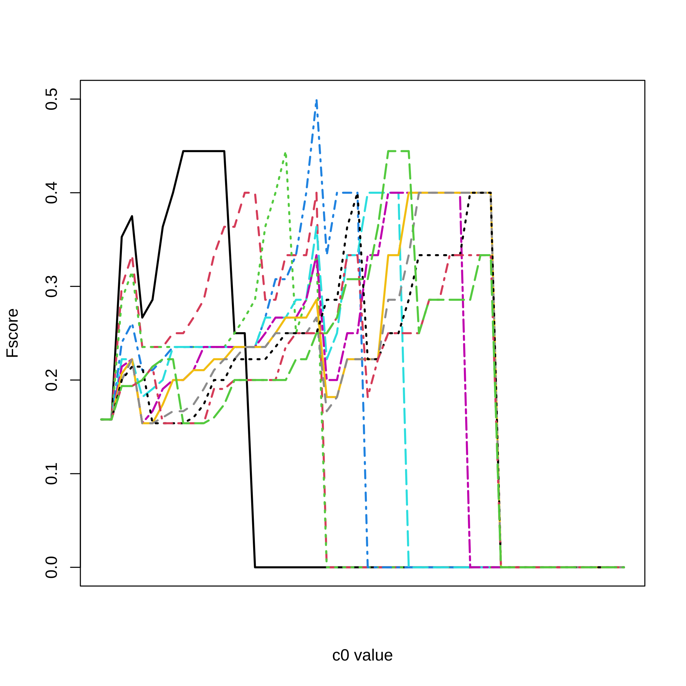

<!-- README.md is generated from README.Rmd. Please edit that file -->


# SelectBoost 

# A General Algorithm to Enhance the Performance of Variable Selection Methods in Correlated Datasets
## Frédéric Bertrand and Myriam Maumy-Bertrand


<!-- badges: start -->
[](https://lifecycle.r-lib.org/articles/stages.html)
[](https://www.repostatus.org/#active)
[](https://github.com/fbertran/SelectBoost/actions)
[](https://codecov.io/gh/fbertran/SelectBoost?branch=master)
[](https://cran.r-project.org/package=SelectBoost)
[](https://cran.r-project.org/package=SelectBoost)
[](https://github.com/fbertran/SelectBoost)
[](https://zenodo.org/badge/latestdoi/136206211)
<!-- badges: end -->


The SelectBoost package implements SelectBoost: a general algorithm to enhance the performance of variable selection methods <https://doi.org/10.1093/bioinformatics/btaa855>, F. Bertrand, I. Aouadi, N. Jung, R. Carapito, L. Vallat, S. Bahram, M. Maumy-Bertrand (2015), 


With the growth of big data, variable selection has become one of the major challenges in statistics. Although many methods have been proposed in the literature their performance in terms of recall and precision are limited in a context where the number of variables by far exceeds the number of observations or in a high correlated setting. 


Results: This package implements a new general algorithm which improves the precision of any existing variable selection method. This algorithm is based on highly intensive simulations and takes into account the correlation structure of the data. Our algorithm can either produce a confidence index for variable selection or it can be used in an experimental design planning perspective.


This website and these examples were created by F. Bertrand and M. Maumy-Bertrand.

## Installation

You can install the released version of SelectBoost from [CRAN](https://CRAN.R-project.org) with:


```r
install.packages("SelectBoost")
```

You can install the development version of SelectBoost from [github](https://github.com) with:


```r
devtools::install_github("fbertran/SelectBoost")
```

If you are a Linux/Unix or a Macos user, you can install a version of SelectBoost with support for `doMC` from [github](https://github.com) with:


```r
devtools::install_github("fbertran/SelectBoost", ref = "doMC")
```


## Examples

### First example: Simulated dataset 

#### Simulating data
Create a correlation matrix for two groups of variable with an intragroup correlation value of $cor\_group$.

```r
library(SelectBoost)
group<-c(rep(1:2,5))
cor_group<-c(.8,.4)
C<-simulation_cor(group,cor_group)
C
#>       [,1] [,2] [,3] [,4] [,5] [,6] [,7] [,8] [,9] [,10]
#>  [1,]  1.0  0.0  0.8  0.0  0.8  0.0  0.8  0.0  0.8   0.0
#>  [2,]  0.0  1.0  0.0  0.4  0.0  0.4  0.0  0.4  0.0   0.4
#>  [3,]  0.8  0.0  1.0  0.0  0.8  0.0  0.8  0.0  0.8   0.0
#>  [4,]  0.0  0.4  0.0  1.0  0.0  0.4  0.0  0.4  0.0   0.4
#>  [5,]  0.8  0.0  0.8  0.0  1.0  0.0  0.8  0.0  0.8   0.0
#>  [6,]  0.0  0.4  0.0  0.4  0.0  1.0  0.0  0.4  0.0   0.4
#>  [7,]  0.8  0.0  0.8  0.0  0.8  0.0  1.0  0.0  0.8   0.0
#>  [8,]  0.0  0.4  0.0  0.4  0.0  0.4  0.0  1.0  0.0   0.4
#>  [9,]  0.8  0.0  0.8  0.0  0.8  0.0  0.8  0.0  1.0   0.0
#> [10,]  0.0  0.4  0.0  0.4  0.0  0.4  0.0  0.4  0.0   1.0
```

Simulate predictor dataset witn $N=100$ observations.

```r
N<-100
X<-simulation_X(N,C)
head(X)
#>            [,1]       [,2]       [,3]       [,4]       [,5]
#> [1,]  0.5209288  1.1663811  0.7381058  1.9386420  1.2039892
#> [2,] -0.5911446 -0.5808995 -0.6760521 -0.1866394 -0.4991862
#> [3,]  0.3138004  1.2618401 -1.0629761  1.0546571 -0.6232203
#> [4,] -1.6016065  0.7522056 -1.3065762 -0.1153790 -1.2832543
#> [5,]  1.1997618 -0.5927740  1.2049216 -0.2614173  0.8886441
#> [6,] -0.1285173  0.6915071 -0.5747171 -0.5331741 -0.6738615
#>             [,6]       [,7]        [,8]        [,9]       [,10]
#> [1,]  1.09261755  1.2291210 -0.36185224  1.37139221  1.08208548
#> [2,] -0.09181285 -0.7150010  0.03889866 -0.93957319  0.99223150
#> [3,]  0.61175006  0.4066837  0.58184774 -0.90972873 -0.30024916
#> [4,] -1.40064179 -0.5220805 -0.19566179 -1.22425000 -0.01566066
#> [5,] -1.18552902  0.2868512 -0.27445380  0.58209245  0.08362703
#> [6,]  0.27887167 -0.3542788  0.33585089 -0.08974916  0.28137704
```

$supp$ set the predictors that will be used to simulate the response (=true predictors). $minB$ and $maxB$ set the minimum and maximum absolute value for a $\beta$ coefficient used in the model for the (true) predictors. $stn$ is a scaling factor for the noise in the response.

```r
supp<-c(1,1,1,0,0,0,0,0,0,0)
minB<-1
maxB<-2
stn<-500
DATA_exemple<-simulation_DATA(X,supp,minB,maxB,stn)
str(DATA_exemple)
#> List of 6
#>  $ X      : num [1:100, 1:10] 0.521 -0.591 0.314 -1.602 1.2 ...
#>  $ Y      : num [1:100] -3.886 2.886 -0.747 3.014 -2.589 ...
#>  $ support: num [1:10] 1 1 1 0 0 0 0 0 0 0
#>  $ beta   : num [1:10] -1.3 -1.69 -1.68 0 0 ...
#>  $ stn    : num 500
#>  $ sigma  : num [1, 1] 0.149
#>  - attr(*, "class")= chr "simuls"
```

#### Selectboost analysis

By default `fastboost` performs $B=100$ resamplings of the model. As a result, we get a matrix with the proportions of selection of each variable at a given resampling level $c_0$. The resampling are designed to take into account the correlation structure of the predictors. The correlation used by default is the Pearson Correlation but any can be passed through the `corrfunc` argument. The $c_0$ value sets the minimum level for which correlations between two predictors are kept in the resampling process. The correlation structure is used to group the variables. Two groups functions `group_func_1`, grouping by thresholding the correlation matrix, and `group_func_2`, grouping using community selection, are available but any can be provided using the `group` argument of the function. The `func` argument is the variable selection function that should be used to assess variable memberships. It  defaults to `lasso_msgps_AICc` but many others, for instance for lasso, elastinet, logistic glmnet and network inference with the [Cascade package](https://fbertran.github.io/Cascade/), are provided:

* lasso_cv_glmnet_bin_min(X, Y)
* lasso_cv_glmnet_bin_1se(X, Y)
* lasso_glmnet_bin_AICc(X, Y)
* lasso_glmnet_bin_BIC(X, Y)
* lasso_cv_lars_min(X, Y)
* lasso_cv_lars_1se(X, Y)
* lasso_cv_glmnet_min(X, Y)
* lasso_cv_glmnet_min_weighted(X, Y, priors)
* lasso_cv_glmnet_1se(X, Y)
* lasso_cv_glmnet_1se_weighted(X, Y, priors)
* lasso_msgps_Cp(X, Y, penalty = "enet")
* lasso_msgps_AICc(X, Y, penalty = "enet")
* lasso_msgps_GCV(X, Y, penalty = "enet")
* lasso_msgps_BIC(X, Y, penalty = "enet")
* enetf_msgps_Cp(X, Y, penalty = "enet", alpha = 0.5)
* enetf_msgps_AICc(X, Y, penalty = "enet", alpha = 0.5)
* enetf_msgps_GCV(X, Y, penalty = "enet", alpha = 0.5)
* enetf_msgps_BIC(X, Y, penalty = "enet", alpha = 0.5)
* lasso_cascade(M, Y, K, eps = 10^-5, cv.fun)

User defined functions can alse be specified in the `func` argument. See the vignette for an example of use with *adaptative* lasso.

Default steps for $c_0$

```r
quantile(abs(cor(DATA_exemple$X))[abs(cor(DATA_exemple$X))!=1],(0:10)/10)
#>          0%         10%         20%         30%         40% 
#> 0.005930982 0.029182132 0.049930305 0.064747556 0.091392033 
#>         50%         60%         70%         80%         90% 
#> 0.140159651 0.381723470 0.452891781 0.813991109 0.826697022 
#>        100% 
#> 0.872194572
```


```r
result.boost.raw = fastboost(DATA_exemple$X, DATA_exemple$Y)
result.boost.raw
#>               1    2    3    4    5    6    7    8    9   10
#> c0 = 1     1.00 1.00 1.00 0.00 0.00 0.00 0.00 0.00 1.00 0.00
#> c0 = 0.872 1.00 1.00 1.00 0.00 0.00 0.00 0.00 0.00 1.00 0.00
#> c0 = 0.827 1.00 1.00 1.00 0.23 1.00 0.99 0.42 0.33 1.00 0.43
#> c0 = 0.814 0.99 1.00 1.00 0.29 1.00 0.98 0.97 0.60 1.00 0.41
#> c0 = 0.451 0.96 1.00 0.96 0.98 0.93 0.93 0.93 0.33 0.96 0.96
#> c0 = 0.382 0.98 0.77 0.98 0.95 0.91 0.96 0.97 0.86 0.98 1.00
#> c0 = 0.14  0.99 0.96 0.97 0.82 0.97 0.86 0.97 0.90 0.68 0.94
#> c0 = 0.091 0.86 0.92 0.95 0.85 1.00 0.90 1.00 0.87 0.79 0.93
#> c0 = 0.065 0.87 0.96 0.86 0.80 1.00 0.96 1.00 0.93 0.82 0.85
#> c0 = 0.05  0.99 0.73 0.99 0.78 1.00 0.91 1.00 0.94 0.98 0.60
#> c0 = 0.03  0.99 0.75 0.97 0.73 0.99 0.55 1.00 0.95 0.98 0.60
#> c0 = 0.006 0.99 0.80 1.00 0.70 1.00 0.76 0.99 0.67 0.98 0.52
#> c0 = 0     0.84 0.84 0.84 0.89 0.91 0.87 0.83 0.83 0.89 0.91
#> attr(,"c0.seq")
#>              100%      90%      80%      70%      60%      50% 
#> 1.000000 0.872195 0.826637 0.813991 0.451330 0.381723 0.140160 
#>      40%      30%      20%      10%       0%          
#> 0.091392 0.065416 0.049930 0.030077 0.005931 0.000000 
#> attr(,"c0lim")
#> [1] TRUE
#> attr(,"steps.seq")
#>  [1] 1.0 0.9 0.8 0.7 0.6 0.5 0.4 0.3 0.2 0.1 0.0
#> attr(,"typeboost")
#> [1] "fastboost"
#> attr(,"limi_alea")
#> [1] NA
#> attr(,"B")
#> [1] 100
#> attr(,"class")
#> [1] "selectboost"
```

Applying a non increasing post-processing step to the results improves the performance of the algorithm. 

```r
result.boost = force.non.inc(result.boost.raw)
result.boost
#>               1    2    3 4 5 6 7 8    9 10
#>            1.00 1.00 1.00 0 0 0 0 0 1.00  0
#> c0 = 0.872 1.00 1.00 1.00 0 0 0 0 0 1.00  0
#> c0 = 0.827 1.00 1.00 1.00 0 0 0 0 0 1.00  0
#> c0 = 0.814 0.99 1.00 1.00 0 0 0 0 0 1.00  0
#> c0 = 0.451 0.96 1.00 0.96 0 0 0 0 0 0.96  0
#> c0 = 0.382 0.96 0.77 0.96 0 0 0 0 0 0.96  0
#> c0 = 0.14  0.96 0.77 0.95 0 0 0 0 0 0.66  0
#> c0 = 0.091 0.83 0.73 0.93 0 0 0 0 0 0.66  0
#> c0 = 0.065 0.83 0.73 0.84 0 0 0 0 0 0.66  0
#> c0 = 0.05  0.83 0.50 0.84 0 0 0 0 0 0.66  0
#> c0 = 0.03  0.83 0.50 0.82 0 0 0 0 0 0.66  0
#> c0 = 0.006 0.83 0.50 0.82 0 0 0 0 0 0.66  0
#> c0 = 0     0.68 0.50 0.66 0 0 0 0 0 0.57  0
#> attr(,"c0.seq")
#>              100%      90%      80%      70%      60%      50% 
#> 1.000000 0.872195 0.826637 0.813991 0.451330 0.381723 0.140160 
#>      40%      30%      20%      10%       0%          
#> 0.091392 0.065416 0.049930 0.030077 0.005931 0.000000 
#> attr(,"c0lim")
#> [1] TRUE
#> attr(,"steps.seq")
#>  [1] 1.0 0.9 0.8 0.7 0.6 0.5 0.4 0.3 0.2 0.1 0.0
#> attr(,"typeboost")
#> [1] "fastboost"
#> attr(,"limi_alea")
#> [1] NA
#> attr(,"B")
#> [1] 100
#> attr(,"class")
#> [1] "fastboost"
```

#### Comparing true and selected predictors

We can compute, for all the $c_0$ values and for a selection threshold varying from $1$ to $0.5$ by $0.05$ steps, the recall (sensitivity), the precision (positive predictive value), as well as several Fscores ($F_1$ harmonic mean of recall and precision, $F_{1/2}$ and $F_2$ two weighted harmonic means of recall and precision).

```r
All_res=NULL
#Here are the cutoff level tested
for(lev in 20:10/20){
F_score=NULL
for(u in 1:nrow(result.boost)){
	F_score<-rbind(F_score,SelectBoost::compsim(DATA_exemple,result.boost[u,],
	                                            level=lev)[1:5])
}
All_res <- abind::abind(All_res,F_score,along=3)
}
```

For a selection threshold equal to $0.90$, all the $c_0$ values and the 5 criteria.

```r
matplot(1:nrow(result.boost),All_res[,,3],type="l",ylab="criterion value",
        xlab="c0 value",xaxt="n",lwd=2)
axis(1, at=1:length(attr(result.boost,"c0.seq")),  
     labels=round(attr(result.boost,"c0.seq"),3))
legend(x="topright",legend=c("recall (sensitivity)",
      "precision (positive predictive value)","non-weighted Fscore",
      "F1/2 weighted Fscore","F2 weighted Fscore"),lty=1:5,col=1:5,lwd=2)
```


Fscores for all selection thresholds and all the $c_0$ values.

```r
matplot(1:nrow(result.boost),All_res[,3,],type="l",ylab="Fscore",
        xlab="c0 value",xaxt="n",lwd=2,col=1:11,lty=1:11)
axis(1, at=1:length(attr(result.boost,"c0.seq")),
     labels=round(attr(result.boost,"c0.seq"),3))
legend(x="topright",legend=(20:11)/20,lty=1:11,col=1:11,lwd=2,
       title="Threshold")
```


#### Complete Selectboost analysis

What is the maximum number of steps ?

```r
all.cors=unique(abs(cor(DATA_exemple$X))[abs(cor(DATA_exemple$X))!=1])
length(all.cors)
#> [1] 45
```

With such datasets, we can perform all the 45 steps for the Selectboost analysis. We switch to  community analysis from the [igraph package](https://igraph.org) as the grouping variable function.

```r
groups.seq.f2=lapply(sort(unique(c(1,all.cors,0)),decreasing=TRUE), function(c0)
  if(c0!=1){lapply(group_func_2(cor(DATA_exemple$X),c0)$communities,sort)}
  else {lapply(group_func_2(cor(DATA_exemple$X),c0),sort)})
names(groups.seq.f2)<-sort(unique(c(1,all.cors,0)),decreasing=TRUE)
groups.seq.f2[[1]]
#> [[1]]
#> [1] 1
#> 
#> [[2]]
#> [1] 2
#> 
#> [[3]]
#> [1] 3
#> 
#> [[4]]
#> [1] 4
#> 
#> [[5]]
#> [1] 5
#> 
#> [[6]]
#> [1] 6
#> 
#> [[7]]
#> [1] 7
#> 
#> [[8]]
#> [1] 8
#> 
#> [[9]]
#> [1] 9
#> 
#> [[10]]
#> [1] 10
```


```r
result.boost.45.raw = fastboost(DATA_exemple$X, DATA_exemple$Y, B=100,
                    steps.seq=sort(unique(all.cors),decreasing=TRUE))
result.boost.45.raw
#>               1    2    3    4    5    6    7    8    9   10
#> c0 = 1     1.00 1.00 1.00 0.00 0.00 0.00 0.00 0.00 1.00 0.00
#> c0 = 0.872 1.00 1.00 1.00 0.00 0.00 0.00 0.00 0.00 1.00 0.00
#> c0 = 0.849 1.00 1.00 1.00 0.50 0.99 0.93 0.49 0.63 0.99 0.69
#> c0 = 0.834 1.00 1.00 1.00 0.29 0.99 0.97 0.34 0.48 0.54 0.61
#> c0 = 0.827 1.00 1.00 1.00 0.21 1.00 0.99 0.33 0.37 0.70 0.38
#> c0 = 0.827 1.00 1.00 1.00 0.31 1.00 0.98 0.46 0.35 1.00 0.42
#> c0 = 0.827 1.00 1.00 1.00 0.18 1.00 0.99 0.36 0.35 1.00 0.41
#> c0 = 0.826 0.98 1.00 1.00 0.32 1.00 0.98 0.51 0.49 1.00 0.35
#> c0 = 0.824 1.00 1.00 1.00 0.24 1.00 0.97 0.58 0.43 1.00 0.43
#> c0 = 0.82  1.00 1.00 0.98 0.36 0.99 0.96 0.97 0.53 1.00 0.38
#> c0 = 0.812 1.00 1.00 0.99 0.32 0.99 0.95 0.95 0.60 1.00 0.44
#> c0 = 0.562 1.00 1.00 0.99 0.20 1.00 0.96 1.00 0.66 0.99 0.27
#> c0 = 0.556 0.99 1.00 0.98 0.98 0.97 0.39 0.95 0.82 0.99 0.92
#> c0 = 0.526 0.95 1.00 0.97 0.95 0.98 0.36 0.97 0.75 0.97 0.93
#> c0 = 0.453 0.95 1.00 0.98 0.94 1.00 0.44 0.96 0.72 0.97 0.97
#> c0 = 0.445 0.96 1.00 0.96 1.00 1.00 0.92 0.91 0.53 0.99 0.77
#> c0 = 0.443 0.97 0.92 0.95 0.99 0.97 0.94 0.98 0.40 0.96 1.00
#> c0 = 0.43  0.97 0.89 0.99 0.99 0.97 0.92 0.96 0.32 0.98 0.99
#> c0 = 0.411 0.97 0.95 0.96 0.97 0.97 0.96 0.97 0.44 0.97 0.98
#> c0 = 0.362 0.98 0.86 0.93 0.84 0.97 0.95 0.98 0.93 0.94 0.98
#> c0 = 0.353 0.94 0.90 0.99 0.87 0.92 0.98 0.97 0.86 0.97 0.90
#> c0 = 0.208 0.96 0.91 0.95 0.86 0.97 0.96 0.96 0.85 0.96 0.95
#> c0 = 0.153 0.99 0.92 0.98 0.84 0.97 0.87 0.97 0.97 0.75 0.93
#> c0 = 0.14  1.00 0.95 0.98 0.89 0.97 0.86 1.00 0.94 0.74 0.92
#> c0 = 0.138 1.00 0.95 0.89 0.85 1.00 0.89 0.98 0.90 0.68 0.91
#> c0 = 0.127 0.93 0.95 0.90 0.85 1.00 0.92 1.00 0.88 0.78 0.89
#> c0 = 0.097 0.87 0.88 0.89 0.85 1.00 0.90 1.00 0.88 0.85 0.94
#> c0 = 0.093 0.80 0.89 0.91 0.90 1.00 0.91 1.00 0.88 0.88 0.89
#> c0 = 0.089 0.85 0.93 0.92 0.91 1.00 0.89 1.00 0.90 0.78 0.94
#> c0 = 0.088 0.85 0.88 0.93 0.86 1.00 0.93 1.00 0.89 0.85 0.91
#> c0 = 0.076 0.86 0.90 0.99 0.86 1.00 0.94 1.00 0.85 0.71 0.89
#> c0 = 0.068 0.93 0.89 0.85 0.89 1.00 0.86 1.00 0.95 0.73 0.92
#> c0 = 0.065 0.82 0.93 0.85 0.89 1.00 0.94 1.00 0.89 0.80 0.92
#> c0 = 0.061 0.84 0.91 0.85 0.87 1.00 0.90 1.00 0.91 0.79 0.89
#> c0 = 0.061 0.90 0.80 0.89 0.87 0.96 0.92 1.00 0.90 0.83 0.82
#> c0 = 0.057 0.90 0.82 0.88 0.84 0.97 0.95 1.00 0.92 0.90 0.79
#> c0 = 0.051 0.99 0.69 0.95 0.73 1.00 0.89 1.00 0.90 0.97 0.51
#> c0 = 0.045 0.98 0.68 0.98 0.75 0.99 0.68 1.00 0.88 0.95 0.64
#> c0 = 0.039 0.98 0.69 0.99 0.82 0.98 0.69 1.00 0.95 0.98 0.62
#> c0 = 0.032 1.00 0.72 0.99 0.72 0.99 0.64 1.00 0.93 0.98 0.58
#> c0 = 0.031 0.97 0.79 0.99 0.70 0.99 0.62 1.00 0.91 0.98 0.69
#> c0 = 0.029 0.98 0.72 0.99 0.75 0.98 0.66 1.00 0.90 0.95 0.63
#> c0 = 0.029 0.97 0.71 0.98 0.75 1.00 0.64 1.00 0.93 1.00 0.57
#> c0 = 0.019 1.00 0.76 1.00 0.71 1.00 0.70 1.00 0.73 0.98 0.61
#> c0 = 0.015 1.00 0.82 1.00 0.82 1.00 0.80 1.00 0.67 0.97 0.58
#> c0 = 0.006 1.00 0.75 1.00 0.82 1.00 0.69 1.00 0.66 0.98 0.58
#> c0 = 0     0.89 0.87 0.77 0.82 0.87 0.83 0.91 0.93 0.81 0.87
#> attr(,"c0.seq")
#>  [1] 1.000000 0.872195 0.849426 0.834458 0.827004 0.826697 0.826546
#>  [8] 0.825640 0.824288 0.820456 0.812375 0.562051 0.555662 0.526161
#> [15] 0.452892 0.445081 0.443186 0.430309 0.411234 0.362050 0.353205
#> [22] 0.207584 0.153294 0.140160 0.137957 0.126956 0.097160 0.093091
#> [29] 0.088844 0.087657 0.075975 0.068089 0.064748 0.061425 0.060726
#> [36] 0.057481 0.051102 0.045243 0.038514 0.032463 0.031419 0.029182
#> [43] 0.028934 0.019110 0.014646 0.005931 0.000000
#> attr(,"c0lim")
#> [1] TRUE
#> attr(,"steps.seq")
#>  [1] 0.000000000 0.872194572 0.849426445 0.834458305 0.827004402
#>  [6] 0.826697022 0.826545743 0.825640327 0.824287871 0.820456146
#> [11] 0.812374850 0.562050868 0.555662029 0.526161240 0.452891781
#> [16] 0.445081387 0.443186206 0.430308684 0.411233622 0.362050035
#> [21] 0.353204555 0.207583541 0.153294209 0.140159651 0.137957256
#> [26] 0.126956057 0.097160048 0.093090645 0.088844115 0.087657412
#> [31] 0.075974774 0.068089466 0.064747556 0.061424861 0.060726449
#> [36] 0.057480918 0.051102123 0.045243034 0.038514346 0.032463399
#> [41] 0.031419329 0.029182132 0.028934334 0.019110051 0.014646231
#> [46] 0.005930982 1.000000000
#> attr(,"typeboost")
#> [1] "fastboost"
#> attr(,"limi_alea")
#> [1] NA
#> attr(,"B")
#> [1] 100
#> attr(,"class")
#> [1] "selectboost"
```

Applying a non increasing post-processing step to the results improves the performance of the algorithm. 

```r
result.boost.45 = force.non.inc(result.boost.45.raw)
result.boost.45
#>               1    2    3 4 5 6 7 8    9 10
#>            1.00 1.00 1.00 0 0 0 0 0 1.00  0
#> c0 = 0.872 1.00 1.00 1.00 0 0 0 0 0 1.00  0
#> c0 = 0.849 1.00 1.00 1.00 0 0 0 0 0 0.99  0
#> c0 = 0.834 1.00 1.00 1.00 0 0 0 0 0 0.54  0
#> c0 = 0.827 1.00 1.00 1.00 0 0 0 0 0 0.54  0
#> c0 = 0.827 1.00 1.00 1.00 0 0 0 0 0 0.54  0
#> c0 = 0.827 1.00 1.00 1.00 0 0 0 0 0 0.54  0
#> c0 = 0.826 0.98 1.00 1.00 0 0 0 0 0 0.54  0
#> c0 = 0.824 0.98 1.00 1.00 0 0 0 0 0 0.54  0
#> c0 = 0.82  0.98 1.00 0.98 0 0 0 0 0 0.54  0
#> c0 = 0.812 0.98 1.00 0.98 0 0 0 0 0 0.54  0
#> c0 = 0.562 0.98 1.00 0.98 0 0 0 0 0 0.53  0
#> c0 = 0.556 0.97 1.00 0.97 0 0 0 0 0 0.53  0
#> c0 = 0.526 0.93 1.00 0.96 0 0 0 0 0 0.51  0
#> c0 = 0.453 0.93 1.00 0.96 0 0 0 0 0 0.51  0
#> c0 = 0.445 0.93 1.00 0.94 0 0 0 0 0 0.51  0
#> c0 = 0.443 0.93 0.92 0.93 0 0 0 0 0 0.48  0
#> c0 = 0.43  0.93 0.89 0.93 0 0 0 0 0 0.48  0
#> c0 = 0.411 0.93 0.89 0.90 0 0 0 0 0 0.47  0
#> c0 = 0.362 0.93 0.80 0.87 0 0 0 0 0 0.44  0
#> c0 = 0.353 0.89 0.80 0.87 0 0 0 0 0 0.44  0
#> c0 = 0.208 0.89 0.80 0.83 0 0 0 0 0 0.43  0
#> c0 = 0.153 0.89 0.80 0.83 0 0 0 0 0 0.22  0
#> c0 = 0.14  0.89 0.80 0.83 0 0 0 0 0 0.21  0
#> c0 = 0.138 0.89 0.80 0.74 0 0 0 0 0 0.15  0
#> c0 = 0.127 0.82 0.80 0.74 0 0 0 0 0 0.15  0
#> c0 = 0.097 0.76 0.73 0.73 0 0 0 0 0 0.15  0
#> c0 = 0.093 0.69 0.73 0.73 0 0 0 0 0 0.15  0
#> c0 = 0.089 0.69 0.73 0.73 0 0 0 0 0 0.05  0
#> c0 = 0.088 0.69 0.68 0.73 0 0 0 0 0 0.05  0
#> c0 = 0.076 0.69 0.68 0.73 0 0 0 0 0 0.00  0
#> c0 = 0.068 0.69 0.67 0.59 0 0 0 0 0 0.00  0
#> c0 = 0.065 0.58 0.67 0.59 0 0 0 0 0 0.00  0
#> c0 = 0.061 0.58 0.65 0.59 0 0 0 0 0 0.00  0
#> c0 = 0.061 0.58 0.54 0.59 0 0 0 0 0 0.00  0
#> c0 = 0.057 0.58 0.54 0.58 0 0 0 0 0 0.00  0
#> c0 = 0.051 0.58 0.41 0.58 0 0 0 0 0 0.00  0
#> c0 = 0.045 0.57 0.40 0.58 0 0 0 0 0 0.00  0
#> c0 = 0.039 0.57 0.40 0.58 0 0 0 0 0 0.00  0
#> c0 = 0.032 0.57 0.40 0.58 0 0 0 0 0 0.00  0
#> c0 = 0.031 0.54 0.40 0.58 0 0 0 0 0 0.00  0
#> c0 = 0.029 0.54 0.33 0.58 0 0 0 0 0 0.00  0
#> c0 = 0.029 0.53 0.32 0.57 0 0 0 0 0 0.00  0
#> c0 = 0.019 0.53 0.32 0.57 0 0 0 0 0 0.00  0
#> c0 = 0.015 0.53 0.32 0.57 0 0 0 0 0 0.00  0
#> c0 = 0.006 0.53 0.25 0.57 0 0 0 0 0 0.00  0
#> c0 = 0     0.42 0.25 0.34 0 0 0 0 0 0.00  0
#> attr(,"c0.seq")
#>  [1] 1.000000 0.872195 0.849426 0.834458 0.827004 0.826697 0.826546
#>  [8] 0.825640 0.824288 0.820456 0.812375 0.562051 0.555662 0.526161
#> [15] 0.452892 0.445081 0.443186 0.430309 0.411234 0.362050 0.353205
#> [22] 0.207584 0.153294 0.140160 0.137957 0.126956 0.097160 0.093091
#> [29] 0.088844 0.087657 0.075975 0.068089 0.064748 0.061425 0.060726
#> [36] 0.057481 0.051102 0.045243 0.038514 0.032463 0.031419 0.029182
#> [43] 0.028934 0.019110 0.014646 0.005931 0.000000
#> attr(,"c0lim")
#> [1] TRUE
#> attr(,"steps.seq")
#>  [1] 0.000000000 0.872194572 0.849426445 0.834458305 0.827004402
#>  [6] 0.826697022 0.826545743 0.825640327 0.824287871 0.820456146
#> [11] 0.812374850 0.562050868 0.555662029 0.526161240 0.452891781
#> [16] 0.445081387 0.443186206 0.430308684 0.411233622 0.362050035
#> [21] 0.353204555 0.207583541 0.153294209 0.140159651 0.137957256
#> [26] 0.126956057 0.097160048 0.093090645 0.088844115 0.087657412
#> [31] 0.075974774 0.068089466 0.064747556 0.061424861 0.060726449
#> [36] 0.057480918 0.051102123 0.045243034 0.038514346 0.032463399
#> [41] 0.031419329 0.029182132 0.028934334 0.019110051 0.014646231
#> [46] 0.005930982 1.000000000
#> attr(,"typeboost")
#> [1] "fastboost"
#> attr(,"limi_alea")
#> [1] NA
#> attr(,"B")
#> [1] 100
#> attr(,"class")
#> [1] "fastboost"
```

#### Comparing true and selected predictors
Due to the effect of the correlated resampling, the proportion of selection for a variable may increase, especially if it is a variable that is often discarded. Hence, one should force those proportions of selection to be non-increasing. It is one of the results of the $summary$ function for the $selectboost$ class.


```r
dec.result.boost.45 <- summary(result.boost.45)$selectboost_result.dec
#> Error in summary(result.boost.45)$selectboost_result.dec: $ operator is invalid for atomic vectors
dec.result.boost.45
#> Error in eval(expr, envir, enclos): objet 'dec.result.boost.45' introuvable
```

Let's compute again, for all the $c_0$ values, the recall (sensitivity), precision (positive predictive value), and several Fscores ($F_1$ harmonic mean of recall and precision, $F_{1/2}$ and $F_2$ two weighted harmonic means of recall and precision).

```r
All_res.45=NULL
#Here are the cutoff level tested
for(lev.45 in 20:10/20){
F_score.45=NULL
for(u.45 in 1:nrow(dec.result.boost.45
)){
	F_score.45<-rbind(F_score.45,SelectBoost::compsim(DATA_exemple,
	           dec.result.boost.45[u.45,],level=lev.45)[1:5])
}
All_res.45 <- abind::abind(All_res.45,F_score.45,along=3)
}
#> Error in nrow(dec.result.boost.45): objet 'dec.result.boost.45' introuvable
```

For a selection threshold equal to $0.90$, all the $c_0$ values and the 5 criteria.

```r
matplot(1:nrow(dec.result.boost.45),All_res.45[,,3],type="l",
        ylab="criterion value",xlab="c0 value",xaxt="n",lwd=2)
#> Error in nrow(dec.result.boost.45): objet 'dec.result.boost.45' introuvable
axis(1, at=1:length(attr(result.boost.45,"c0.seq")), 
     labels=round(attr(result.boost.45,"c0.seq"),3))
#> Error in axis(1, at = 1:length(attr(result.boost.45, "c0.seq")), labels = round(attr(result.boost.45, : plot.new has not been called yet
legend(x="topright",legend=c("recall (sensitivity)",
       "precision (positive predictive value)","non-weighted Fscore",
       "F1/2 weighted Fscore","F2 weighted Fscore"),
       lty=1:5,col=1:5,lwd=2)
#> Error in strwidth(legend, units = "user", cex = cex, font = text.font): plot.new has not been called yet
```

Fscores for all selection thresholds and all the $c_0$ values.

```r
matplot(1:nrow(dec.result.boost.45),All_res.45[,3,],type="l",
        ylab="Fscore",xlab="c0 value",xaxt="n",lwd=2,col=1:11,lty=1:11)
#> Error in nrow(dec.result.boost.45): objet 'dec.result.boost.45' introuvable
axis(1, at=1:length(attr(result.boost.45,"c0.seq")), 
     labels=round(attr(result.boost.45,"c0.seq"),3))
#> Error in axis(1, at = 1:length(attr(result.boost.45, "c0.seq")), labels = round(attr(result.boost.45, : plot.new has not been called yet
legend(x="topright",legend=(20:11)/20,lty=1:11,col=1:11,lwd=2,
       title="Threshold")
#> Error in strwidth(legend, units = "user", cex = cex, font = text.font): plot.new has not been called yet
```

#### Confidence indices.

First compute the highest $c_0$ value for which the proportion of selection is under the threshold $thr$. In that analysis, we set $thr=1$.

```r
thr=1
index.last.c0=apply(dec.result.boost.45>=thr,2,which.min)-1
#> Error in apply(dec.result.boost.45 >= thr, 2, which.min): objet 'dec.result.boost.45' introuvable
index.last.c0
#> Error in eval(expr, envir, enclos): objet 'index.last.c0' introuvable
```

Define some colorRamp ranging from blue (high confidence) to red (low confidence).

```r
jet.colors <-
  colorRamp(rev(c(
  "blue", "#007FFF", "#FF7F00", "red", "#7F0000")))
```


```r
rownames(dec.result.boost.45)[index.last.c0]
#> Error in rownames(dec.result.boost.45): objet 'dec.result.boost.45' introuvable
attr(result.boost.45,"c0.seq")[index.last.c0]
#> Error in eval(expr, envir, enclos): objet 'index.last.c0' introuvable
confidence.indices = c(0,1-attr(result.boost.45,"c0.seq"))[index.last.c0+1]
#> Error in eval(expr, envir, enclos): objet 'index.last.c0' introuvable
confidence.indices
#> Error in eval(expr, envir, enclos): objet 'confidence.indices' introuvable
barplot(confidence.indices,col=rgb(jet.colors(confidence.indices), maxColorValue = 255), 
        names.arg=colnames(result.boost.45), ylim=c(0,1))
#> Error in barplot(confidence.indices, col = rgb(jet.colors(confidence.indices), : objet 'confidence.indices' introuvable
```

First compute the highest $c_0$ value for which the proportion of selection is under the threshold $thr$. In that analysis, we set $thr=1$.

```r
thr=.9
index.last.c0=apply(dec.result.boost.45>=thr,2,which.min)-1
#> Error in apply(dec.result.boost.45 >= thr, 2, which.min): objet 'dec.result.boost.45' introuvable
index.last.c0
#> Error in eval(expr, envir, enclos): objet 'index.last.c0' introuvable
```


```r
rownames(dec.result.boost.45)[index.last.c0]
#> Error in rownames(dec.result.boost.45): objet 'dec.result.boost.45' introuvable
attr(result.boost.45,"c0.seq")[index.last.c0]
#> Error in eval(expr, envir, enclos): objet 'index.last.c0' introuvable
confidence.indices = c(0,1-attr(result.boost.45,"c0.seq"))[index.last.c0+1]
#> Error in eval(expr, envir, enclos): objet 'index.last.c0' introuvable
confidence.indices
#> Error in eval(expr, envir, enclos): objet 'confidence.indices' introuvable
barplot(confidence.indices,col=rgb(jet.colors(confidence.indices), maxColorValue = 255), 
        names.arg=colnames(result.boost.45), ylim=c(0,1))
#> Error in barplot(confidence.indices, col = rgb(jet.colors(confidence.indices), : objet 'confidence.indices' introuvable
```


### Second example: biological network data
#### Simulating data using real data

The loop should be used to generate at least 100 datasets and then average the results.

```r
require(CascadeData)
data(micro_S)
data(micro_US)
micro_US<-Cascade::as.micro_array(micro_US,c(60,90,240,390),6)
micro_S<-Cascade::as.micro_array(micro_S,c(60,90,240,390),6)
S<-Cascade::geneSelection(list(micro_S,micro_US),list("condition",c(1,2),1),-1)
rm(micro_S);data(micro_S)
Sel<-micro_S[S@name,]

supp<-c(1,1,1,1,1,rep(0,95))
minB<-1
maxB<-2
stn<-5

set.seed(3141)
for(i in 1:1){
X<-t(as.matrix(Sel[sample(1:1300 ,100),]))
Xnorm<-t(t(X)/sqrt(diag(t(X)%*%X)))
assign(paste("DATA_exemple3_nb_",i,sep=""),simulation_DATA(Xnorm,supp,minB,maxB,stn))
}
```


```r
all.cors.micro=unique(abs(cor(DATA_exemple3_nb_1$X))[abs(cor(
  DATA_exemple3_nb_1$X))!=1])
length(unique(all.cors.micro))
#> [1] 4950
quantile(all.cors.micro,.90)
#>       90% 
#> 0.6938712
```


```r
top10p.all.cors.micro=all.cors.micro[all.cors.micro>=quantile(all.cors.micro,.90)]
c0seq.top10p.all.cors.micro=quantile(top10p.all.cors.micro,rev(
  seq(0,length(top10p.all.cors.micro),length.out = 50)/495))
c0seq.top10p.all.cors.micro
#>      100% 97.95918% 95.91837% 93.87755% 91.83673% 89.79592% 
#> 0.9486685 0.9184348 0.8993626 0.8867508 0.8783368 0.8688498 
#>  87.7551% 85.71429% 83.67347% 81.63265% 79.59184% 77.55102% 
#> 0.8597920 0.8517712 0.8441046 0.8370590 0.8315722 0.8248607 
#>  75.5102% 73.46939% 71.42857% 69.38776% 67.34694% 65.30612% 
#> 0.8193079 0.8124198 0.8084936 0.8038357 0.7967669 0.7920303 
#> 63.26531% 61.22449% 59.18367% 57.14286% 55.10204% 53.06122% 
#> 0.7885399 0.7842243 0.7803654 0.7783504 0.7750129 0.7711674 
#> 51.02041% 48.97959% 46.93878% 44.89796% 42.85714% 40.81633% 
#> 0.7687731 0.7663441 0.7606838 0.7577961 0.7553123 0.7524554 
#> 38.77551% 36.73469% 34.69388% 32.65306% 30.61224% 28.57143% 
#> 0.7493711 0.7456580 0.7431055 0.7403313 0.7377508 0.7345842 
#> 26.53061%  24.4898% 22.44898% 20.40816% 18.36735% 16.32653% 
#> 0.7313349 0.7296512 0.7264820 0.7246836 0.7229066 0.7198827 
#> 14.28571%  12.2449% 10.20408% 8.163265% 6.122449% 4.081633% 
#> 0.7158667 0.7122053 0.7076771 0.7044341 0.7009353 0.6991250 
#> 2.040816%        0% 
#> 0.6955766 0.6939670
```


```r
result.boost.micro_nb1 = fastboost(DATA_exemple3_nb_1$X, DATA_exemple3_nb_1$Y, B=100, 
                                   steps.seq=c0seq.top10p.all.cors.micro)
result.boost.micro_nb1
#>               1    2    3    4    5    6    7    8    9   10   11
#> c0 = 1     1.00 1.00 1.00 1.00 1.00 0.00 0.00 0.00 0.00 0.00 0.00
#> c0 = 0.949 1.00 1.00 1.00 1.00 1.00 0.00 0.00 0.00 0.00 0.00 0.00
#> c0 = 0.918 1.00 1.00 1.00 0.96 1.00 0.03 0.04 0.08 0.00 0.00 0.00
#> c0 = 0.899 1.00 1.00 1.00 0.90 1.00 0.04 0.02 0.16 0.11 0.03 0.00
#> c0 = 0.887 1.00 1.00 0.64 0.73 1.00 0.09 0.06 0.18 0.13 0.08 0.12
#> c0 = 0.878 1.00 1.00 0.63 0.82 1.00 0.07 0.03 0.11 0.10 0.08 0.12
#> c0 = 0.869 1.00 1.00 0.63 0.75 1.00 0.07 0.06 0.16 0.14 0.14 0.45
#> c0 = 0.86  1.00 1.00 0.54 0.66 1.00 0.18 0.08 0.16 0.19 0.25 0.49
#> c0 = 0.852 1.00 1.00 0.47 0.69 1.00 0.07 0.08 0.14 0.18 0.15 0.62
#> c0 = 0.844 1.00 1.00 0.51 0.81 1.00 0.17 0.07 0.17 0.20 0.21 0.41
#>              12   13   14   15   16   17   18   19   20   21   22
#> c0 = 1     1.00 0.00 0.00 1.00 0.00 0.00 1.00 1.00 0.00 0.00 0.00
#> c0 = 0.949 1.00 0.00 0.00 1.00 0.00 0.00 1.00 1.00 0.00 0.00 0.00
#> c0 = 0.918 0.73 0.25 0.00 0.91 0.08 0.04 0.90 1.00 0.23 0.01 0.27
#> c0 = 0.899 0.64 0.37 0.00 0.89 0.04 0.04 0.93 1.00 0.36 0.09 0.19
#> c0 = 0.887 0.70 0.27 0.01 0.87 0.02 0.07 0.91 1.00 0.37 0.10 0.29
#> c0 = 0.878 0.78 0.27 0.03 0.86 0.07 0.04 0.93 0.99 0.44 0.15 0.22
#> c0 = 0.869 0.70 0.38 0.02 0.85 0.06 0.10 0.94 0.99 0.31 0.16 0.29
#> c0 = 0.86  0.73 0.45 0.33 0.85 0.15 0.13 0.89 0.98 0.27 0.13 0.30
#> c0 = 0.852 0.74 0.41 0.33 0.92 0.11 0.16 0.91 1.00 0.20 0.19 0.26
#> c0 = 0.844 0.69 0.36 0.32 0.88 0.15 0.15 0.89 0.97 0.27 0.24 0.36
#>              23   24   25   26   27   28   29   30   31   32   33
#> c0 = 1     0.00 0.00 1.00 0.00 1.00 0.00 1.00 0.00 1.00 0.00 0.00
#> c0 = 0.949 0.00 0.00 1.00 0.00 1.00 0.00 1.00 0.00 1.00 0.00 0.00
#> c0 = 0.918 0.06 0.04 0.89 0.08 0.03 0.31 1.00 0.04 0.77 0.00 0.33
#> c0 = 0.899 0.07 0.05 0.85 0.08 0.04 0.31 1.00 0.02 0.91 0.00 0.52
#> c0 = 0.887 0.09 0.03 0.75 0.06 0.05 0.39 1.00 0.01 0.86 0.48 0.57
#> c0 = 0.878 0.16 0.06 0.80 0.15 0.07 0.41 0.98 0.08 0.84 0.47 0.54
#> c0 = 0.869 0.22 0.10 0.78 0.14 0.09 0.49 1.00 0.06 0.85 0.46 0.60
#> c0 = 0.86  0.16 0.06 0.80 0.19 0.13 0.46 0.97 0.07 0.84 0.44 0.70
#> c0 = 0.852 0.22 0.09 0.80 0.26 0.08 0.41 0.96 0.07 0.87 0.35 0.61
#> c0 = 0.844 0.26 0.14 0.75 0.27 0.15 0.43 0.96 0.11 0.85 0.50 0.58
#>              34   35   36   37   38   39   40   41   42   43   44
#> c0 = 1     1.00 1.00 1.00 0.00 0.00 1.00 0.00 0.00 0.00 0.00 0.00
#> c0 = 0.949 1.00 1.00 1.00 0.00 0.00 1.00 0.00 0.00 0.00 0.00 0.00
#> c0 = 0.918 1.00 1.00 1.00 0.00 0.00 0.84 0.00 0.00 0.00 0.20 0.93
#> c0 = 0.899 1.00 1.00 0.99 0.00 0.01 0.88 0.01 0.00 0.00 0.08 0.85
#> c0 = 0.887 1.00 1.00 0.99 0.01 0.00 0.84 0.03 0.00 0.00 0.14 0.86
#> c0 = 0.878 1.00 1.00 1.00 0.05 0.00 0.81 0.05 0.00 0.03 0.16 0.85
#> c0 = 0.869 1.00 1.00 1.00 0.05 0.02 0.71 0.14 0.00 0.01 0.27 0.70
#> c0 = 0.86  1.00 1.00 0.98 0.05 0.03 0.66 0.12 0.01 0.10 0.33 0.35
#> c0 = 0.852 1.00 1.00 0.99 0.26 0.02 0.70 0.19 0.00 0.06 0.31 0.36
#> c0 = 0.844 0.99 1.00 0.98 0.14 0.03 0.71 0.16 0.02 0.10 0.38 0.34
#>              45   46   47   48   49   50   51   52   53   54   55
#> c0 = 1     1.00 0.00 1.00 0.00 0.00 0.00 1.00 0.00 0.00 0.00 1.00
#> c0 = 0.949 1.00 0.00 1.00 0.00 0.00 0.00 1.00 0.00 0.00 0.00 1.00
#> c0 = 0.918 0.26 0.02 0.43 0.02 0.21 0.04 0.93 0.00 0.00 0.22 1.00
#> c0 = 0.899 0.34 0.00 0.26 0.08 0.17 0.01 0.90 0.01 0.00 0.05 1.00
#> c0 = 0.887 0.33 0.06 0.36 0.06 0.13 0.03 0.71 0.07 0.00 0.14 1.00
#> c0 = 0.878 0.47 0.02 0.33 0.12 0.16 0.03 0.83 0.04 0.00 0.15 1.00
#> c0 = 0.869 0.37 0.10 0.24 0.10 0.13 0.06 0.77 0.03 0.01 0.14 1.00
#> c0 = 0.86  0.40 0.25 0.22 0.11 0.21 0.13 0.82 0.06 0.00 0.25 1.00
#> c0 = 0.852 0.37 0.27 0.23 0.11 0.09 0.06 0.81 0.03 0.01 0.04 1.00
#> c0 = 0.844 0.33 0.19 0.21 0.13 0.15 0.03 0.82 0.02 0.02 0.06 1.00
#>              56   57   58   59   60   61   62   63   64   65   66
#> c0 = 1     0.00 0.00 0.00 0.00 0.00 0.00 0.00 0.00 1.00 0.00 0.00
#> c0 = 0.949 0.00 0.00 0.00 0.00 0.00 0.00 0.00 0.00 1.00 0.00 0.00
#> c0 = 0.918 0.66 0.06 0.03 0.01 0.15 0.00 0.00 0.02 0.51 0.07 0.17
#> c0 = 0.899 0.48 0.08 0.04 0.05 0.32 0.00 0.04 0.04 0.62 0.07 0.13
#> c0 = 0.887 0.30 0.09 0.01 0.02 0.21 0.00 0.04 0.04 0.51 0.10 0.12
#> c0 = 0.878 0.32 0.25 0.17 0.03 0.21 0.00 0.04 0.06 0.51 0.06 0.16
#> c0 = 0.869 0.19 0.17 0.18 0.05 0.24 0.00 0.06 0.07 0.41 0.09 0.25
#> c0 = 0.86  0.19 0.28 0.23 0.11 0.27 0.00 0.11 0.14 0.42 0.16 0.27
#> c0 = 0.852 0.26 0.33 0.22 0.10 0.24 0.00 0.09 0.12 0.45 0.19 0.26
#> c0 = 0.844 0.24 0.23 0.18 0.08 0.26 0.00 0.14 0.18 0.48 0.19 0.25
#>              67   68   69   70   71   72   73   74   75   76   77
#> c0 = 1     1.00 1.00 0.00 1.00 0.00 1.00 1.00 0.00 0.00 0.00 0.00
#> c0 = 0.949 1.00 1.00 0.00 1.00 0.00 1.00 1.00 0.00 0.00 0.00 0.00
#> c0 = 0.918 1.00 1.00 0.02 0.14 0.00 0.10 1.00 0.03 0.00 0.02 0.00
#> c0 = 0.899 1.00 1.00 0.09 0.11 0.00 0.03 1.00 0.03 0.00 0.03 0.02
#> c0 = 0.887 1.00 1.00 0.11 0.17 0.05 0.05 1.00 0.03 0.00 0.06 0.00
#> c0 = 0.878 0.99 1.00 0.09 0.19 0.04 0.11 1.00 0.06 0.01 0.06 0.00
#> c0 = 0.869 0.99 1.00 0.13 0.25 0.08 0.10 1.00 0.02 0.00 0.07 0.01
#> c0 = 0.86  1.00 1.00 0.15 0.29 0.06 0.12 0.99 0.07 0.01 0.03 0.02
#> c0 = 0.852 0.99 1.00 0.08 0.22 0.09 0.13 0.98 0.07 0.03 0.08 0.00
#> c0 = 0.844 0.99 1.00 0.11 0.41 0.04 0.18 0.99 0.09 0.01 0.07 0.19
#>              78   79   80   81   82   83   84   85   86   87   88
#> c0 = 1     1.00 0.00 0.00 0.00 0.00 0.00 1.00 0.00 1.00 0.00 0.00
#> c0 = 0.949 1.00 0.00 0.00 0.00 0.00 0.00 1.00 0.00 1.00 0.00 0.00
#> c0 = 0.918 0.81 0.00 0.18 0.05 0.00 0.00 1.00 0.18 0.02 0.03 0.75
#> c0 = 0.899 0.68 0.00 0.15 0.05 0.00 0.00 1.00 0.31 0.06 0.01 0.67
#> c0 = 0.887 0.70 0.00 0.16 0.21 0.00 0.00 1.00 0.47 0.05 0.07 0.68
#> c0 = 0.878 0.74 0.00 0.17 0.12 0.00 0.00 1.00 0.28 0.10 0.07 0.62
#> c0 = 0.869 0.62 0.00 0.09 0.21 0.00 0.04 1.00 0.37 0.11 0.16 0.73
#> c0 = 0.86  0.66 0.00 0.17 0.16 0.00 0.02 0.98 0.29 0.15 0.24 0.37
#> c0 = 0.852 0.71 0.00 0.19 0.19 0.00 0.16 0.99 0.25 0.17 0.23 0.35
#> c0 = 0.844 0.66 0.00 0.14 0.24 0.18 0.10 0.97 0.30 0.07 0.30 0.42
#>              89   90   91   92   93   94   95   96   97   98   99
#> c0 = 1     0.00 0.00 1.00 0.00 1.00 1.00 0.00 0.00 0.00 1.00 1.00
#> c0 = 0.949 0.00 0.00 1.00 0.00 1.00 1.00 0.00 0.00 0.00 1.00 1.00
#> c0 = 0.918 0.03 0.71 0.39 0.00 0.64 0.92 0.00 0.26 0.00 0.87 1.00
#> c0 = 0.899 0.03 0.79 0.19 0.00 0.69 0.91 0.01 0.14 0.05 0.85 1.00
#> c0 = 0.887 0.00 0.36 0.18 0.00 0.51 0.91 0.01 0.18 0.03 0.80 1.00
#> c0 = 0.878 0.09 0.12 0.31 0.00 0.51 0.82 0.04 0.27 0.03 0.80 1.00
#> c0 = 0.869 0.03 0.15 0.34 0.01 0.44 0.88 0.01 0.19 0.07 0.72 1.00
#> c0 = 0.86  0.10 0.20 0.54 0.00 0.46 0.87 0.03 0.27 0.09 0.71 1.00
#> c0 = 0.852 0.09 0.22 0.51 0.02 0.49 0.86 0.02 0.15 0.09 0.77 1.00
#> c0 = 0.844 0.19 0.29 0.46 0.02 0.44 0.80 0.06 0.23 0.09 0.72 1.00
#>             100
#> c0 = 1     0.00
#> c0 = 0.949 0.00
#> c0 = 0.918 0.00
#> c0 = 0.899 0.16
#> c0 = 0.887 0.15
#> c0 = 0.878 0.16
#> c0 = 0.869 0.16
#> c0 = 0.86  0.24
#> c0 = 0.852 0.20
#> c0 = 0.844 0.20
#>  [ getOption("max.print") est atteint -- 42 lignes omises ]
#> attr(,"c0.seq")
#>  [1] 1.000000 0.948669 0.918435 0.899363 0.886751 0.878337 0.868850
#>  [8] 0.859792 0.851771 0.844105 0.837059 0.831572 0.824861 0.819308
#> [15] 0.812420 0.808494 0.803836 0.796767 0.792030 0.788540 0.784224
#> [22] 0.780365 0.778350 0.775013 0.771167 0.768773 0.766344 0.760684
#> [29] 0.757796 0.755312 0.752455 0.749371 0.745658 0.743105 0.740331
#> [36] 0.737751 0.734584 0.731335 0.729651 0.726482 0.724684 0.722907
#> [43] 0.719883 0.715867 0.712205 0.707677 0.704434 0.700935 0.699125
#> [50] 0.695577 0.693967 0.000000
#> attr(,"c0lim")
#> [1] TRUE
#> attr(,"steps.seq")
#>  [1] 0.0000000 0.9486685 0.9184348 0.8993626 0.8867508 0.8783368
#>  [7] 0.8688498 0.8597920 0.8517712 0.8441046 0.8370590 0.8315722
#> [13] 0.8248607 0.8193079 0.8124198 0.8084936 0.8038357 0.7967669
#> [19] 0.7920303 0.7885399 0.7842243 0.7803654 0.7783504 0.7750129
#> [25] 0.7711674 0.7687731 0.7663441 0.7606838 0.7577961 0.7553123
#> [31] 0.7524554 0.7493711 0.7456580 0.7431055 0.7403313 0.7377508
#> [37] 0.7345842 0.7313349 0.7296512 0.7264820 0.7246836 0.7229066
#> [43] 0.7198827 0.7158667 0.7122053 0.7076771 0.7044341 0.7009353
#> [49] 0.6991250 0.6955766 0.6939670 1.0000000
#> attr(,"typeboost")
#> [1] "fastboost"
#> attr(,"limi_alea")
#> [1] NA
#> attr(,"B")
#> [1] 100
#> attr(,"class")
#> [1] "selectboost"
```

The summary function computes applies a non increasing post-processing step to the results to improve the performance of the algorithm. The results are store int the selectboost_result.dec entry of the summary.

```r
dec.result.boost.micro_nb1 <- summary(result.boost.micro_nb1)$selectboost_result.dec
dec.result.boost.micro_nb1
#>               1    2    3    4    5 6 7 8 9 10 11   12 13 14   15
#>            1.00 1.00 1.00 1.00 1.00 0 0 0 0  0  0 1.00  0  0 1.00
#> c0 = 0.949 1.00 1.00 1.00 1.00 1.00 0 0 0 0  0  0 1.00  0  0 1.00
#> c0 = 0.918 1.00 1.00 1.00 0.96 1.00 0 0 0 0  0  0 0.73  0  0 0.91
#> c0 = 0.899 1.00 1.00 1.00 0.90 1.00 0 0 0 0  0  0 0.64  0  0 0.89
#> c0 = 0.887 1.00 1.00 0.64 0.73 1.00 0 0 0 0  0  0 0.64  0  0 0.87
#> c0 = 0.878 1.00 1.00 0.63 0.73 1.00 0 0 0 0  0  0 0.64  0  0 0.86
#> c0 = 0.869 1.00 1.00 0.63 0.66 1.00 0 0 0 0  0  0 0.56  0  0 0.85
#> c0 = 0.86  1.00 1.00 0.54 0.57 1.00 0 0 0 0  0  0 0.56  0  0 0.85
#> c0 = 0.852 1.00 1.00 0.47 0.57 1.00 0 0 0 0  0  0 0.56  0  0 0.85
#> c0 = 0.844 1.00 1.00 0.47 0.57 1.00 0 0 0 0  0  0 0.51  0  0 0.81
#>            16 17   18   19 20 21 22 23 24   25 26   27 28   29 30
#>             0  0 1.00 1.00  0  0  0  0  0 1.00  0 1.00  0 1.00  0
#> c0 = 0.949  0  0 1.00 1.00  0  0  0  0  0 1.00  0 1.00  0 1.00  0
#> c0 = 0.918  0  0 0.90 1.00  0  0  0  0  0 0.89  0 0.03  0 1.00  0
#> c0 = 0.899  0  0 0.90 1.00  0  0  0  0  0 0.85  0 0.03  0 1.00  0
#> c0 = 0.887  0  0 0.88 1.00  0  0  0  0  0 0.75  0 0.03  0 1.00  0
#> c0 = 0.878  0  0 0.88 0.99  0  0  0  0  0 0.75  0 0.03  0 0.98  0
#> c0 = 0.869  0  0 0.88 0.99  0  0  0  0  0 0.73  0 0.03  0 0.98  0
#> c0 = 0.86   0  0 0.83 0.98  0  0  0  0  0 0.73  0 0.03  0 0.95  0
#> c0 = 0.852  0  0 0.83 0.98  0  0  0  0  0 0.73  0 0.00  0 0.94  0
#> c0 = 0.844  0  0 0.81 0.95  0  0  0  0  0 0.68  0 0.00  0 0.94  0
#>              31 32 33   34   35   36 37 38   39 40 41 42 43 44   45
#>            1.00  0  0 1.00 1.00 1.00  0  0 1.00  0  0  0  0  0 1.00
#> c0 = 0.949 1.00  0  0 1.00 1.00 1.00  0  0 1.00  0  0  0  0  0 1.00
#> c0 = 0.918 0.77  0  0 1.00 1.00 1.00  0  0 0.84  0  0  0  0  0 0.26
#> c0 = 0.899 0.77  0  0 1.00 1.00 0.99  0  0 0.84  0  0  0  0  0 0.26
#> c0 = 0.887 0.72  0  0 1.00 1.00 0.99  0  0 0.80  0  0  0  0  0 0.25
#> c0 = 0.878 0.70  0  0 1.00 1.00 0.99  0  0 0.77  0  0  0  0  0 0.25
#> c0 = 0.869 0.70  0  0 1.00 1.00 0.99  0  0 0.67  0  0  0  0  0 0.15
#> c0 = 0.86  0.69  0  0 1.00 1.00 0.97  0  0 0.62  0  0  0  0  0 0.15
#> c0 = 0.852 0.69  0  0 1.00 1.00 0.97  0  0 0.62  0  0  0  0  0 0.12
#> c0 = 0.844 0.67  0  0 0.99 1.00 0.96  0  0 0.62  0  0  0  0  0 0.08
#>            46   47 48 49 50   51 52 53 54   55 56 57 58 59 60 61 62
#>             0 1.00  0  0  0 1.00  0  0  0 1.00  0  0  0  0  0  0  0
#> c0 = 0.949  0 1.00  0  0  0 1.00  0  0  0 1.00  0  0  0  0  0  0  0
#> c0 = 0.918  0 0.43  0  0  0 0.93  0  0  0 1.00  0  0  0  0  0  0  0
#> c0 = 0.899  0 0.26  0  0  0 0.90  0  0  0 1.00  0  0  0  0  0  0  0
#> c0 = 0.887  0 0.26  0  0  0 0.71  0  0  0 1.00  0  0  0  0  0  0  0
#> c0 = 0.878  0 0.23  0  0  0 0.71  0  0  0 1.00  0  0  0  0  0  0  0
#> c0 = 0.869  0 0.14  0  0  0 0.65  0  0  0 1.00  0  0  0  0  0  0  0
#> c0 = 0.86   0 0.12  0  0  0 0.65  0  0  0 1.00  0  0  0  0  0  0  0
#> c0 = 0.852  0 0.12  0  0  0 0.64  0  0  0 1.00  0  0  0  0  0  0  0
#> c0 = 0.844  0 0.10  0  0  0 0.64  0  0  0 1.00  0  0  0  0  0  0  0
#>            63   64 65 66   67   68 69   70 71   72           73 74
#>             0 1.00  0  0 1.00 1.00  0 1.00  0 1.00 1.000000e+00  0
#> c0 = 0.949  0 1.00  0  0 1.00 1.00  0 1.00  0 1.00 1.000000e+00  0
#> c0 = 0.918  0 0.51  0  0 1.00 1.00  0 0.14  0 0.10 1.000000e+00  0
#> c0 = 0.899  0 0.51  0  0 1.00 1.00  0 0.11  0 0.03 1.000000e+00  0
#> c0 = 0.887  0 0.40  0  0 1.00 1.00  0 0.11  0 0.03 1.000000e+00  0
#> c0 = 0.878  0 0.40  0  0 0.99 1.00  0 0.11  0 0.03 1.000000e+00  0
#> c0 = 0.869  0 0.30  0  0 0.99 1.00  0 0.11  0 0.02 1.000000e+00  0
#> c0 = 0.86   0 0.30  0  0 0.99 1.00  0 0.11  0 0.02 9.900000e-01  0
#> c0 = 0.852  0 0.30  0  0 0.98 1.00  0 0.04  0 0.02 9.800000e-01  0
#> c0 = 0.844  0 0.30  0  0 0.98 1.00  0 0.04  0 0.02 9.800000e-01  0
#>            75 76 77   78 79 80 81 82 83   84 85   86 87 88 89 90
#>             0  0  0 1.00  0  0  0  0  0 1.00  0 1.00  0  0  0  0
#> c0 = 0.949  0  0  0 1.00  0  0  0  0  0 1.00  0 1.00  0  0  0  0
#> c0 = 0.918  0  0  0 0.81  0  0  0  0  0 1.00  0 0.02  0  0  0  0
#> c0 = 0.899  0  0  0 0.68  0  0  0  0  0 1.00  0 0.02  0  0  0  0
#> c0 = 0.887  0  0  0 0.68  0  0  0  0  0 1.00  0 0.01  0  0  0  0
#> c0 = 0.878  0  0  0 0.68  0  0  0  0  0 1.00  0 0.01  0  0  0  0
#> c0 = 0.869  0  0  0 0.56  0  0  0  0  0 1.00  0 0.01  0  0  0  0
#> c0 = 0.86   0  0  0 0.56  0  0  0  0  0 0.98  0 0.01  0  0  0  0
#> c0 = 0.852  0  0  0 0.56  0  0  0  0  0 0.98  0 0.01  0  0  0  0
#> c0 = 0.844  0  0  0 0.51  0  0  0  0  0 0.96  0 0.00  0  0  0  0
#>              91 92   93   94 95 96 97   98   99 100
#>            1.00  0 1.00 1.00  0  0  0 1.00 1.00   0
#> c0 = 0.949 1.00  0 1.00 1.00  0  0  0 1.00 1.00   0
#> c0 = 0.918 0.39  0 0.64 0.92  0  0  0 0.87 1.00   0
#> c0 = 0.899 0.19  0 0.64 0.91  0  0  0 0.85 1.00   0
#> c0 = 0.887 0.18  0 0.46 0.91  0  0  0 0.80 1.00   0
#> c0 = 0.878 0.18  0 0.46 0.82  0  0  0 0.80 1.00   0
#> c0 = 0.869 0.18  0 0.39 0.82  0  0  0 0.72 1.00   0
#> c0 = 0.86  0.18  0 0.39 0.81  0  0  0 0.71 1.00   0
#> c0 = 0.852 0.15  0 0.39 0.80  0  0  0 0.71 1.00   0
#> c0 = 0.844 0.10  0 0.34 0.74  0  0  0 0.66 1.00   0
#>  [ getOption("max.print") est atteint -- 42 lignes omises ]
```

#### Confidence indices.

First compute the highest $c_0$ value for which the proportion of selection is under the threshold $thr$. In that analysis, we set $thr=1$.

```r
thr=1
index.last.c0.micro_nb1=apply(dec.result.boost.micro_nb1>=thr,2,which.min)-1
index.last.c0.micro_nb1
#>   1   2   3   4   5   6   7   8   9  10  11  12  13  14  15  16  17 
#>  15  14   4   2  17   0   0   0   0   0   0   2   0   0   2   0   0 
#>  18  19  20  21  22  23  24  25  26  27  28  29  30  31  32  33  34 
#>   2   5   0   0   0   0   0   2   0   2   0   5   0   2   0   0   9 
#>  35  36  37  38  39  40  41  42  43  44  45  46  47  48  49  50  51 
#>  13   3   0   0   2   0   0   0   0   0   2   0   2   0   0   0   2 
#>  52  53  54  55  56  57  58  59  60  61  62  63  64  65  66  67  68 
#>   0   0   0  16   0   0   0   0   0   0   0   0   2   0   0   5  23 
#>  69  70  71  72  73  74  75  76  77  78  79  80  81  82  83  84  85 
#>   0   2   0   2   7   0   0   0   0   2   0   0   0   0   0   7   0 
#>  86  87  88  89  90  91  92  93  94  95  96  97  98  99 100 
#>   2   0   0   0   0   2   0   2   2   0   0   0   2  15   0
```

We have to cap the confidence index value to the $1-\{\textrm{smallest } c_0\}$ that we specified in the $c_0$ sequence and that was actually used for resampling. As a consequence, we have to exclude the $c_0=0$ case since we do not know what happen between $c0=\mathrm{quantile}(cors,.9)$ and $c_0=0$.


```r
index.last.c0.micro_nb1 <- pmin(index.last.c0.micro_nb1,
                                nrow(dec.result.boost.micro_nb1)-1)
```

Define some colorRamp ranging from blue (high confidence) to red (low confidence).

```r
jet.colors <-colorRamp(rev(c("blue", "#007FFF", "#FF7F00", "red", "#7F0000")))
```


```r
rownames(dec.result.boost.micro_nb1)[index.last.c0.micro_nb1]
#>  [1] "c0 = 0.812" "c0 = 0.819" "c0 = 0.899" "c0 = 0.949"
#>  [5] "c0 = 0.804" "c0 = 0.949" "c0 = 0.949" "c0 = 0.949"
#>  [9] "c0 = 0.887" "c0 = 0.949" "c0 = 0.949" "c0 = 0.887"
#> [13] "c0 = 0.949" "c0 = 0.852" "c0 = 0.825" "c0 = 0.918"
#> [17] "c0 = 0.949" "c0 = 0.949" "c0 = 0.949" "c0 = 0.949"
#> [21] "c0 = 0.808" "c0 = 0.949" "c0 = 0.887" "c0 = 0.778"
#> [25] "c0 = 0.949" "c0 = 0.949" "c0 = 0.869" "c0 = 0.949"
#> [29] "c0 = 0.869" "c0 = 0.949" "c0 = 0.949" "c0 = 0.949"
#> [33] "c0 = 0.949" "c0 = 0.949" "c0 = 0.812"
attr(result.boost.micro_nb1,"c0.seq")[index.last.c0.micro_nb1]
#>  [1] 0.812420 0.819308 0.899363 0.948669 0.803836 0.948669 0.948669
#>  [8] 0.948669 0.886751 0.948669 0.948669 0.886751 0.948669 0.851771
#> [15] 0.824861 0.918435 0.948669 0.948669 0.948669 0.948669 0.808494
#> [22] 0.948669 0.886751 0.778350 0.948669 0.948669 0.868850 0.948669
#> [29] 0.868850 0.948669 0.948669 0.948669 0.948669 0.948669 0.812420
confidence.indices.micro_nb1 = c(0,1-attr(result.boost.micro_nb1,"c0.seq"))[
  index.last.c0.micro_nb1+1]
confidence.indices.micro_nb1
#>   [1] 0.187580 0.180692 0.100637 0.051331 0.196164 0.000000 0.000000
#>   [8] 0.000000 0.000000 0.000000 0.000000 0.051331 0.000000 0.000000
#>  [15] 0.051331 0.000000 0.000000 0.051331 0.113249 0.000000 0.000000
#>  [22] 0.000000 0.000000 0.000000 0.051331 0.000000 0.051331 0.000000
#>  [29] 0.113249 0.000000 0.051331 0.000000 0.000000 0.148229 0.175139
#>  [36] 0.081565 0.000000 0.000000 0.051331 0.000000 0.000000 0.000000
#>  [43] 0.000000 0.000000 0.051331 0.000000 0.051331 0.000000 0.000000
#>  [50] 0.000000 0.051331 0.000000 0.000000 0.000000 0.191506 0.000000
#>  [57] 0.000000 0.000000 0.000000 0.000000 0.000000 0.000000 0.000000
#>  [64] 0.051331 0.000000 0.000000 0.113249 0.221650 0.000000 0.051331
#>  [71] 0.000000 0.051331 0.131150 0.000000 0.000000 0.000000 0.000000
#>  [78] 0.051331 0.000000 0.000000 0.000000 0.000000 0.000000 0.131150
#>  [85] 0.000000 0.051331 0.000000 0.000000 0.000000 0.000000 0.051331
#>  [92] 0.000000 0.051331 0.051331 0.000000 0.000000 0.000000 0.051331
#>  [99] 0.187580 0.000000
barplot(confidence.indices.micro_nb1,col=rgb(jet.colors(confidence.indices.micro_nb1),
maxColorValue = 255), names.arg=colnames(result.boost.micro_nb1), ylim=c(0,1))
abline(h=)
```


Let's compute again, for all the $c_0$ values, the recall (sensitivity), precision (positive predictive value), and several Fscores ($F_1$ harmonic mean of recall and precision, $F_{1/2}$ and $F_2$ two weighted harmonic means of recall and precision).

```r
All_micro_nb1=NULL
#Here are the cutoff level tested
for(lev.micro_nb1 in 20:10/20){
F_score.micro_nb1=NULL
for(u.micro_nb1 in 1:nrow(dec.result.boost.micro_nb1
)){
	F_score.micro_nb1<-rbind(F_score.micro_nb1,SelectBoost::compsim(DATA_exemple,
	                                                                dec.result.boost.micro_nb1[u.micro_nb1,],level=lev.micro_nb1)[1:5])
}
All_micro_nb1 <- abind::abind(All_micro_nb1,F_score.micro_nb1,along=3)
}
```

For a selection threshold equal to $0.90$, all the c0 values and the 5 criteria.

```r
matplot(1:nrow(dec.result.boost.micro_nb1),All_micro_nb1[,,3],type="l",
        ylab="criterion value",xlab="c0 value",xaxt="n",lwd=2)
axis(1, at=1:length(attr(result.boost.micro_nb1,"c0.seq")),
     labels=round(attr(result.boost.micro_nb1,"c0.seq"),3))
legend(x="topright",legend=c("recall (sensitivity)",
       "precision (positive predictive value)","non-weighted Fscore",
       "F1/2 weighted Fscore","F2 weighted Fscore"),
       lty=1:5,col=1:5,lwd=2)
```


Fscores for all selection thresholds and all the $c_0$ values.

```r
matplot(1:nrow(dec.result.boost.micro_nb1),All_micro_nb1[,3,],type="l",
        ylab="Fscore",xlab="c0 value",xaxt="n",lwd=2,col=1:11,lty=1:11)
```



```r
axis(1, at=1:length(attr(result.boost.micro_nb1,"c0.seq")), 
     labels=round(attr(result.boost.micro_nb1,"c0.seq"),3))
```


```r
legend(x="bottomright",legend=(20:11)/20,lty=1:11,col=1:11,lwd=2,
       title="Threshold")
```


